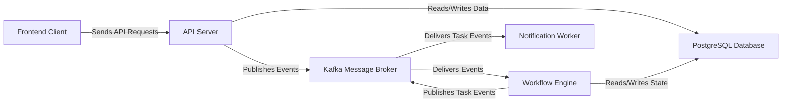

## Details

One paragraph explaining the functionality which is represented by this graph. What the main flow is and what is its purpose.

### Frontend Client
The React-based single-page application that provides the user interface for managing campaigns, workflows, and audiences. Provides the user interface for all application features.

**Related Classes/Methods**:

- `packages/client/src/`

### API Server [[Expand]](./API_Server.md)
A Node.js/Express backend that handles client requests, authentication, and business logic, acting as the main entry point to the system. Exposes the application's functionality via a public API. It handles user authentication, validates incoming data, and initiates backend processes by publishing events to the Kafka Message Broker.

**Related Classes/Methods**:

- `packages/server/src/api/`
- `Dockerfile.dev.server`
- `Dockerfile.prod.server`

### PostgreSQL Database
The primary relational database for storing persistent data like user accounts, workflow definitions, and audience information. Acts as the single source of truth for all persistent application data.

**Related Classes/Methods**:

- `packages/server/src/migrations/`
- `packages/server/src/common/entities/`
- `docker-compose.yml`

### Kafka Message Broker
The central nervous system of the backend, used to decouple the API server from asynchronous processing. It handles events for starting workflows and executing individual steps. Decouples the API server from the backend workers, enabling asynchronous, event-driven communication.

**Related Classes/Methods**:

- `packages/server/src/common/services/queue/`
- `local-env/kafkaconnect/`

### Workflow Engine [[Expand]](./Workflow_Engine.md)
The core logic for executing marketing journeys. It consumes events from Kafka, processes the steps in a journey (e.g., waits, checks, sending messages), and publishes new events for each action. Executes the logic of multi-step marketing journeys. It interprets workflow definitions, manages state, and orchestrates the execution of individual steps.

**Related Classes/Methods**:

- `packages/server/src/api/journeys/processors/`
- `packages/server/src/api/steps/processors/`

### Notification Worker
A logical component responsible for handling the final delivery of messages like emails, SMS, or push notifications by integrating with third-party services. A logical component that consumes final task events from the message broker and integrates with third-party services to send notifications.

**Related Classes/Methods**:

- `packages/server/src/api/channels/`

### [FAQ](https://github.com/CodeBoarding/GeneratedOnBoardings/tree/main?tab=readme-ov-file#faq)