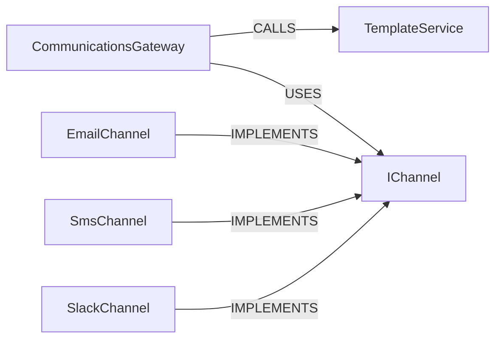

## Details

This architecture isolates the logic for message dispatching, templating, and channel-specific delivery, following a clean, extensible pattern suitable for a microservices environment. The design relies on a central gateway, a dedicated templating service, and a strategy pattern for handling various communication channels.

### CommunicationsGateway
The primary entry point and facade for the subsystem. It orchestrates the entire process of sending a message by coordinating between the templating service and the appropriate channel. It consumes events or API requests and is the sole point of contact for other services.

**Related Classes/Methods**:

- `services/communications.gateway.ts`
- `controllers/message.controller.ts`

### TemplateService
A dedicated service responsible for retrieving message templates from a data store (e.g., MongoDB) and rendering them with user-specific data. It separates the concern of content generation from the concern of message delivery.

**Related Classes/Methods**:

- `services/template.service.ts`
- `lib/templating.ts`

### IChannel
An abstract contract that defines a common interface (e.g., a `send()` method) for all communication channel implementations. This ensures that the `CommunicationsGateway` can interact with any channel in a uniform way.

**Related Classes/Methods**:

- `channels/ichannel.interface.ts`

### EmailChannel
A concrete implementation of the `IChannel` interface responsible for sending emails. It integrates with a specific third-party email provider (e.g., SendGrid), handling API authentication and request formatting.

**Related Classes/Methods**:

- `channels/email.channel.ts`
- `providers/sendgrid.provider.ts`

### SmsChannel
A concrete implementation of the `IChannel` interface for sending SMS messages. It integrates with a specific SMS provider (e.g., Twilio) and manages the details of the SMS API.

**Related Classes/Methods**:

- `channels/sms.channel.ts`
- `providers/twilio.provider.ts`

### SlackChannel
A concrete implementation of the `IChannel` interface for sending messages to Slack workspaces, typically using incoming webhooks.

**Related Classes/Methods**:

- `channels/slack.channel.ts`

### [FAQ](https://github.com/CodeBoarding/GeneratedOnBoardings/tree/main?tab=readme-ov-file#faq)