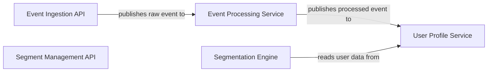

## Details

One paragraph explaining the functionality which is represented by this graph. What the main flow is and what is its purpose.

### Event Ingestion API
A public-facing, high-throughput API endpoint responsible for receiving raw event data from client applications (e.g., website, mobile app). It performs initial validation and places the raw events onto a Kafka topic for asynchronous processing.

**Related Classes/Methods**:

- `packages/api/src/controllers/eventsController.ts`
- `packages/api/src/routes/events.ts`

### Event Processing Service
A Kafka consumer that reads from the raw event topic. It standardizes, enriches, and transforms raw events into a structured format, then publishes them to a "processed events" topic for other services to consume.

**Related Classes/Methods**:

- `packages/worker/src/consumers/eventConsumer.ts`
- `packages/worker/src/services/eventProcessingService.ts`

### User Profile Service
Manages the state of individual customer profiles. It consumes processed events to update user attributes and timelines. It exposes an internal API for other services to query for user profile data. Profiles are stored in MongoDB for schema flexibility.

**Related Classes/Methods**:

- `packages/server/src/modules/users/user.service.ts`
- `packages/server/src/modules/users/user.model.ts`
- `packages/server/src/modules/users/user.controller.ts`

### Segmentation Engine
The core logic for dynamic segmentation. It evaluates segment definitions (e.g., "users who viewed page X in the last 7 days") against the user profile database. This can be triggered by user profile updates or run on a schedule.

**Related Classes/Methods**:

- `packages/server/src/modules/segments/segment.service.ts`
- `packages/server/src/modules/segments/segment.engine.ts`

### Segment Management API
Provides CRUD (Create, Read, Update, Delete) functionality for segment definitions. This is the interface used by the main application's UI to allow marketers to create and manage customer segments.

**Related Classes/Methods**:

- `packages/server/src/modules/segments/segment.controller.ts`
- `packages/server/src/modules/segments/segment.model.ts`

### [FAQ](https://github.com/CodeBoarding/GeneratedOnBoardings/tree/main?tab=readme-ov-file#faq)