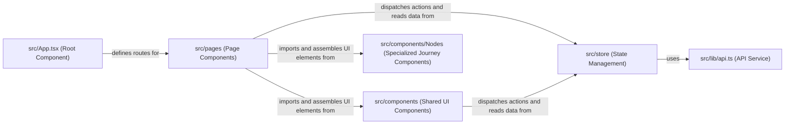

## Details

This is a revised architectural analysis of the `src` subsystem, tying the analysis to the actual file structure to make the component structure more concrete and verifiable.

### src/App.tsx (Root Component)
The main application shell. It sets up the primary routing structure that directs users to different pages (`Dashboard`, `JourneyBuilder`, etc.) and likely wraps the application in global context providers from `src/store/provider.tsx`.

**Related Classes/Methods**:

- `src/App.tsx`
- `src/index.tsx`

### src/pages (Page Components)
A directory containing top-level components, where each file corresponds to a major view or page in the application. These components compose the overall layout for a given route.

**Related Classes/Methods**:

- `src/pages/Dashboard.tsx`
- `src/pages/JourneyBuilder.tsx`
- `src/pages/JourneyAnalytics.tsx`

### src/components (Shared UI Components)
Contains a collection of reusable UI components that are shared across different pages. This includes general-purpose components like `SideBar.tsx` and more complex, feature-specific ones like `Journey.tsx`.

**Related Classes/Methods**:

- `src/components/`
- `src/components/SideBar.tsx`
- `src/components/Journey.tsx`

### src/components/Nodes (Specialized Journey Components)
A specialized subset of components responsible for rendering different types of nodes within the `JourneyBuilder` page. It includes a `BaseNode` and specific variations like `EmailNode` and `WaitNode`.

**Related Classes/Methods**:

- `src/components/Nodes/BaseNode.tsx`
- `src/components/Nodes/CustomNode.tsx`
- `src/components/Nodes/EmailNode.tsx`

### src/store (State Management)
This directory centralizes the application's state. It defines the state structure (e.g., `journey.ts`), and provides the mechanism (`provider.tsx`) to make that state available to the entire component tree.

**Related Classes/Methods**:

- `src/store/`
- `src/store/journey.ts`
- `src/store/provider.tsx`

### src/lib/api.ts (API Service)
A dedicated module for handling all outbound network requests to the backend. It likely exports functions that encapsulate API endpoints, which are then used by the state management logic in `src/store` to fetch and update data.

**Related Classes/Methods**:

- `src/lib/api.ts`

### [FAQ](https://github.com/CodeBoarding/GeneratedOnBoardings/tree/main?tab=readme-ov-file#faq)