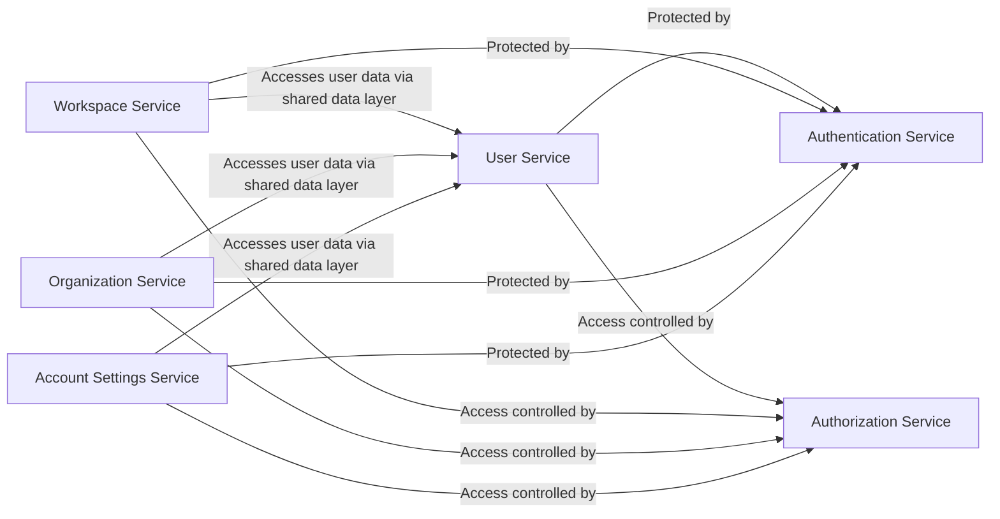

## Details

The `dittofeed` backend follows a modular monolith pattern. The core functionalities are separated into distinct modules (`user`, `auth`, `workspace`, etc.), each with a clearly defined responsibility. These modules are part of a single server application and likely interact indirectly through a shared data persistence layer and a common API request pipeline. This decoupled approach explains the lack of direct method invocations between service modules in the control flow graph. Cross-cutting concerns like authentication and authorization are likely handled by middleware in the request lifecycle before control is passed to a specific module's business logic.

### User Service
The definitive source of truth for all user-related data. It manages the lifecycle of user accounts, including creation, retrieval, updates, and deletion.

**Related Classes/Methods**: _None_

### Authentication Service
Handles all aspects of user authentication. It is responsible for verifying credentials (e.g., email/password, OAuth providers), issuing secure authentication tokens (JWTs), and managing token lifecycles. It operates as a distinct module, likely invoked early in the request lifecycle.

**Related Classes/Methods**: _None_

### Authorization Service
Manages roles, permissions, and access control policies. This service is likely consulted by a central request handler or middleware to determine if an authenticated user has the necessary permissions for a given resource before the request reaches the target service module.

**Related Classes/Methods**: _None_

### Organization Service
Manages top-level customer accounts or "tenants." This includes creating and managing organization details, settings, and billing information. It also maintains the list of users who are members of each organization, likely via relations in the data layer.

**Related Classes/Methods**: _None_

### Workspace Service
Manages workspaces, which are sub-environments within an organization. A workspace contains specific resources like customer journeys, segments, and campaigns. This service controls workspace settings and user membership at this more granular level.

**Related Classes/Methods**: _None_

### Account Settings Service
Manages user-specific settings and preferences that are not directly related to core identity. This includes profile information (e.g., name, avatar), notification preferences, and interface settings.

**Related Classes/Methods**: _None_

### [FAQ](https://github.com/CodeBoarding/GeneratedOnBoardings/tree/main?tab=readme-ov-file#faq)