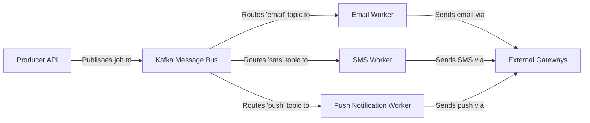

## Details

One paragraph explaining the functionality which is represented by this graph. What the main flow is and what is its purpose.

### Producer API
This component serves as the entry point for creating and sending notification jobs. It likely exposes a function that takes parameters such as channel (email, SMS, push), recipient, and payload. It then serializes this information and publishes it as a message to the Kafka Message Bus. This is the concrete implementation of the abstract "Messaging Dispatcher".

**Related Classes/Methods**:

- `laudspeaker/main.py`

### Kafka Message Bus
An external message broker that decouples the message production from consumption. It uses distinct topics (email_topic, sms_topic, push_topic) to buffer and route jobs to the appropriate worker.

**Related Classes/Methods**:

- `laudspeaker/main.py`
- `laudspeaker/workers/email_worker.py`
- `laudspeaker/workers/sms_worker.py`
- `laudspeaker/workers/push_worker.py`

### Email Worker
A background process that subscribes to the email_topic on Kafka. It consumes messages, parses the job payload, and uses an external email provider to send the email.

**Related Classes/Methods**:

- `laudspeaker/workers/email_worker.py`

### SMS Worker
A background process that subscribes to the sms_topic on Kafka. It consumes messages, extracts the recipient's phone number and content, and uses an external SMS gateway to deliver the message.

**Related Classes/Methods**:

- `laudspeaker/workers/sms_worker.py`

### Push Notification Worker
A background process that subscribes to the push_topic on Kafka. It consumes messages and interfaces with external push notification services (like FCM or APNS) to send alerts to user devices.

**Related Classes/Methods**:

- `laudspeaker/workers/push_worker.py`

### External Gateways
A collection of third-party services that handle the final delivery of notifications. This includes an Email Service, an SMS Gateway, and a Push Service. The workers are responsible for integrating with these external APIs.

**Related Classes/Methods**:

- `laudspeaker/workers/email_worker.py`
- `laudspeaker/workers/sms_worker.py`
- `laudspeaker/workers/push_worker.py`

### [FAQ](https://github.com/CodeBoarding/GeneratedOnBoardings/tree/main?tab=readme-ov-file#faq)