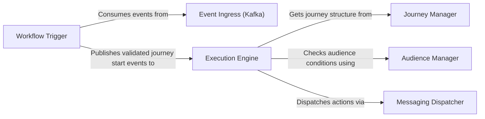

## Details

One paragraph explaining the functionality which is represented by this graph. What the main flow is and what is its purpose.

### Event Ingress (Kafka)
This component serves as the primary entry point for all external events that can initiate or influence a marketing journey. It leverages Kafka topics to provide a durable and scalable ingestion layer, effectively decoupling the event producers (e.g., user activity trackers) from the internal processing logic of the workflow engine.

**Related Classes/Methods**:

- `laudspeaker.kafka.consumer`

### Workflow Trigger
The Workflow Trigger acts as the initial consumer and validator within the subsystem. It listens to the Event Ingress topics, performs high-level checks (e.g., verifying that an associated journey exists and is active), and, upon success, initiates the workflow by placing a validated event onto an internal processing channel for the Execution Engine.

**Related Classes/Methods**:

- `laudspeaker.workflows`

### Journey Manager
A passive but critical component that provides the structural definition of marketing journeys. It holds the blueprint for each workflow, including the sequence of steps (nodes) and the conditional paths between them (edges). The Execution Engine queries this component to understand "what to do next" at any given point in a journey.

**Related Classes/Methods**:

- `laudspeaker.journeys`

### Audience Manager
This component is responsible for managing user segmentation and evaluating audience criteria. During journey execution, the engine queries the Audience Manager to determine if a specific user meets the conditions required to proceed down a particular path (e.g., "Is the user in the 'New Sign-ups' segment?").

**Related Classes/Methods**:

- `laudspeaker.audience`

### Execution Engine
The brain of the subsystem. It consumes events from the Workflow Trigger and orchestrates the user's progression through a journey. It continuously queries the Journey Manager for the workflow structure and the Audience Manager for conditional checks to make real-time decisions.

**Related Classes/Methods**:

- `laudspeaker.engine`

### Messaging Dispatcher
This component acts as the exit point of the workflow engine. Once the Execution Engine determines that an action needs to be taken (e.g., send an email, send an SMS), it hands the request to the Messaging Dispatcher. The dispatcher formats the request and places it onto an outgoing message queue (e.g., Kafka or RabbitMQ) for consumption by external worker services.

**Related Classes/Methods**:

- `laudspeaker.messaging`

### [FAQ](https://github.com/CodeBoarding/GeneratedOnBoardings/tree/main?tab=readme-ov-file#faq)