```mermaid
graph LR
    API_Gateway["API Gateway"]
    User_Management["User Management"]
    Customer_Data_Platform["Customer Data Platform"]
    Journey_Orchestration_Engine["Journey Orchestration Engine"]
    Communications_Gateway["Communications Gateway"]
    API_Gateway -- "Authenticates platform users via" --> User_Management
    API_Gateway -- "Routes customer data and event requests to" --> Customer_Data_Platform
    Customer_Data_Platform -- "Triggers journeys based on customer events and segment changes" --> Journey_Orchestration_Engine
    Journey_Orchestration_Engine -- "Queries for customer and segment data" --> Customer_Data_Platform
    Journey_Orchestration_Engine -- "Instructs to dispatch messages" --> Communications_Gateway
    click API_Gateway href "https://github.com/CodeBoarding/GeneratedOnBoardings/blob/main/laudspeaker/API_Gateway.md" "Details"
    click User_Management href "https://github.com/CodeBoarding/GeneratedOnBoardings/blob/main/laudspeaker/User_Management.md" "Details"
    click Customer_Data_Platform href "https://github.com/CodeBoarding/GeneratedOnBoardings/blob/main/laudspeaker/Customer_Data_Platform.md" "Details"
    click Journey_Orchestration_Engine href "https://github.com/CodeBoarding/GeneratedOnBoardings/blob/main/laudspeaker/Journey_Orchestration_Engine.md" "Details"
    click Communications_Gateway href "https://github.com/CodeBoarding/GeneratedOnBoardings/blob/main/laudspeaker/Communications_Gateway.md" "Details"
```

## Details

One paragraph explaining the functionality which is represented by this graph. What the main flow is and what is its purpose.

### API Gateway [[Expand]](./API_Gateway.md)
Serves as the single entry point for all incoming requests from the user interface and external systems. It is responsible for request validation, routing to appropriate internal services, and handling API versioning.

**Related Classes/Methods**:

- `Main server entry point`
- `API Gateway controllers`

### User Management [[Expand]](./User_Management.md)
Manages the platform's administrative users, including authentication, authorization, and account-level settings. It ensures that only authenticated users can access and manage the platform's resources.

**Related Classes/Methods**:

- `Authentication`
- `Account management`
- `Organization management`
- `Workspace management`

### Customer Data Platform [[Expand]](./Customer_Data_Platform.md)
The central repository for all end-customer information. It ingests customer events and data, manages customer profiles, and dynamically groups customers into segments based on their attributes and behavior.

**Related Classes/Methods**:

- `Customer management`
- `Event ingestion`
- `Segment management`

### Journey Orchestration Engine [[Expand]](./Journey_Orchestration_Engine.md)
The core logic engine that designs and executes customer journeys. It listens for triggers from the Customer Data Platform (e.g., a user entering a segment) and orchestrates the sequence of actions and delays that define a journey.

**Related Classes/Methods**:

- `Journey management`
- `Step management`
- `Queueing mechanism`

### Communications Gateway [[Expand]](./Communications_Gateway.md)
A unified service for dispatching messages through various channels like email, SMS, or webhooks. It abstracts the complexities of third-party providers and utilizes a templating system to enable message personalization.

**Related Classes/Methods**:

- `Channel interface`
- `Email channel`
- `SMS channel`
- `Slack channel`
- `Template management`

### [FAQ](https://github.com/CodeBoarding/GeneratedOnBoardings/tree/main?tab=readme-ov-file#faq)