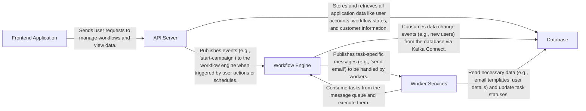

## Details

One paragraph explaining the functionality which is represented by this graph. What the main flow is and what is its purpose.

### Frontend Application [[Expand]](./Frontend_Application.md)
A client-side application, likely built with a modern JavaScript framework like React, that provides the user interface for the platform. It is responsible for all user-facing interactions, such as building marketing journeys and viewing analytics.

**Related Classes/Methods**:

- `Dockerfile.dev.client`
- `Dockerfile.prod.client`

### API Server [[Expand]](./API_Server.md)
The central backend service that exposes a REST or GraphQL API. It handles business logic, authentication, and data validation, acting as the primary intermediary between the frontend client and the backend infrastructure.

**Related Classes/Methods**:

- `Dockerfile.dev.server`
- `Dockerfile.prod.server`
- `env-server-example`

### Workflow Engine [[Expand]](./Workflow_Engine.md)
An event-driven system responsible for executing the marketing automation workflows. It uses Apache Kafka to manage and process events, such as user sign-ups or product purchases, triggering corresponding actions like sending emails or SMS messages.

**Related Classes/Methods**:

- `local-env/1a_init_kafka_engine.sql`
- `local-env/kafkaconnect/`

### Worker Services [[Expand]](./Worker_Services.md)
These are background processes that subscribe to topics in the Workflow Engine (Kafka) and perform the actual work of a given task, such as sending emails, SMS, or push notifications. This decouples long-running tasks from the API server, ensuring the system remains responsive.

**Related Classes/Methods**:

- `Procfile`

### Database
A PostgreSQL database that serves as the primary data store for the application. It holds all persistent data, including user information, workflow configurations, customer data, and campaign results.

**Related Classes/Methods**:

- `Dockerfile.postgres`
- `local-env/kafkaconnect/postgres-source-connector.json`

### [FAQ](https://github.com/CodeBoarding/GeneratedOnBoardings/tree/main?tab=readme-ov-file#faq)