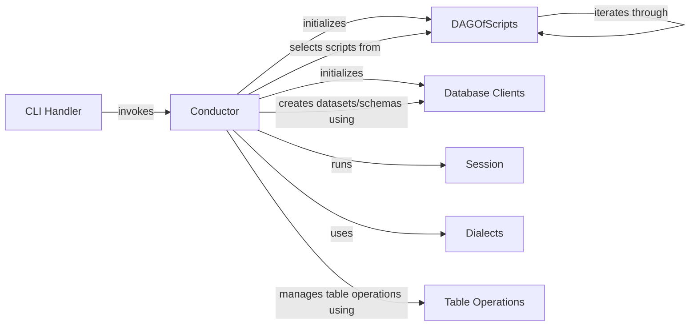

## Component Details

The Lea application orchestrates data transformations through a pipeline initiated via the command-line interface. The CLI Handler parses arguments and triggers the Conductor, which manages the overall execution. The Conductor initializes database clients and a DAG of scripts, prepares a session, and executes the scripts. Database clients provide connectivity to various database systems, while the DAGOfScripts represents the dependencies between transformation scripts. The Session module maintains the execution context, and Dialects provide database-specific query generation. Table operations handle tasks like materializing scripts and managing audit tables. This system allows users to define and execute complex data transformations across different database environments.

### CLI Handler
The CLI Handler serves as the entry point for the Lea application. It parses command-line arguments using `lea.cli:run` and initiates the data transformation pipeline by calling the Conductor. It is responsible for setting up the environment and triggering the execution of the data transformation process based on user-provided arguments.

**Related Classes/Methods**:

- <a href="https://github.com/carbonfact/lea/blob/master/lea/cli.py#L31-L57" target="_blank" rel="noopener noreferrer">`lea.cli:run` (31:57)</a>

### Conductor
The Conductor orchestrates the data transformation pipeline. It initializes the necessary components, prepares the session, and runs the data transformation scripts. It manages the overall execution flow, including creating database clients, selecting scripts, and handling audit tables.

**Related Classes/Methods**:

- <a href="https://github.com/carbonfact/lea/blob/master/lea/conductor.py#L22-L351" target="_blank" rel="noopener noreferrer">`lea.conductor.Conductor` (22:351)</a>
- <a href="https://github.com/carbonfact/lea/blob/master/lea/conductor.py#L23-L88" target="_blank" rel="noopener noreferrer">`lea.conductor.Conductor:__init__` (23:88)</a>
- <a href="https://github.com/carbonfact/lea/blob/master/lea/conductor.py#L90-L118" target="_blank" rel="noopener noreferrer">`lea.conductor.Conductor:run` (90:118)</a>
- <a href="https://github.com/carbonfact/lea/blob/master/lea/conductor.py#L120-L221" target="_blank" rel="noopener noreferrer">`lea.conductor.Conductor:prepare_session` (120:221)</a>
- <a href="https://github.com/carbonfact/lea/blob/master/lea/conductor.py#L223-L254" target="_blank" rel="noopener noreferrer">`lea.conductor.Conductor:run_session` (223:254)</a>
- <a href="https://github.com/carbonfact/lea/blob/master/lea/conductor.py#L256-L325" target="_blank" rel="noopener noreferrer">`lea.conductor.Conductor:make_client` (256:325)</a>

### DAGOfScripts
The DAGOfScripts module represents the directed acyclic graph (DAG) of data transformation scripts. It loads the scripts from a directory, selects the relevant scripts based on changes, and provides methods for iterating through ancestors and descendants of a script.

**Related Classes/Methods**:

- <a href="https://github.com/carbonfact/lea/blob/master/lea/dag.py#L15-L182" target="_blank" rel="noopener noreferrer">`lea.dag.DAGOfScripts` (15:182)</a>
- <a href="https://github.com/carbonfact/lea/blob/master/lea/dag.py#L32-L66" target="_blank" rel="noopener noreferrer">`lea.dag.DAGOfScripts:from_directory` (32:66)</a>
- <a href="https://github.com/carbonfact/lea/blob/master/lea/dag.py#L68-L148" target="_blank" rel="noopener noreferrer">`lea.dag.DAGOfScripts:select` (68:148)</a>
- <a href="https://github.com/carbonfact/lea/blob/master/lea/dag.py#L173-L176" target="_blank" rel="noopener noreferrer">`lea.dag.DAGOfScripts:iter_ancestors` (173:176)</a>
- <a href="https://github.com/carbonfact/lea/blob/master/lea/dag.py#L178-L182" target="_blank" rel="noopener noreferrer">`lea.dag.DAGOfScripts:iter_descendants` (178:182)</a>

### Database Clients
The Database Clients module provides clients for interacting with different database systems, such as BigQuery, DuckDB, MotherDuck and DuckLake. These clients are responsible for creating datasets/schemas, listing existing tables, and executing SQL queries.

**Related Classes/Methods**:

- <a href="https://github.com/carbonfact/lea/blob/master/lea/databases.py#L266-L532" target="_blank" rel="noopener noreferrer">`lea.databases.BigQueryClient` (266:532)</a>
- <a href="https://github.com/carbonfact/lea/blob/master/lea/databases.py#L584-L758" target="_blank" rel="noopener noreferrer">`lea.databases.DuckDBClient` (584:758)</a>
- <a href="https://github.com/carbonfact/lea/blob/master/lea/databases.py#L761-L772" target="_blank" rel="noopener noreferrer">`lea.databases.MotherDuckClient` (761:772)</a>
- <a href="https://github.com/carbonfact/lea/blob/master/lea/databases.py#L775-L786" target="_blank" rel="noopener noreferrer">`lea.databases.DuckLakeClient` (775:786)</a>
- <a href="https://github.com/carbonfact/lea/blob/master/lea/databases.py#L24-L28" target="_blank" rel="noopener noreferrer">`lea.databases.Warehouse` (24:28)</a>
- <a href="https://github.com/carbonfact/lea/blob/master/lea/databases.py#L313-L320" target="_blank" rel="noopener noreferrer">`lea.databases.BigQueryClient.create_dataset` (313:320)</a>
- <a href="https://github.com/carbonfact/lea/blob/master/lea/databases.py#L603-L604" target="_blank" rel="noopener noreferrer">`lea.databases.DuckDBClient.create_schema` (603:604)</a>

### Session
The Session module manages the execution context for a data transformation pipeline. It stores information about the current session, such as the user dataset and existing tables.

**Related Classes/Methods**:

- <a href="https://github.com/carbonfact/lea/blob/master/lea/session.py#L19-L273" target="_blank" rel="noopener noreferrer">`lea.session.Session` (19:273)</a>

### Dialects
The Dialects module provides dialect-specific implementations for different database systems, such as BigQuery and DuckDB. These dialects are used to generate SQL queries that are compatible with the target database.

**Related Classes/Methods**:

- <a href="https://github.com/carbonfact/lea/blob/master/lea/dialects.py#L121-L172" target="_blank" rel="noopener noreferrer">`lea.dialects.BigQueryDialect` (121:172)</a>
- <a href="https://github.com/carbonfact/lea/blob/master/lea/dialects.py#L175-L229" target="_blank" rel="noopener noreferrer">`lea.dialects.DuckDBDialect` (175:229)</a>

### Table Operations
This component contains functions for performing operations on tables, such as deleting audit tables, deleting orphan tables, materializing scripts, and promoting audit tables.

**Related Classes/Methods**:

- <a href="https://github.com/carbonfact/lea/blob/master/lea/conductor.py#L354-L396" target="_blank" rel="noopener noreferrer">`lea.conductor:materialize_scripts` (354:396)</a>
- <a href="https://github.com/carbonfact/lea/blob/master/lea/conductor.py#L424-L441" target="_blank" rel="noopener noreferrer">`lea.conductor:delete_audit_tables` (424:441)</a>
- <a href="https://github.com/carbonfact/lea/blob/master/lea/conductor.py#L444-L457" target="_blank" rel="noopener noreferrer">`lea.conductor:delete_orphan_tables` (444:457)</a>