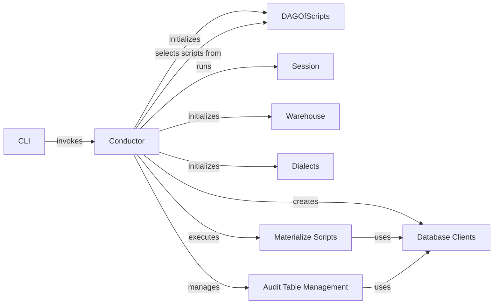

## Component Details

The Lea application orchestrates data transformations within a data warehouse. The CLI initiates the process, which is then managed by the Conductor. The Conductor leverages a DAG of scripts to determine the execution order, interacts with database clients to execute SQL, and manages audit tables for data lineage and versioning. Sessions are created to manage the state of each execution. The Warehouse component stores metadata about the data warehouse environment. Dialects provide database-specific SQL implementations. Materialize Scripts executes the scripts and Audit Table Management handles the audit tables.

### CLI
The Command Line Interface serves as the entry point for the Lea application. It parses command-line arguments and invokes the Conductor to orchestrate the data transformation workflow.

**Related Classes/Methods**:

- <a href="https://github.com/carbonfact/lea/blob/master/lea/cli.py#L31-L57" target="_blank" rel="noopener noreferrer">`lea.cli:run` (31:57)</a>

### Conductor
The Conductor orchestrates the entire data transformation process. It manages the DAG of scripts, prepares the database session, and executes the scripts in the correct order. It initializes database clients, manages audit tables, and handles the overall execution flow.

**Related Classes/Methods**:

- <a href="https://github.com/carbonfact/lea/blob/master/lea/conductor.py#L22-L351" target="_blank" rel="noopener noreferrer">`lea.conductor.Conductor` (22:351)</a>
- <a href="https://github.com/carbonfact/lea/blob/master/lea/conductor.py#L23-L88" target="_blank" rel="noopener noreferrer">`lea.conductor.Conductor:__init__` (23:88)</a>
- <a href="https://github.com/carbonfact/lea/blob/master/lea/conductor.py#L90-L118" target="_blank" rel="noopener noreferrer">`lea.conductor.Conductor:run` (90:118)</a>
- <a href="https://github.com/carbonfact/lea/blob/master/lea/conductor.py#L120-L221" target="_blank" rel="noopener noreferrer">`lea.conductor.Conductor:prepare_session` (120:221)</a>
- <a href="https://github.com/carbonfact/lea/blob/master/lea/conductor.py#L223-L254" target="_blank" rel="noopener noreferrer">`lea.conductor.Conductor:run_session` (223:254)</a>
- <a href="https://github.com/carbonfact/lea/blob/master/lea/conductor.py#L256-L325" target="_blank" rel="noopener noreferrer">`lea.conductor.Conductor:make_client` (256:325)</a>
- <a href="https://github.com/carbonfact/lea/blob/master/lea/conductor.py#L354-L396" target="_blank" rel="noopener noreferrer">`lea.conductor:materialize_scripts` (354:396)</a>
- <a href="https://github.com/carbonfact/lea/blob/master/lea/conductor.py#L424-L441" target="_blank" rel="noopener noreferrer">`lea.conductor:delete_audit_tables` (424:441)</a>
- <a href="https://github.com/carbonfact/lea/blob/master/lea/conductor.py#L444-L457" target="_blank" rel="noopener noreferrer">`lea.conductor:delete_orphan_tables` (444:457)</a>

### DAGOfScripts
The DAGOfScripts represents the directed acyclic graph of scripts to be executed. It loads scripts, selects a subset, and determines the execution order.

**Related Classes/Methods**:

- <a href="https://github.com/carbonfact/lea/blob/master/lea/dag.py#L32-L66" target="_blank" rel="noopener noreferrer">`lea.dag.DAGOfScripts.from_directory` (32:66)</a>
- <a href="https://github.com/carbonfact/lea/blob/master/lea/dag.py#L68-L148" target="_blank" rel="noopener noreferrer">`lea.dag.DAGOfScripts.select` (68:148)</a>

### Database Clients
Database Clients (BigQueryClient, DuckDBClient, MotherDuckClient, DuckLakeClient) provide an abstraction layer for interacting with different database systems. They create datasets/schemas, execute queries, and manage connections.

**Related Classes/Methods**:

- <a href="https://github.com/carbonfact/lea/blob/master/lea/databases.py#L266-L532" target="_blank" rel="noopener noreferrer">`lea.databases.BigQueryClient` (266:532)</a>
- <a href="https://github.com/carbonfact/lea/blob/master/lea/databases.py#L584-L758" target="_blank" rel="noopener noreferrer">`lea.databases.DuckDBClient` (584:758)</a>
- <a href="https://github.com/carbonfact/lea/blob/master/lea/databases.py#L761-L772" target="_blank" rel="noopener noreferrer">`lea.databases.MotherDuckClient` (761:772)</a>
- <a href="https://github.com/carbonfact/lea/blob/master/lea/databases.py#L775-L786" target="_blank" rel="noopener noreferrer">`lea.databases.DuckLakeClient` (775:786)</a>
- <a href="https://github.com/carbonfact/lea/blob/master/lea/databases.py#L313-L320" target="_blank" rel="noopener noreferrer">`lea.databases.BigQueryClient.create_dataset` (313:320)</a>
- <a href="https://github.com/carbonfact/lea/blob/master/lea/databases.py#L603-L604" target="_blank" rel="noopener noreferrer">`lea.databases.DuckDBClient.create_schema` (603:604)</a>

### Session
The Session manages the state of a single execution of the data transformation workflow. It stores information about the current user, dataset, and other relevant parameters.

**Related Classes/Methods**:

- <a href="https://github.com/carbonfact/lea/blob/master/lea/session.py#L19-L273" target="_blank" rel="noopener noreferrer">`lea.session.Session` (19:273)</a>

### Warehouse
The Warehouse manages the metadata and configuration related to the data warehouse environment.

**Related Classes/Methods**:

- <a href="https://github.com/carbonfact/lea/blob/master/lea/databases.py#L24-L28" target="_blank" rel="noopener noreferrer">`lea.databases.Warehouse` (24:28)</a>

### Dialects
Dialects (BigQueryDialect, DuckDBDialect) provide database-specific implementations for generating SQL queries and handling data types.

**Related Classes/Methods**:

- <a href="https://github.com/carbonfact/lea/blob/master/lea/dialects.py#L121-L172" target="_blank" rel="noopener noreferrer">`lea.dialects.BigQueryDialect` (121:172)</a>
- <a href="https://github.com/carbonfact/lea/blob/master/lea/dialects.py#L175-L229" target="_blank" rel="noopener noreferrer">`lea.dialects.DuckDBDialect` (175:229)</a>

### Materialize Scripts
The `materialize_scripts` function executes the scripts in the DAG and materializes the resulting tables in the database.

**Related Classes/Methods**:

- <a href="https://github.com/carbonfact/lea/blob/master/lea/conductor.py#L354-L396" target="_blank" rel="noopener noreferrer">`lea.conductor:materialize_scripts` (354:396)</a>
- <a href="https://github.com/carbonfact/lea/blob/master/lea/conductor.py#L479-L542" target="_blank" rel="noopener noreferrer">`.mnt.e.StartUp.lea.lea.conductor.determine_table_refs_to_run` (479:542)</a>

### Audit Table Management
The `delete_audit_tables`, `promote_audit_tables`, and `delete_orphan_tables` functions manage audit tables, which track changes to the data warehouse over time.

**Related Classes/Methods**:

- <a href="https://github.com/carbonfact/lea/blob/master/lea/conductor.py#L424-L441" target="_blank" rel="noopener noreferrer">`lea.conductor:delete_audit_tables` (424:441)</a>
- <a href="https://github.com/carbonfact/lea/blob/master/lea/conductor.py#L444-L457" target="_blank" rel="noopener noreferrer">`lea.conductor:delete_orphan_tables` (444:457)</a>
- <a href="https://github.com/carbonfact/lea/blob/master/lea/conductor.py#L460-L476" target="_blank" rel="noopener noreferrer">`.mnt.e.StartUp.lea.lea.conductor.delete_table_refs` (460:476)</a>