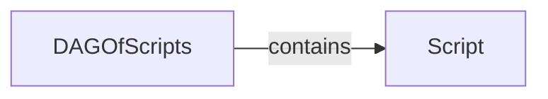

## Component Details

The DAG Manager is responsible for constructing and managing a directed acyclic graph (DAG) of SQL scripts, enabling the execution of scripts in the correct order based on their dependencies. It loads scripts from a specified directory, represents each script as a node in the graph, and establishes edges based on dependencies between scripts. The DAG Manager allows for selecting subgraphs based on changed table references and provides methods for iterating through ancestors and descendants of nodes, ensuring that scripts are executed in the correct order, satisfying all dependencies.

### DAGOfScripts
Represents the directed acyclic graph (DAG) of data transformation scripts. It's responsible for loading scripts from a directory, constructing the graph based on dependencies, selecting a subset of scripts based on specified criteria, and iterating through the graph to determine the order of execution.

**Related Classes/Methods**:

- <a href="https://github.com/carbonfact/lea/blob/master/lea/dag.py#L15-L182" target="_blank" rel="noopener noreferrer">`lea.dag.DAGOfScripts` (15:182)</a>
- <a href="https://github.com/carbonfact/lea/blob/master/lea/dag.py#L32-L66" target="_blank" rel="noopener noreferrer">`lea.dag.DAGOfScripts:from_directory` (32:66)</a>
- <a href="https://github.com/carbonfact/lea/blob/master/lea/dag.py#L68-L148" target="_blank" rel="noopener noreferrer">`lea.dag.DAGOfScripts:select` (68:148)</a>
- <a href="https://github.com/carbonfact/lea/blob/master/lea/dag.py#L173-L176" target="_blank" rel="noopener noreferrer">`lea.dag.DAGOfScripts:iter_ancestors` (173:176)</a>
- <a href="https://github.com/carbonfact/lea/blob/master/lea/dag.py#L178-L182" target="_blank" rel="noopener noreferrer">`lea.dag.DAGOfScripts:iter_descendants` (178:182)</a>

### Script
Represents a single data transformation script within the DAG. It encapsulates the script's content, dependencies (tables it reads from), and execution status. It is a node in the DAG.

**Related Classes/Methods**:

- <a href="https://github.com/carbonfact/lea/blob/master/lea/dag.py#L7-L13" target="_blank" rel="noopener noreferrer">`lea.dag.Script` (7:13)</a>