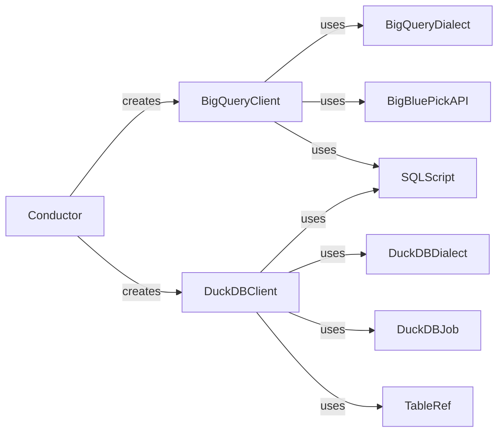

## Component Details

The Database Client component provides an abstraction layer for interacting with various database systems, including BigQuery and DuckDB. It encapsulates the complexities of database-specific operations, offering a unified interface for executing queries, materializing scripts, managing tables, and retrieving table metadata. The Conductor utilizes this component to interact with different databases seamlessly.

### BigQueryClient
The BigQueryClient provides an interface for interacting with Google BigQuery. It handles tasks such as executing queries, materializing scripts, cloning tables, deleting and inserting data, deleting tables, and listing table statistics and fields. It leverages BigQueryDialect for dialect-specific conversions and BigBluePickAPI for client picking.

**Related Classes/Methods**:

- <a href="https://github.com/carbonfact/lea/blob/master/lea/databases.py#L266-L532" target="_blank" rel="noopener noreferrer">`lea.databases.BigQueryClient` (266:532)</a>
- <a href="https://github.com/carbonfact/lea/blob/master/lea/databases.py#L267-L311" target="_blank" rel="noopener noreferrer">`lea.databases.BigQueryClient.__init__` (267:311)</a>
- <a href="https://github.com/carbonfact/lea/blob/master/lea/databases.py#L334-L337" target="_blank" rel="noopener noreferrer">`lea.databases.BigQueryClient.materialize_script` (334:337)</a>
- <a href="https://github.com/carbonfact/lea/blob/master/lea/databases.py#L339-L380" target="_blank" rel="noopener noreferrer">`lea.databases.BigQueryClient.materialize_sql_script` (339:380)</a>
- <a href="https://github.com/carbonfact/lea/blob/master/lea/databases.py#L382-L385" target="_blank" rel="noopener noreferrer">`lea.databases.BigQueryClient.query_script` (382:385)</a>
- <a href="https://github.com/carbonfact/lea/blob/master/lea/databases.py#L387-L404" target="_blank" rel="noopener noreferrer">`lea.databases.BigQueryClient.query_sql_script` (387:404)</a>
- <a href="https://github.com/carbonfact/lea/blob/master/lea/databases.py#L406-L428" target="_blank" rel="noopener noreferrer">`lea.databases.BigQueryClient.clone_table` (406:428)</a>
- <a href="https://github.com/carbonfact/lea/blob/master/lea/databases.py#L430-L467" target="_blank" rel="noopener noreferrer">`lea.databases.BigQueryClient.delete_and_insert` (430:467)</a>
- <a href="https://github.com/carbonfact/lea/blob/master/lea/databases.py#L469-L487" target="_blank" rel="noopener noreferrer">`lea.databases.BigQueryClient.delete_table` (469:487)</a>
- <a href="https://github.com/carbonfact/lea/blob/master/lea/databases.py#L489-L506" target="_blank" rel="noopener noreferrer">`lea.databases.BigQueryClient.list_table_stats` (489:506)</a>
- <a href="https://github.com/carbonfact/lea/blob/master/lea/databases.py#L508-L522" target="_blank" rel="noopener noreferrer">`lea.databases.BigQueryClient.list_table_fields` (508:522)</a>

### DuckDBClient
The DuckDBClient provides an interface for interacting with DuckDB. It offers methods for executing queries, materializing scripts, cloning tables, deleting and inserting data, deleting tables, and listing table statistics and fields. It utilizes DuckDBDialect for dialect-specific conversions and DuckDBJob for job execution.

**Related Classes/Methods**:

- <a href="https://github.com/carbonfact/lea/blob/master/lea/databases.py#L584-L758" target="_blank" rel="noopener noreferrer">`lea.databases.DuckDBClient` (584:758)</a>
- <a href="https://github.com/carbonfact/lea/blob/master/lea/databases.py#L606-L609" target="_blank" rel="noopener noreferrer">`lea.databases.DuckDBClient.materialize_script` (606:609)</a>
- <a href="https://github.com/carbonfact/lea/blob/master/lea/databases.py#L611-L634" target="_blank" rel="noopener noreferrer">`lea.databases.DuckDBClient.materialize_sql_script` (611:634)</a>
- <a href="https://github.com/carbonfact/lea/blob/master/lea/databases.py#L636-L640" target="_blank" rel="noopener noreferrer">`lea.databases.DuckDBClient.query_script` (636:640)</a>
- <a href="https://github.com/carbonfact/lea/blob/master/lea/databases.py#L642-L658" target="_blank" rel="noopener noreferrer">`lea.databases.DuckDBClient.clone_table` (642:658)</a>
- <a href="https://github.com/carbonfact/lea/blob/master/lea/databases.py#L660-L684" target="_blank" rel="noopener noreferrer">`lea.databases.DuckDBClient.delete_and_insert` (660:684)</a>
- <a href="https://github.com/carbonfact/lea/blob/master/lea/databases.py#L686-L697" target="_blank" rel="noopener noreferrer">`lea.databases.DuckDBClient.delete_table` (686:697)</a>
- <a href="https://github.com/carbonfact/lea/blob/master/lea/databases.py#L706-L736" target="_blank" rel="noopener noreferrer">`lea.databases.DuckDBClient.list_table_stats` (706:736)</a>
- <a href="https://github.com/carbonfact/lea/blob/master/lea/databases.py#L738-L750" target="_blank" rel="noopener noreferrer">`lea.databases.DuckDBClient.list_table_fields` (738:750)</a>
- <a href="https://github.com/carbonfact/lea/blob/master/lea/databases.py#L752-L758" target="_blank" rel="noopener noreferrer">`lea.databases.DuckDBClient.make_job_config` (752:758)</a>

### BigQueryDialect
The BigQueryDialect provides methods for converting table references to BigQuery table references and parsing table references. It is used by BigQueryClient for dialect-specific operations.

**Related Classes/Methods**:

- <a href="https://github.com/carbonfact/lea/blob/master/lea/dialects.py#L166-L172" target="_blank" rel="noopener noreferrer">`lea.dialects.BigQueryDialect.convert_table_ref_to_bigquery_table_reference` (166:172)</a>
- <a href="https://github.com/carbonfact/lea/blob/master/lea/dialects.py#L125-L153" target="_blank" rel="noopener noreferrer">`lea.dialects.BigQueryDialect.parse_table_ref` (125:153)</a>

### DuckDBDialect
The DuckDBDialect provides methods for converting table references to DuckDB table references and parsing table references. It is used by DuckDBClient for dialect-specific operations.

**Related Classes/Methods**:

- <a href="https://github.com/carbonfact/lea/blob/master/lea/dialects.py#L228-L229" target="_blank" rel="noopener noreferrer">`lea.dialects.DuckDBDialect.convert_table_ref_to_duckdb_table_reference` (228:229)</a>
- <a href="https://github.com/carbonfact/lea/blob/master/lea/dialects.py#L179-L202" target="_blank" rel="noopener noreferrer">`lea.dialects.DuckDBDialect.parse_table_ref` (179:202)</a>

### SQLScript
The SQLScript component represents an SQL script. It is used by BigQueryClient and DuckDBClient for executing SQL scripts.

**Related Classes/Methods**:

- <a href="https://github.com/carbonfact/lea/blob/master/lea/scripts.py#L23-L212" target="_blank" rel="noopener noreferrer">`lea.scripts.SQLScript` (23:212)</a>

### BigBluePickAPI
The BigBluePickAPI is used by BigQueryClient for picking a client.

**Related Classes/Methods**:

- <a href="https://github.com/carbonfact/lea/blob/master/lea/databases.py#L165-L263" target="_blank" rel="noopener noreferrer">`.mnt.e.StartUp.lea.lea.databases.BigBluePickAPI` (165:263)</a>
- <a href="https://github.com/carbonfact/lea/blob/master/lea/databases.py#L235-L239" target="_blank" rel="noopener noreferrer">`.mnt.e.StartUp.lea.lea.databases.BigBluePickAPI.pick_client` (235:239)</a>

### DuckDBJob
The DuckDBJob component represents a DuckDB job. It is used by DuckDBClient for executing DuckDB jobs.

**Related Classes/Methods**:

- <a href="https://github.com/carbonfact/lea/blob/master/lea/databases.py#L542-L543" target="_blank" rel="noopener noreferrer">`.mnt.e.StartUp.lea.lea.databases.DuckDBJob.execute` (542:543)</a>
- <a href="https://github.com/carbonfact/lea/blob/master/lea/databases.py#L536-L581" target="_blank" rel="noopener noreferrer">`.mnt.e.StartUp.lea.lea.databases.DuckDBJob` (536:581)</a>

### TableRef
The TableRef component represents a table reference. It is used by DuckDBClient for table operations.

**Related Classes/Methods**:

- <a href="https://github.com/carbonfact/lea/blob/master/lea/table_ref.py#L11-L55" target="_blank" rel="noopener noreferrer">`lea.table_ref.TableRef` (11:55)</a>
- <a href="https://github.com/carbonfact/lea/blob/master/lea/table_ref.py#L33-L34" target="_blank" rel="noopener noreferrer">`lea.table_ref.TableRef.replace_dataset` (33:34)</a>

### Conductor
The Conductor component is responsible for creating database clients (BigQueryClient, DuckDBClient, etc.).

**Related Classes/Methods**:

- <a href="https://github.com/carbonfact/lea/blob/master/lea/conductor.py#L22-L351" target="_blank" rel="noopener noreferrer">`lea.conductor.Conductor` (22:351)</a>
- <a href="https://github.com/carbonfact/lea/blob/master/lea/conductor.py#L256-L325" target="_blank" rel="noopener noreferrer">`lea.conductor.Conductor:make_client` (256:325)</a>