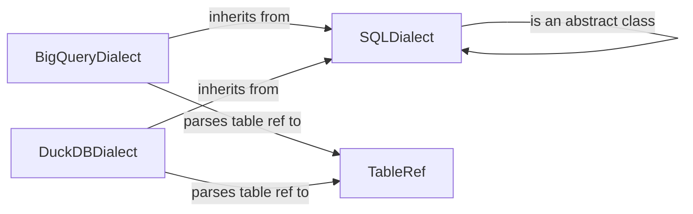

## Component Details

The SQL Dialect Handler provides dialect-specific functionality for parsing and formatting table references, converting table references to database-specific formats, and generating SQL code for data quality tests. The abstract class `SQLDialect` defines the common interface for different SQL dialects, while concrete implementations like `BigQueryDialect` and `DuckDBDialect` provide specific implementations for each database system. The `TableRef` class represents a table reference and is used by the dialects to parse and manipulate table references. The Database Client uses the SQL Dialect Handler to adapt SQL scripts to the specific database system being used, ensuring that the SQL scripts are compatible with the target database.

### SQLDialect
Abstract base class for SQL dialects. Defines common methods for generating column tests (unique, unique_by, no_nulls, set), adding dependency filters, and handling incremental dependencies. It provides a foundation for dialect-specific implementations.

**Related Classes/Methods**:

- <a href="https://github.com/carbonfact/lea/blob/master/lea/dialects.py#L15-L108" target="_blank" rel="noopener noreferrer">`lea.dialects.SQLDialect` (15:108)</a>
- <a href="https://github.com/carbonfact/lea/blob/master/lea/dialects.py#L26-L30" target="_blank" rel="noopener noreferrer">`lea.dialects.SQLDialect:make_column_test_unique` (26:30)</a>
- <a href="https://github.com/carbonfact/lea/blob/master/lea/dialects.py#L32-L38" target="_blank" rel="noopener noreferrer">`lea.dialects.SQLDialect:make_column_test_unique_by` (32:38)</a>
- <a href="https://github.com/carbonfact/lea/blob/master/lea/dialects.py#L40-L44" target="_blank" rel="noopener noreferrer">`lea.dialects.SQLDialect:make_column_test_no_nulls` (40:44)</a>
- <a href="https://github.com/carbonfact/lea/blob/master/lea/dialects.py#L46-L52" target="_blank" rel="noopener noreferrer">`lea.dialects.SQLDialect:make_column_test_set` (46:52)</a>
- <a href="https://github.com/carbonfact/lea/blob/master/lea/dialects.py#L55-L76" target="_blank" rel="noopener noreferrer">`lea.dialects.SQLDialect:add_dependency_filters` (55:76)</a>
- <a href="https://github.com/carbonfact/lea/blob/master/lea/dialects.py#L79-L108" target="_blank" rel="noopener noreferrer">`lea.dialects.SQLDialect:handle_incremental_dependencies` (79:108)</a>

### BigQueryDialect
Concrete implementation of SQLDialect for Google BigQuery. Provides specific functionality for parsing table references to BigQuery format. It inherits from SQLDialect and overrides methods to provide BigQuery-specific behavior.

**Related Classes/Methods**:

- <a href="https://github.com/carbonfact/lea/blob/master/lea/dialects.py#L121-L172" target="_blank" rel="noopener noreferrer">`lea.dialects.BigQueryDialect` (121:172)</a>
- <a href="https://github.com/carbonfact/lea/blob/master/lea/dialects.py#L125-L153" target="_blank" rel="noopener noreferrer">`lea.dialects.BigQueryDialect:parse_table_ref` (125:153)</a>

### DuckDBDialect
Concrete implementation of SQLDialect for DuckDB. Provides specific functionality for parsing and converting table references to DuckDB format. It inherits from SQLDialect and overrides methods to provide DuckDB-specific behavior.

**Related Classes/Methods**:

- <a href="https://github.com/carbonfact/lea/blob/master/lea/dialects.py#L175-L229" target="_blank" rel="noopener noreferrer">`lea.dialects.DuckDBDialect` (175:229)</a>
- <a href="https://github.com/carbonfact/lea/blob/master/lea/dialects.py#L179-L202" target="_blank" rel="noopener noreferrer">`lea.dialects.DuckDBDialect:parse_table_ref` (179:202)</a>
- <a href="https://github.com/carbonfact/lea/blob/master/lea/dialects.py#L228-L229" target="_blank" rel="noopener noreferrer">`lea.dialects.DuckDBDialect:convert_table_ref_to_duckdb_table_reference` (228:229)</a>

### TableRef
Represents a table reference. Used by the dialects to parse and manipulate table references. It encapsulates the different parts of a table reference, such as the database, schema, and table name.

**Related Classes/Methods**:

- <a href="https://github.com/carbonfact/lea/blob/master/lea/table_ref.py#L11-L55" target="_blank" rel="noopener noreferrer">`lea.table_ref.TableRef` (11:55)</a>