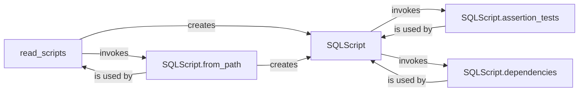

## Component Details

The Script Handler component is responsible for managing SQL scripts within the lea project. It encompasses reading scripts from specified directories, parsing them, extracting dependencies, and generating assertion tests based on comments embedded within the scripts. The central class is `SQLScript`, which represents an individual SQL script and encapsulates its metadata, dependencies, and tests. The `read_scripts` function facilitates the bulk reading of scripts from a directory. The `from_path` method handles the creation of `SQLScript` objects from file paths, including Jinja template rendering. The `dependencies` and `assertion_tests` methods extract table dependencies and generate data quality tests, respectively. These components work together to provide a comprehensive script management system for the lea project.

### SQLScript
Represents a SQL script with its metadata, including table references, code, dialect, and fields. It handles reading from a file, extracting dependencies, and generating assertion tests based on comments within the script.

**Related Classes/Methods**:

- <a href="https://github.com/carbonfact/lea/blob/master/lea/scripts.py#L23-L212" target="_blank" rel="noopener noreferrer">`lea.scripts.SQLScript` (23:212)</a>

### read_scripts
Reads all SQL scripts from a directory, applying a SQL dialect and dataset name. It filters files based on their suffixes and size, and it skips files starting with an underscore.

**Related Classes/Methods**:

- <a href="https://github.com/carbonfact/lea/blob/master/lea/scripts.py#L218-L243" target="_blank" rel="noopener noreferrer">`lea.scripts:read_scripts` (218:243)</a>

### SQLScript.from_path
Creates an SQLScript object from a file path. It handles both regular SQL files and Jinja templates, rendering the latter with environment variables.

**Related Classes/Methods**:

- <a href="https://github.com/carbonfact/lea/blob/master/lea/scripts.py#L74-L100" target="_blank" rel="noopener noreferrer">`lea.scripts.SQLScript:from_path` (74:100)</a>

### SQLScript.dependencies
Extracts table dependencies from the SQL script using sqlglot. It traverses the abstract syntax tree (AST) of the SQL code to identify table references.

**Related Classes/Methods**:

- <a href="https://github.com/carbonfact/lea/blob/master/lea/scripts.py#L115-L140" target="_blank" rel="noopener noreferrer">`lea.scripts.SQLScript:dependencies` (115:140)</a>

### SQLScript.assertion_tests
Generates assertion tests based on comments in the SQL script. It supports tags like #NO_NULLS, #UNIQUE, #UNIQUE_BY, and #SET to define different types of data quality tests.

**Related Classes/Methods**:

- <a href="https://github.com/carbonfact/lea/blob/master/lea/scripts.py#L143-L204" target="_blank" rel="noopener noreferrer">`lea.scripts.SQLScript:assertion_tests` (143:204)</a>