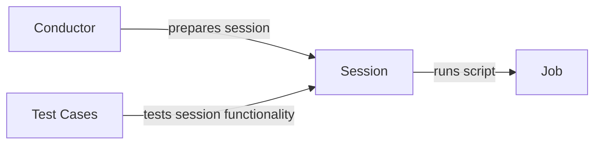

## Component Details

The Session Manager orchestrates the execution of SQL scripts within a database session. It leverages the Conductor to prepare the session environment, then executes the scripts as Jobs, monitors their progress, and promotes audit tables upon completion. Test cases validate the core functionality, ensuring scripts are executed correctly and context is properly added.

### Session
The Session class manages the lifecycle of a script execution. It is responsible for adding context to the script, running the script as a job, monitoring the job's progress, and promoting audit tables after the job completes. It interacts with the Conductor to prepare the session and with the Job class to execute the script.

**Related Classes/Methods**:

- <a href="https://github.com/carbonfact/lea/blob/master/lea/session.py#L19-L273" target="_blank" rel="noopener noreferrer">`lea.session.Session` (19:273)</a>
- <a href="https://github.com/carbonfact/lea/blob/master/lea/session.py#L87-L146" target="_blank" rel="noopener noreferrer">`lea.session.Session:add_context_to_script` (87:146)</a>
- <a href="https://github.com/carbonfact/lea/blob/master/lea/session.py#L148-L169" target="_blank" rel="noopener noreferrer">`lea.session.Session:run_script` (148:169)</a>
- <a href="https://github.com/carbonfact/lea/blob/master/lea/session.py#L171-L224" target="_blank" rel="noopener noreferrer">`lea.session.Session:monitor_job` (171:224)</a>
- <a href="https://github.com/carbonfact/lea/blob/master/lea/session.py#L226-L248" target="_blank" rel="noopener noreferrer">`lea.session.Session:promote_audit_table` (226:248)</a>

### Conductor
The Conductor class is responsible for preparing the session environment. It sets up the necessary configurations and resources required for the script execution. It interacts with the Session class to initiate and manage the session.

**Related Classes/Methods**:

- <a href="https://github.com/carbonfact/lea/blob/master/lea/conductor.py#L22-L351" target="_blank" rel="noopener noreferrer">`lea.conductor.Conductor` (22:351)</a>
- <a href="https://github.com/carbonfact/lea/blob/master/lea/conductor.py#L120-L221" target="_blank" rel="noopener noreferrer">`lea.conductor.Conductor:prepare_session` (120:221)</a>

### Job
The Job class represents the execution of a script. It is responsible for running the script and providing status updates during execution. It is invoked by the Session class to execute the script.

**Related Classes/Methods**:

- <a href="https://github.com/carbonfact/lea/blob/master/lea/job.py#L22-L31" target="_blank" rel="noopener noreferrer">`lea.job.Job` (22:31)</a>

### Test Cases
The test cases in `lea.test_big_query` and `lea.test_duckdb` validate the functionality of the Session class, particularly the `add_context_to_script` method. They set up different scenarios and assert the expected behavior.

**Related Classes/Methods**:

- <a href="https://github.com/carbonfact/lea/blob/master/lea/test_big_query.py#L70-L102" target="_blank" rel="noopener noreferrer">`lea.test_big_query:test_simple_run` (70:102)</a>
- <a href="https://github.com/carbonfact/lea/blob/master/lea/test_big_query.py#L105-L150" target="_blank" rel="noopener noreferrer">`lea.test_big_query:test_incremental_field` (105:150)</a>
- <a href="https://github.com/carbonfact/lea/blob/master/lea/test_big_query.py#L153-L198" target="_blank" rel="noopener noreferrer">`lea.test_big_query:test_incremental_field_with_comma` (153:198)</a>
- <a href="https://github.com/carbonfact/lea/blob/master/lea/test_big_query.py#L201-L227" target="_blank" rel="noopener noreferrer">`lea.test_big_query:test_incremental_field_but_no_incremental_table_selected` (201:227)</a>
- <a href="https://github.com/carbonfact/lea/blob/master/lea/test_big_query.py#L230-L256" target="_blank" rel="noopener noreferrer">`lea.test_big_query:test_incremental_field_with_just_incremental_table_selected` (230:256)</a>
- <a href="https://github.com/carbonfact/lea/blob/master/lea/test_big_query.py#L259-L289" target="_blank" rel="noopener noreferrer">`lea.test_big_query:test_incremental_field_with_just_incremental_table_selected_and_materialized_dependency` (259:289)</a>
- <a href="https://github.com/carbonfact/lea/blob/master/lea/test_big_query.py#L292-L328" target="_blank" rel="noopener noreferrer">`lea.test_big_query:test_incremental_field_but_no_incremental_table_selected_and_yet_dependency_is_materialized` (292:328)</a>
- <a href="https://github.com/carbonfact/lea/blob/master/lea/test_big_query.py#L331-L372" target="_blank" rel="noopener noreferrer">`lea.test_big_query:test_incremental_field_but_no_incremental_table_selected_and_yet_dependency_is_materialized_with_client` (331:372)</a>
- <a href="https://github.com/carbonfact/lea/blob/master/lea/test_duckdb.py#L66-L102" target="_blank" rel="noopener noreferrer">`lea.test_duckdb:test_simple_run` (66:102)</a>
- <a href="https://github.com/carbonfact/lea/blob/master/lea/test_duckdb.py#L105-L150" target="_blank" rel="noopener noreferrer">`lea.test_duckdb:test_incremental_field` (105:150)</a>
- <a href="https://github.com/carbonfact/lea/blob/master/lea/test_duckdb.py#L153-L179" target="_blank" rel="noopener noreferrer">`lea.test_duckdb:test_incremental_field_but_no_incremental_table_selected` (153:179)</a>
- <a href="https://github.com/carbonfact/lea/blob/master/lea/test_duckdb.py#L183-L209" target="_blank" rel="noopener noreferrer">`lea.test_duckdb:test_incremental_field_with_just_incremental_table_selected` (183:209)</a>
- <a href="https://github.com/carbonfact/lea/blob/master/lea/test_duckdb.py#L212-L242" target="_blank" rel="noopener noreferrer">`lea.test_duckdb:test_incremental_field_with_just_incremental_table_selected_and_materialized_dependency` (212:242)</a>
- <a href="https://github.com/carbonfact/lea/blob/master/lea/test_duckdb.py#L245-L281" target="_blank" rel="noopener noreferrer">`lea.test_duckdb:test_incremental_field_but_no_incremental_table_selected_and_yet_dependency_is_materialized` (245:281)</a>
- <a href="https://github.com/carbonfact/lea/blob/master/lea/test_duckdb.py#L284-L324" target="_blank" rel="noopener noreferrer">`lea.test_duckdb:test_incremental_field_but_no_incremental_table_selected_and_yet_dependency_is_materialized_with_client` (284:324)</a>