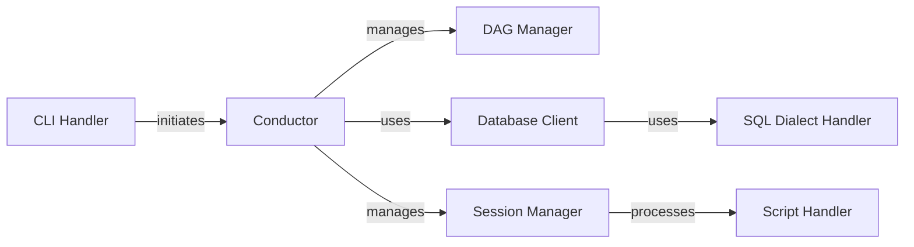

## Component Details

Lea is a data transformation tool that orchestrates the execution of SQL scripts within different database environments. The tool parses command-line arguments, constructs a directed acyclic graph (DAG) of SQL scripts based on their dependencies, and executes these scripts in the correct order using database-specific clients. It manages database sessions, handles SQL dialect variations, and provides mechanisms for testing data quality and managing audit tables. The core functionality revolves around transforming data through SQL scripts, ensuring data integrity, and supporting multiple database systems.

### CLI Handler
The CLI Handler serves as the entry point for the Lea application. It parses command-line arguments using `lea.cli:run` and initiates the data transformation pipeline by calling the Conductor. It is responsible for setting up the environment and triggering the execution of the data transformation process based on user-provided arguments.

**Related Classes/Methods**:

- <a href="https://github.com/carbonfact/lea/blob/master/lea/cli.py#L31-L57" target="_blank" rel="noopener noreferrer">`lea.cli:run` (31:57)</a>

### Conductor
The Conductor orchestrates the entire data transformation process. It manages the DAG of scripts, prepares the database session, and executes the scripts in the correct order. It initializes database clients, manages audit tables, and handles the overall execution flow. The Conductor uses the DAG Manager to understand script dependencies and the Session Manager to execute scripts within a database session, ensuring that the data transformation is performed correctly and efficiently.

**Related Classes/Methods**:

- <a href="https://github.com/carbonfact/lea/blob/master/lea/conductor.py#L22-L351" target="_blank" rel="noopener noreferrer">`lea.conductor.Conductor` (22:351)</a>
- <a href="https://github.com/carbonfact/lea/blob/master/lea/conductor.py#L23-L88" target="_blank" rel="noopener noreferrer">`lea.conductor.Conductor:__init__` (23:88)</a>
- <a href="https://github.com/carbonfact/lea/blob/master/lea/conductor.py#L90-L118" target="_blank" rel="noopener noreferrer">`lea.conductor.Conductor:run` (90:118)</a>
- <a href="https://github.com/carbonfact/lea/blob/master/lea/conductor.py#L120-L221" target="_blank" rel="noopener noreferrer">`lea.conductor.Conductor:prepare_session` (120:221)</a>
- <a href="https://github.com/carbonfact/lea/blob/master/lea/conductor.py#L223-L254" target="_blank" rel="noopener noreferrer">`lea.conductor.Conductor:run_session` (223:254)</a>
- <a href="https://github.com/carbonfact/lea/blob/master/lea/conductor.py#L256-L325" target="_blank" rel="noopener noreferrer">`lea.conductor.Conductor:make_client` (256:325)</a>
- <a href="https://github.com/carbonfact/lea/blob/master/lea/conductor.py#L354-L396" target="_blank" rel="noopener noreferrer">`lea.conductor:materialize_scripts` (354:396)</a>
- <a href="https://github.com/carbonfact/lea/blob/master/lea/conductor.py#L424-L441" target="_blank" rel="noopener noreferrer">`lea.conductor:delete_audit_tables` (424:441)</a>
- <a href="https://github.com/carbonfact/lea/blob/master/lea/conductor.py#L444-L457" target="_blank" rel="noopener noreferrer">`lea.conductor:delete_orphan_tables` (444:457)</a>

### DAG Manager
The DAG Manager constructs and manipulates the Directed Acyclic Graph (DAG) of SQL scripts. It determines the execution order of scripts based on their dependencies. It allows selecting subgraphs based on changed table references and iterating through ancestors and descendants of nodes in the graph. The DAG Manager provides the Conductor with the necessary information to execute scripts in the correct order, ensuring that dependencies are met before a script is executed.

**Related Classes/Methods**:

- <a href="https://github.com/carbonfact/lea/blob/master/lea/dag.py#L15-L182" target="_blank" rel="noopener noreferrer">`lea.dag.DAGOfScripts` (15:182)</a>
- <a href="https://github.com/carbonfact/lea/blob/master/lea/dag.py#L32-L66" target="_blank" rel="noopener noreferrer">`lea.dag.DAGOfScripts:from_directory` (32:66)</a>
- <a href="https://github.com/carbonfact/lea/blob/master/lea/dag.py#L68-L148" target="_blank" rel="noopener noreferrer">`lea.dag.DAGOfScripts:select` (68:148)</a>
- <a href="https://github.com/carbonfact/lea/blob/master/lea/dag.py#L173-L176" target="_blank" rel="noopener noreferrer">`lea.dag.DAGOfScripts:iter_ancestors` (173:176)</a>
- <a href="https://github.com/carbonfact/lea/blob/master/lea/dag.py#L178-L182" target="_blank" rel="noopener noreferrer">`lea.dag.DAGOfScripts:iter_descendants` (178:182)</a>

### Database Client
The Database Client provides an abstraction layer for interacting with different database systems (BigQuery, DuckDB, MotherDuck, DuckLake). It handles tasks such as materializing scripts, querying data, cloning tables, deleting tables, and listing table statistics and fields. The Conductor uses the Database Client to execute scripts and manage data within a specific database, abstracting away the complexities of interacting with different database systems.

**Related Classes/Methods**:

- <a href="https://github.com/carbonfact/lea/blob/master/lea/databases.py#L266-L532" target="_blank" rel="noopener noreferrer">`lea.databases.BigQueryClient` (266:532)</a>
- <a href="https://github.com/carbonfact/lea/blob/master/lea/databases.py#L584-L758" target="_blank" rel="noopener noreferrer">`lea.databases.DuckDBClient` (584:758)</a>
- <a href="https://github.com/carbonfact/lea/blob/master/lea/databases.py#L761-L772" target="_blank" rel="noopener noreferrer">`lea.databases.MotherDuckClient` (761:772)</a>
- <a href="https://github.com/carbonfact/lea/blob/master/lea/databases.py#L775-L786" target="_blank" rel="noopener noreferrer">`lea.databases.DuckLakeClient` (775:786)</a>
- <a href="https://github.com/carbonfact/lea/blob/master/lea/databases.py#L267-L311" target="_blank" rel="noopener noreferrer">`lea.databases.BigQueryClient:__init__` (267:311)</a>
- <a href="https://github.com/carbonfact/lea/blob/master/lea/databases.py#L334-L337" target="_blank" rel="noopener noreferrer">`lea.databases.BigQueryClient:materialize_script` (334:337)</a>
- <a href="https://github.com/carbonfact/lea/blob/master/lea/databases.py#L339-L380" target="_blank" rel="noopener noreferrer">`lea.databases.BigQueryClient:materialize_sql_script` (339:380)</a>
- <a href="https://github.com/carbonfact/lea/blob/master/lea/databases.py#L382-L385" target="_blank" rel="noopener noreferrer">`lea.databases.BigQueryClient:query_script` (382:385)</a>
- <a href="https://github.com/carbonfact/lea/blob/master/lea/databases.py#L387-L404" target="_blank" rel="noopener noreferrer">`lea.databases.BigQueryClient:query_sql_script` (387:404)</a>
- <a href="https://github.com/carbonfact/lea/blob/master/lea/databases.py#L406-L428" target="_blank" rel="noopener noreferrer">`lea.databases.BigQueryClient:clone_table` (406:428)</a>
- <a href="https://github.com/carbonfact/lea/blob/master/lea/databases.py#L430-L467" target="_blank" rel="noopener noreferrer">`lea.databases.BigQueryClient:delete_and_insert` (430:467)</a>
- <a href="https://github.com/carbonfact/lea/blob/master/lea/databases.py#L469-L487" target="_blank" rel="noopener noreferrer">`lea.databases.BigQueryClient:delete_table` (469:487)</a>
- <a href="https://github.com/carbonfact/lea/blob/master/lea/databases.py#L489-L506" target="_blank" rel="noopener noreferrer">`lea.databases.BigQueryClient:list_table_stats` (489:506)</a>
- <a href="https://github.com/carbonfact/lea/blob/master/lea/databases.py#L508-L522" target="_blank" rel="noopener noreferrer">`lea.databases.BigQueryClient:list_table_fields` (508:522)</a>
- <a href="https://github.com/carbonfact/lea/blob/master/lea/databases.py#L606-L609" target="_blank" rel="noopener noreferrer">`lea.databases.DuckDBClient:materialize_script` (606:609)</a>
- <a href="https://github.com/carbonfact/lea/blob/master/lea/databases.py#L611-L634" target="_blank" rel="noopener noreferrer">`lea.databases.DuckDBClient:materialize_sql_script` (611:634)</a>
- <a href="https://github.com/carbonfact/lea/blob/master/lea/databases.py#L636-L640" target="_blank" rel="noopener noreferrer">`lea.databases.DuckDBClient:query_script` (636:640)</a>
- <a href="https://github.com/carbonfact/lea/blob/master/lea/databases.py#L642-L658" target="_blank" rel="noopener noreferrer">`lea.databases.DuckDBClient:clone_table` (642:658)</a>
- <a href="https://github.com/carbonfact/lea/blob/master/lea/databases.py#L660-L684" target="_blank" rel="noopener noreferrer">`lea.databases.DuckDBClient:delete_and_insert` (660:684)</a>
- <a href="https://github.com/carbonfact/lea/blob/master/lea/databases.py#L686-L697" target="_blank" rel="noopener noreferrer">`lea.databases.DuckDBClient:delete_table` (686:697)</a>
- <a href="https://github.com/carbonfact/lea/blob/master/lea/databases.py#L706-L736" target="_blank" rel="noopener noreferrer">`lea.databases.DuckDBClient:list_table_stats` (706:736)</a>
- <a href="https://github.com/carbonfact/lea/blob/master/lea/databases.py#L738-L750" target="_blank" rel="noopener noreferrer">`lea.databases.DuckDBClient:list_table_fields` (738:750)</a>
- <a href="https://github.com/carbonfact/lea/blob/master/lea/databases.py#L752-L758" target="_blank" rel="noopener noreferrer">`lea.databases.DuckDBClient:make_job_config` (752:758)</a>

### SQL Dialect Handler
The SQL Dialect Handler provides dialect-specific functionality for parsing and formatting table references, converting table references to database-specific formats, and generating SQL code for data quality tests. The Database Client uses the SQL Dialect Handler to adapt SQL scripts to the specific database system being used, ensuring that the SQL scripts are compatible with the target database.

**Related Classes/Methods**:

- <a href="https://github.com/carbonfact/lea/blob/master/lea/dialects.py#L121-L172" target="_blank" rel="noopener noreferrer">`lea.dialects.BigQueryDialect` (121:172)</a>
- <a href="https://github.com/carbonfact/lea/blob/master/lea/dialects.py#L175-L229" target="_blank" rel="noopener noreferrer">`lea.dialects.DuckDBDialect` (175:229)</a>
- <a href="https://github.com/carbonfact/lea/blob/master/lea/dialects.py#L15-L108" target="_blank" rel="noopener noreferrer">`lea.dialects.SQLDialect` (15:108)</a>
- <a href="https://github.com/carbonfact/lea/blob/master/lea/dialects.py#L26-L30" target="_blank" rel="noopener noreferrer">`lea.dialects.SQLDialect:make_column_test_unique` (26:30)</a>
- <a href="https://github.com/carbonfact/lea/blob/master/lea/dialects.py#L32-L38" target="_blank" rel="noopener noreferrer">`lea.dialects.SQLDialect:make_column_test_unique_by` (32:38)</a>
- <a href="https://github.com/carbonfact/lea/blob/master/lea/dialects.py#L40-L44" target="_blank" rel="noopener noreferrer">`lea.dialects.SQLDialect:make_column_test_no_nulls` (40:44)</a>
- <a href="https://github.com/carbonfact/lea/blob/master/lea/dialects.py#L46-L52" target="_blank" rel="noopener noreferrer">`lea.dialects.SQLDialect:make_column_test_set` (46:52)</a>
- <a href="https://github.com/carbonfact/lea/blob/master/lea/dialects.py#L55-L76" target="_blank" rel="noopener noreferrer">`lea.dialects.SQLDialect:add_dependency_filters` (55:76)</a>
- <a href="https://github.com/carbonfact/lea/blob/master/lea/dialects.py#L79-L108" target="_blank" rel="noopener noreferrer">`lea.dialects.SQLDialect:handle_incremental_dependencies` (79:108)</a>
- <a href="https://github.com/carbonfact/lea/blob/master/lea/dialects.py#L125-L153" target="_blank" rel="noopener noreferrer">`lea.dialects.BigQueryDialect:parse_table_ref` (125:153)</a>
- <a href="https://github.com/carbonfact/lea/blob/master/lea/dialects.py#L179-L202" target="_blank" rel="noopener noreferrer">`lea.dialects.DuckDBDialect:parse_table_ref` (179:202)</a>
- <a href="https://github.com/carbonfact/lea/blob/master/lea/dialects.py#L228-L229" target="_blank" rel="noopener noreferrer">`lea.dialects.DuckDBDialect:convert_table_ref_to_duckdb_table_reference` (228:229)</a>

### Script Handler
The Script Handler is responsible for reading, parsing, and processing SQL scripts. It extracts dependencies, identifies assertion tests, and adds context to the scripts. The Conductor uses the Script Handler to understand the dependencies between scripts and to prepare them for execution, ensuring that all necessary information is available before a script is executed.

**Related Classes/Methods**:

- <a href="https://github.com/carbonfact/lea/blob/master/lea/scripts.py#L23-L212" target="_blank" rel="noopener noreferrer">`lea.scripts.SQLScript` (23:212)</a>
- <a href="https://github.com/carbonfact/lea/blob/master/lea/scripts.py#L74-L100" target="_blank" rel="noopener noreferrer">`lea.scripts.SQLScript:from_path` (74:100)</a>
- <a href="https://github.com/carbonfact/lea/blob/master/lea/scripts.py#L115-L140" target="_blank" rel="noopener noreferrer">`lea.scripts.SQLScript:dependencies` (115:140)</a>
- <a href="https://github.com/carbonfact/lea/blob/master/lea/scripts.py#L143-L204" target="_blank" rel="noopener noreferrer">`lea.scripts.SQLScript:assertion_tests` (143:204)</a>
- <a href="https://github.com/carbonfact/lea/blob/master/lea/scripts.py#L218-L243" target="_blank" rel="noopener noreferrer">`lea.scripts:read_scripts` (218:243)</a>

### Session Manager
The Session Manager handles the execution of SQL scripts within a database session. It adds context to scripts, runs scripts, monitors job execution, and promotes audit tables. The Conductor uses the Session Manager to manage the execution of scripts within a specific database session, ensuring that scripts are executed correctly and that audit tables are properly maintained.

**Related Classes/Methods**:

- <a href="https://github.com/carbonfact/lea/blob/master/lea/session.py#L19-L273" target="_blank" rel="noopener noreferrer">`lea.session.Session` (19:273)</a>
- <a href="https://github.com/carbonfact/lea/blob/master/lea/session.py#L87-L146" target="_blank" rel="noopener noreferrer">`lea.session.Session:add_context_to_script` (87:146)</a>
- <a href="https://github.com/carbonfact/lea/blob/master/lea/session.py#L148-L169" target="_blank" rel="noopener noreferrer">`lea.session.Session:run_script` (148:169)</a>
- <a href="https://github.com/carbonfact/lea/blob/master/lea/session.py#L171-L224" target="_blank" rel="noopener noreferrer">`lea.session.Session:monitor_job` (171:224)</a>
- <a href="https://github.com/carbonfact/lea/blob/master/lea/session.py#L226-L248" target="_blank" rel="noopener noreferrer">`lea.session.Session:promote_audit_table` (226:248)</a>