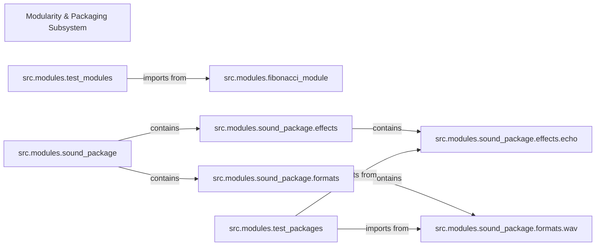

## Component Details

This subsystem is designed to illustrate the fundamental concepts of code organization in Python through modules and packages. It demonstrates how to structure code for reusability, maintainability, and efficient collaboration in larger projects. The components within this subsystem showcase various import mechanisms, from simple module imports to complex package hierarchies with nested sub-packages.

### Modularity & Packaging Subsystem
The overarching component that encapsulates all examples related to Python modules and packages. Its purpose is to provide a practical demonstration of how code can be logically grouped and accessed across different files and directories, forming a cohesive and manageable codebase.

**Related Classes/Methods**:

- `src/modules/` (0:0)

### src.modules.fibonacci_module
A basic, self-contained module that defines functions for generating Fibonacci numbers. It serves as a simple, clear example of a Python module, demonstrating how functions can be encapsulated and made available for import by other parts of the system. It also illustrates the `if __name__ == '__main__'` pattern for dual use as a script and an importable module.

**Related Classes/Methods**:

- <a href="https://github.com/trekhleb/learn-python/blob/master/src/modules/fibonacci_module.py#L0-L0" target="_blank" rel="noopener noreferrer">`src.modules.fibonacci_module` (0:0)</a>

### src.modules.test_modules
This module's primary role is to demonstrate how to import and utilize functionalities from other simple modules, specifically `fibonacci_module`. It showcases different import syntaxes (e.g., `import module`, `from module import function`, `import module as alias`), thereby illustrating the basic mechanisms of module interaction.

**Related Classes/Methods**:

- <a href="https://github.com/trekhleb/learn-python/blob/master/src/modules/test_modules.py#L0-L0" target="_blank" rel="noopener noreferrer">`src.modules.test_modules` (0:0)</a>

### src.modules.sound_package
This component represents a top-level Python package. Its existence, marked by an `__init__.py` file, signifies a directory that can contain other modules and sub-packages. It is fundamental for demonstrating how to group related functionalities into a larger, organized unit, serving as the root for a hierarchical code structure.

**Related Classes/Methods**:

- `src.modules.sound_package` (0:0)

### src.modules.sound_package.effects
A sub-package nested within `sound_package`. Its purpose is to demonstrate the concept of hierarchical packaging, where related functionalities (in this case, sound effects) are further organized into a dedicated sub-directory. This promotes better organization and prevents naming conflicts.

**Related Classes/Methods**:

- `src.modules.sound_package.effects` (0:0)

### src.modules.sound_package.effects.echo
A module residing within the `effects` sub-package. It provides a specific mock function (`echo_function`) related to sound effects. This component exemplifies a leaf-node module within a deep package hierarchy, showing how individual functionalities are encapsulated at the lowest level of organization.

**Related Classes/Methods**:

- <a href="https://github.com/trekhleb/learn-python/blob/master/src/modules/sound_package/effects/echo.py#L0-L0" target="_blank" rel="noopener noreferrer">`src.modules.sound_package.effects.echo` (0:0)</a>

### src.modules.sound_package.formats
Another sub-package within `sound_package`, parallel to `effects`. It is dedicated to handling different sound file formats. This component reinforces the concept of logical separation within a package, allowing different categories of functionalities to coexist in an organized manner.

**Related Classes/Methods**:

- `src.modules.sound_package.formats` (0:0)

### src.modules.sound_package.formats.wav
A module located within the `formats` sub-package, providing a mock function for WAV file handling. Similar to `echo`, it demonstrates how specific format-related functionalities are implemented and contained within a module at the lowest level of the package structure.

**Related Classes/Methods**:

- <a href="https://github.com/trekhleb/learn-python/blob/master/src/modules/sound_package/formats/wav.py#L0-L0" target="_blank" rel="noopener noreferrer">`src.modules.sound_package.formats.wav` (0:0)</a>

### src.modules.test_packages
This module is crucial for demonstrating how to import and interact with components from complex, multi-level package structures like `sound_package`. It showcases various import strategies (e.g., absolute imports, `from package.subpackage import module`, `from package.subpackage.module import function`), which are essential for navigating and utilizing code within large, organized projects.

**Related Classes/Methods**:

- <a href="https://github.com/trekhleb/learn-python/blob/master/src/modules/test_packages.py#L0-L0" target="_blank" rel="noopener noreferrer">`src.modules.test_packages` (0:0)</a>

### [FAQ](https://github.com/CodeBoarding/GeneratedOnBoardings/tree/main?tab=readme-ov-file#faq)