```mermaid
graph LR
    Core_Concepts["Core Concepts"]
    Data_Structures_Types["Data Structures & Types"]
    Operators["Operators"]
    Program_Flow_Error_Handling["Program Flow & Error Handling"]
    Functions_Advanced_Callables["Functions & Advanced Callables"]
    Object_Oriented_Programming_OOP_["Object-Oriented Programming (OOP)"]
    Input_Output_I_O_["Input/Output (I/O)"]
    Modularity_Packaging["Modularity & Packaging"]
    Standard_Library_Utilities["Standard Library Utilities"]
    Core_Concepts -- "is a prerequisite for" --> Data_Structures_Types
    Core_Concepts -- "is a prerequisite for" --> Program_Flow_Error_Handling
    Data_Structures_Types -- "are manipulated by" --> Operators
    Data_Structures_Types -- "are utilized by" --> Functions_Advanced_Callables
    Operators -- "manipulate" --> Data_Structures_Types
    Operators -- "are utilized in" --> Program_Flow_Error_Handling
    Program_Flow_Error_Handling -- "enables logic in" --> Functions_Advanced_Callables
    Program_Flow_Error_Handling -- "uses" --> Data_Structures_Types
    Functions_Advanced_Callables -- "compose" --> Object_Oriented_Programming_OOP_
    Functions_Advanced_Callables -- "are organized by" --> Modularity_Packaging
    Object_Oriented_Programming_OOP_ -- "is composed of" --> Functions_Advanced_Callables
    Object_Oriented_Programming_OOP_ -- "uses" --> Data_Structures_Types
    Input_Output_I_O_ -- "processes" --> Data_Structures_Types
    Input_Output_I_O_ -- "requires" --> Program_Flow_Error_Handling
    Modularity_Packaging -- "organizes" --> Functions_Advanced_Callables
    Modularity_Packaging -- "complements" --> Standard_Library_Utilities
    Standard_Library_Utilities -- "provides utilities for" --> Data_Structures_Types
    Standard_Library_Utilities -- "accessed via" --> Modularity_Packaging
    click Modularity_Packaging href "https://github.com/CodeBoarding/GeneratedOnBoardings/blob/main//learn-python/Modularity_Packaging.md" "Details"
```

## Component Details

The `learn-python` project is structured around a progressive learning path, with each component building upon the foundational knowledge provided by previous ones. The identified components are fundamental as they represent the core building blocks of Python programming, from basic syntax to advanced concepts like object-oriented programming and modular design. Their interdependencies reflect the natural flow of learning and practical application of these concepts in software development.

### Core Concepts
This component introduces the absolute basics of Python, including fundamental syntax, variable declaration, and the `pass` statement. It serves as the initial entry point, establishing the foundational understanding required for all subsequent topics.

**Related Classes/Methods**:

- <a href="https://github.com/trekhleb/learn-python/blob/master/src/getting_started/test_variables.py#L1-L1" target="_blank" rel="noopener noreferrer">`src/getting_started/test_variables.py` (1:1)</a>
- `src/getting_started/python_syntax.md` (1:1)
- `src/getting_started/what_is_python.md` (1:1)
- <a href="https://github.com/trekhleb/learn-python/blob/master/src/additions/test_pass.py#L1-L1" target="_blank" rel="noopener noreferrer">`src/additions/test_pass.py` (1:1)</a>

### Data Structures & Types
Focuses on Python's built-in data structures (lists, dictionaries, sets, tuples) and primitive types (numbers, strings), along with type casting. It teaches how to represent and organize information within a program.

**Related Classes/Methods**:

- <a href="https://github.com/trekhleb/learn-python/blob/master/src/data_types/test_dictionaries.py#L1-L1" target="_blank" rel="noopener noreferrer">`src/data_types/test_dictionaries.py` (1:1)</a>
- <a href="https://github.com/trekhleb/learn-python/blob/master/src/data_types/test_lists.py#L1-L1" target="_blank" rel="noopener noreferrer">`src/data_types/test_lists.py` (1:1)</a>
- <a href="https://github.com/trekhleb/learn-python/blob/master/src/data_types/test_numbers.py#L1-L1" target="_blank" rel="noopener noreferrer">`src/data_types/test_numbers.py` (1:1)</a>
- <a href="https://github.com/trekhleb/learn-python/blob/master/src/data_types/test_sets.py#L1-L1" target="_blank" rel="noopener noreferrer">`src/data_types/test_sets.py` (1:1)</a>
- <a href="https://github.com/trekhleb/learn-python/blob/master/src/data_types/test_strings.py#L1-L1" target="_blank" rel="noopener noreferrer">`src/data_types/test_strings.py` (1:1)</a>
- <a href="https://github.com/trekhleb/learn-python/blob/master/src/data_types/test_tuples.py#L1-L1" target="_blank" rel="noopener noreferrer">`src/data_types/test_tuples.py` (1:1)</a>
- <a href="https://github.com/trekhleb/learn-python/blob/master/src/data_types/test_type_casting.py#L1-L1" target="_blank" rel="noopener noreferrer">`src/data_types/test_type_casting.py` (1:1)</a>

### Operators
Demonstrates various Python operators (arithmetic, assignment, comparison, logical, identity, membership, bitwise) and their usage in expressions to perform computations and comparisons on data.

**Related Classes/Methods**:

- <a href="https://github.com/trekhleb/learn-python/blob/master/src/operators/test_arithmetic.py#L1-L1" target="_blank" rel="noopener noreferrer">`src/operators/test_arithmetic.py` (1:1)</a>
- <a href="https://github.com/trekhleb/learn-python/blob/master/src/operators/test_assigment.py#L1-L1" target="_blank" rel="noopener noreferrer">`src/operators/test_assigment.py` (1:1)</a>
- <a href="https://github.com/trekhleb/learn-python/blob/master/src/operators/test_bitwise.py#L1-L1" target="_blank" rel="noopener noreferrer">`src/operators/test_bitwise.py` (1:1)</a>
- <a href="https://github.com/trekhleb/learn-python/blob/master/src/operators/test_comparison.py#L1-L1" target="_blank" rel="noopener noreferrer">`src/operators/test_comparison.py` (1:1)</a>
- <a href="https://github.com/trekhleb/learn-python/blob/master/src/operators/test_identity.py#L1-L1" target="_blank" rel="noopener noreferrer">`src/operators/test_identity.py` (1:1)</a>
- <a href="https://github.com/trekhleb/learn-python/blob/master/src/operators/test_logical.py#L1-L1" target="_blank" rel="noopener noreferrer">`src/operators/test_logical.py` (1:1)</a>
- <a href="https://github.com/trekhleb/learn-python/blob/master/src/operators/test_membership.py#L1-L1" target="_blank" rel="noopener noreferrer">`src/operators/test_membership.py` (1:1)</a>

### Program Flow & Error Handling
Illustrates how to control the execution path of a program using conditional statements (`if`), loops (`for`, `while`), loop control (`break`, `continue`), and robust error management using `try-except` blocks. This is crucial for creating dynamic and resilient programs.

**Related Classes/Methods**:

- <a href="https://github.com/trekhleb/learn-python/blob/master/src/control_flow/test_break.py#L1-L1" target="_blank" rel="noopener noreferrer">`src/control_flow/test_break.py` (1:1)</a>
- <a href="https://github.com/trekhleb/learn-python/blob/master/src/control_flow/test_continue.py#L1-L1" target="_blank" rel="noopener noreferrer">`src/control_flow/test_continue.py` (1:1)</a>
- <a href="https://github.com/trekhleb/learn-python/blob/master/src/control_flow/test_for.py#L1-L1" target="_blank" rel="noopener noreferrer">`src/control_flow/test_for.py` (1:1)</a>
- <a href="https://github.com/trekhleb/learn-python/blob/master/src/control_flow/test_if.py#L1-L1" target="_blank" rel="noopener noreferrer">`src/control_flow/test_if.py` (1:1)</a>
- <a href="https://github.com/trekhleb/learn-python/blob/master/src/control_flow/test_try.py#L1-L1" target="_blank" rel="noopener noreferrer">`src/control_flow/test_try.py` (1:1)</a>
- <a href="https://github.com/trekhleb/learn-python/blob/master/src/control_flow/test_while.py#L1-L1" target="_blank" rel="noopener noreferrer">`src/control_flow/test_while.py` (1:1)</a>
- <a href="https://github.com/trekhleb/learn-python/blob/master/src/exceptions/test_handle_exceptions.py#L1-L1" target="_blank" rel="noopener noreferrer">`src/exceptions/test_handle_exceptions.py` (1:1)</a>
- <a href="https://github.com/trekhleb/learn-python/blob/master/src/exceptions/test_raise_exceptions.py#L1-L1" target="_blank" rel="noopener noreferrer">`src/exceptions/test_raise_exceptions.py` (1:1)</a>

### Functions & Advanced Callables
Covers the definition, invocation, and advanced features of functions, including arguments, decorators, scopes, lambda expressions, and generators for efficient iteration. This component promotes code reusability and modularity.

**Related Classes/Methods**:

- <a href="https://github.com/trekhleb/learn-python/blob/master/src/functions/test_function_annotations.py#L1-L1" target="_blank" rel="noopener noreferrer">`src/functions/test_function_annotations.py` (1:1)</a>
- <a href="https://github.com/trekhleb/learn-python/blob/master/src/functions/test_function_arbitrary_arguments.py#L1-L1" target="_blank" rel="noopener noreferrer">`src/functions/test_function_arbitrary_arguments.py` (1:1)</a>
- <a href="https://github.com/trekhleb/learn-python/blob/master/src/functions/test_function_decorators.py#L1-L1" target="_blank" rel="noopener noreferrer">`src/functions/test_function_decorators.py` (1:1)</a>
- <a href="https://github.com/trekhleb/learn-python/blob/master/src/functions/test_function_default_arguments.py#L1-L1" target="_blank" rel="noopener noreferrer">`src/functions/test_function_default_arguments.py` (1:1)</a>
- <a href="https://github.com/trekhleb/learn-python/blob/master/src/functions/test_function_definition.py#L1-L1" target="_blank" rel="noopener noreferrer">`src/functions/test_function_definition.py` (1:1)</a>
- <a href="https://github.com/trekhleb/learn-python/blob/master/src/functions/test_function_documentation_string.py#L1-L1" target="_blank" rel="noopener noreferrer">`src/functions/test_function_documentation_string.py` (1:1)</a>
- <a href="https://github.com/trekhleb/learn-python/blob/master/src/functions/test_function_keyword_arguments.py#L1-L1" target="_blank" rel="noopener noreferrer">`src/functions/test_function_keyword_arguments.py` (1:1)</a>
- <a href="https://github.com/trekhleb/learn-python/blob/master/src/functions/test_function_scopes.py#L1-L1" target="_blank" rel="noopener noreferrer">`src/functions/test_function_scopes.py` (1:1)</a>
- <a href="https://github.com/trekhleb/learn-python/blob/master/src/functions/test_function_unpacking_arguments.py#L1-L1" target="_blank" rel="noopener noreferrer">`src/functions/test_function_unpacking_arguments.py` (1:1)</a>
- <a href="https://github.com/trekhleb/learn-python/blob/master/src/functions/test_lambda_expressions.py#L1-L1" target="_blank" rel="noopener noreferrer">`src/functions/test_lambda_expressions.py` (1:1)</a>
- <a href="https://github.com/trekhleb/learn-python/blob/master/src/additions/test_generators.py#L1-L1" target="_blank" rel="noopener noreferrer">`src/additions/test_generators.py` (1:1)</a>

### Object-Oriented Programming (OOP)
Explains Object-Oriented Programming (OOP) concepts in Python, such as class and instance variables, class and instance objects, methods, and inheritance. This enables structured and scalable code design.

**Related Classes/Methods**:

- <a href="https://github.com/trekhleb/learn-python/blob/master/src/classes/test_class_and_instance_variables.py#L1-L1" target="_blank" rel="noopener noreferrer">`src/classes/test_class_and_instance_variables.py` (1:1)</a>
- <a href="https://github.com/trekhleb/learn-python/blob/master/src/classes/test_class_definition.py#L1-L1" target="_blank" rel="noopener noreferrer">`src/classes/test_class_definition.py` (1:1)</a>
- <a href="https://github.com/trekhleb/learn-python/blob/master/src/classes/test_class_objects.py#L1-L1" target="_blank" rel="noopener noreferrer">`src/classes/test_class_objects.py` (1:1)</a>
- <a href="https://github.com/trekhleb/learn-python/blob/master/src/classes/test_inheritance.py#L1-L1" target="_blank" rel="noopener noreferrer">`src/classes/test_inheritance.py` (1:1)</a>
- <a href="https://github.com/trekhleb/learn-python/blob/master/src/classes/test_instance_objects.py#L1-L1" target="_blank" rel="noopener noreferrer">`src/classes/test_instance_objects.py` (1:1)</a>
- <a href="https://github.com/trekhleb/learn-python/blob/master/src/classes/test_method_objects.py#L1-L1" target="_blank" rel="noopener noreferrer">`src/classes/test_method_objects.py` (1:1)</a>
- <a href="https://github.com/trekhleb/learn-python/blob/master/src/classes/test_multiple_inheritance.py#L1-L1" target="_blank" rel="noopener noreferrer">`src/classes/test_multiple_inheritance.py` (1:1)</a>

### Input/Output (I/O)
Provides examples of reading from and writing to files (text and binary) and obtaining input from the user via the console. This component enables persistent data storage and interactive programs.

**Related Classes/Methods**:

- <a href="https://github.com/trekhleb/learn-python/blob/master/src/files/test_file_methods.py#L1-L1" target="_blank" rel="noopener noreferrer">`src/files/test_file_methods.py` (1:1)</a>
- <a href="https://github.com/trekhleb/learn-python/blob/master/src/files/test_file_reading.py#L1-L1" target="_blank" rel="noopener noreferrer">`src/files/test_file_reading.py` (1:1)</a>
- `src/files/binary_file` (1:1)
- `src/files/multi_line_file.txt` (1:1)
- <a href="https://github.com/trekhleb/learn-python/blob/master/src/user_input/test_input.py#L1-L1" target="_blank" rel="noopener noreferrer">`src/user_input/test_input.py` (1:1)</a>

### Modularity & Packaging
Teaches how to organize code into reusable modules and packages, demonstrating import mechanisms and package structures. This is essential for better code management, reusability, and collaboration.

**Related Classes/Methods**:

- <a href="https://github.com/trekhleb/learn-python/blob/master/src/modules/fibonacci_module.py#L1-L1" target="_blank" rel="noopener noreferrer">`src/modules/fibonacci_module.py` (1:1)</a>
- <a href="https://github.com/trekhleb/learn-python/blob/master/src/modules/test_modules.py#L1-L1" target="_blank" rel="noopener noreferrer">`src/modules/test_modules.py` (1:1)</a>
- <a href="https://github.com/trekhleb/learn-python/blob/master/src/modules/test_packages.py#L1-L1" target="_blank" rel="noopener noreferrer">`src/modules/test_packages.py` (1:1)</a>
- `src/modules/sound_package/` (1:1)

### Standard Library Utilities
Introduces commonly used modules from Python's extensive standard library, such as `datetime`, `glob`, `json`, `math`, `re`, and `zlib`. This provides ready-to-use functionalities for various common tasks, significantly accelerating development.

**Related Classes/Methods**:

- <a href="https://github.com/trekhleb/learn-python/blob/master/src/standard_libraries/test_datetime.py#L1-L1" target="_blank" rel="noopener noreferrer">`src/standard_libraries/test_datetime.py` (1:1)</a>
- <a href="https://github.com/trekhleb/learn-python/blob/master/src/standard_libraries/test_glob.py#L1-L1" target="_blank" rel="noopener noreferrer">`src/standard_libraries/test_glob.py` (1:1)</a>
- <a href="https://github.com/trekhleb/learn-python/blob/master/src/standard_libraries/test_json.py#L1-L1" target="_blank" rel="noopener noreferrer">`src/standard_libraries/test_json.py` (1:1)</a>
- <a href="https://github.com/trekhleb/learn-python/blob/master/src/standard_libraries/test_math.py#L1-L1" target="_blank" rel="noopener noreferrer">`src/standard_libraries/test_math.py` (1:1)</a>
- <a href="https://github.com/trekhleb/learn-python/blob/master/src/standard_libraries/test_re.py#L1-L1" target="_blank" rel="noopener noreferrer">`src/standard_libraries/test_re.py` (1:1)</a>
- <a href="https://github.com/trekhleb/learn-python/blob/master/src/standard_libraries/test_zlib.py#L1-L1" target="_blank" rel="noopener noreferrer">`src/standard_libraries/test_zlib.py` (1:1)</a>
- `src/standard_libraries/glob_files/` (1:1)

### [FAQ](https://github.com/CodeBoarding/GeneratedOnBoardings/tree/main?tab=readme-ov-file#faq)