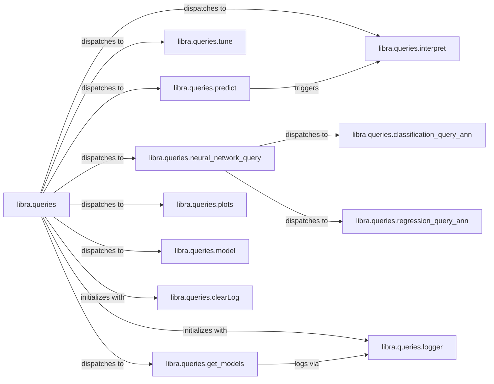

## Details

The `Client API` subsystem, primarily encapsulated within `libra.queries`, serves as the user's main interaction point with the ML library. It embodies the Facade Pattern, simplifying complex underlying ML operations.

### libra.queries
The primary user-facing component, providing a high-level abstraction for interacting with the ML library. It acts as the central orchestrator, receiving user queries, managing the overall workflow, and presenting results.

**Related Classes/Methods**:

- <a href="https://github.com/Palashio/libra/blob/master/libra/queries.py" target="_blank" rel="noopener noreferrer">`libra.queries`</a>

### libra.queries.predict
Handles user requests for making predictions using trained models, serving as a core ML inference capability.

**Related Classes/Methods**:

- <a href="https://github.com/Palashio/libra/blob/master/libra/queries.py#L150-L170" target="_blank" rel="noopener noreferrer">`libra.queries.predict`:150-170</a>

### libra.queries.interpret
Provides functionalities to explain model predictions or internal workings, enhancing model transparency.

**Related Classes/Methods**:

- <a href="https://github.com/Palashio/libra/blob/master/libra/queries.py#L172-L184" target="_blank" rel="noopener noreferrer">`libra.queries.interpret`:172-184</a>

### libra.queries.tune
Manages the process of optimizing model hyperparameters to improve performance.

**Related Classes/Methods**:

- <a href="https://github.com/Palashio/libra/blob/master/libra/queries.py#L670-L742" target="_blank" rel="noopener noreferrer">`libra.queries.tune`:670-742</a>

### libra.queries.neural_network_query
Acts as a specialized facade for neural network-related queries, abstracting specific ANN implementations.

**Related Classes/Methods**:

- <a href="https://github.com/Palashio/libra/blob/master/libra/queries.py#L188-L255" target="_blank" rel="noopener noreferrer">`libra.queries.neural_network_query`:188-255</a>

### libra.queries.get_models
Provides functionality to retrieve a list of available models within the library, enabling users to discover and select models.

**Related Classes/Methods**:

- <a href="https://github.com/Palashio/libra/blob/master/libra/queries.py#L129-L137" target="_blank" rel="noopener noreferrer">`libra.queries.get_models`:129-137</a>

### libra.queries.plots
Offers functionalities for generating visualizations and reports based on model results or data, aiding in analysis and presentation.

**Related Classes/Methods**:

- <a href="https://github.com/Palashio/libra/blob/master/libra/queries.py#L1218-L1228" target="_blank" rel="noopener noreferrer">`libra.queries.plots`:1218-1228</a>

### libra.queries.model
Provides a general interface for interacting with various ML models, likely for loading, saving, or querying model metadata.

**Related Classes/Methods**:

- <a href="https://github.com/Palashio/libra/blob/master/libra/queries.py" target="_blank" rel="noopener noreferrer">`libra.queries.model`</a>

### libra.queries.clearLog
Utility for clearing logs.

**Related Classes/Methods**:

- <a href="https://github.com/Palashio/libra/blob/master/libra/queries.py#L48-L54" target="_blank" rel="noopener noreferrer">`libra.queries.clearLog`:48-54</a>

### libra.queries.logger
Utility for logging information.

**Related Classes/Methods**:

- <a href="https://github.com/Palashio/libra/blob/master/libra/queries.py#L57-L79" target="_blank" rel="noopener noreferrer">`libra.queries.logger`:57-79</a>

### libra.queries.classification_query_ann
Specific ANN implementation for classification queries.

**Related Classes/Methods**:

- <a href="https://github.com/Palashio/libra/blob/master/libra/queries.py#L321-L378" target="_blank" rel="noopener noreferrer">`libra.queries.classification_query_ann`:321-378</a>

### libra.queries.regression_query_ann
Specific ANN implementation for regression queries.

**Related Classes/Methods**:

- <a href="https://github.com/Palashio/libra/blob/master/libra/queries.py#L259-L316" target="_blank" rel="noopener noreferrer">`libra.queries.regression_query_ann`:259-316</a>

### [FAQ](https://github.com/CodeBoarding/GeneratedOnBoardings/tree/main?tab=readme-ov-file#faq)