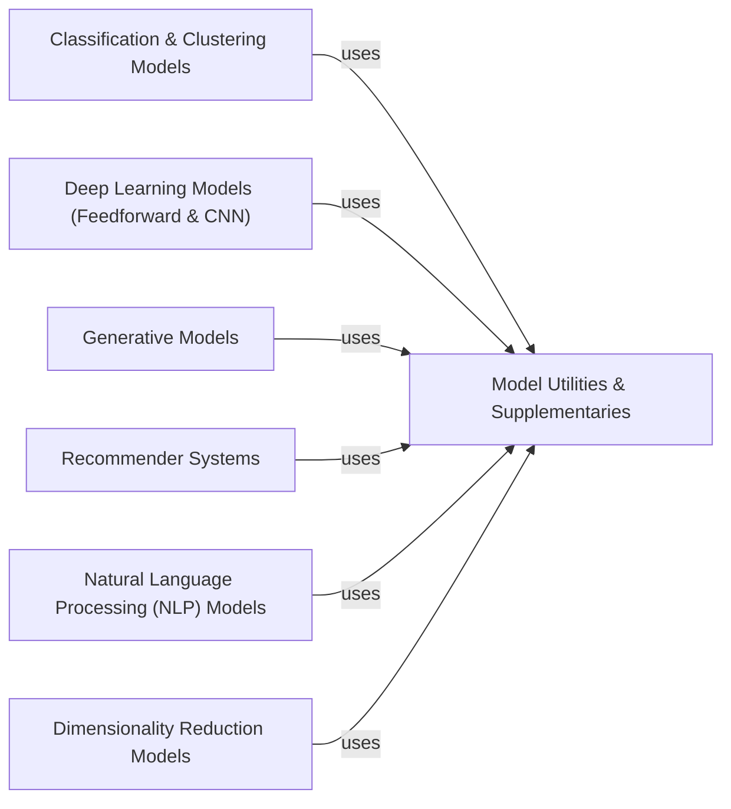

## Details

The Core ML Model Repository subsystem is primarily defined by the `libra.query` package, specifically encompassing modules responsible for various machine learning model implementations and their execution. Its boundaries are marked by the following key modules: `libra.query.classification_models`, `libra.query.feedforward_nn`, `libra.query.generative_models`, `libra.query.recommender_systems`, `libra.query.nlp_queries`, `libra.query.dimensionality_red_queries`, `libra.query.supplementaries` (as a supporting utility component).

### Classification & Clustering Models
Encapsulates traditional machine learning algorithms for classification and clustering tasks, including K-Means, SVM, Nearest Neighbors, Decision Trees, and XGBoost. This component is responsible for executing these specific model types.

**Related Classes/Methods**:

- <a href="https://github.com/Palashio/libra/blob/master/libra/query/classification_models.py" target="_blank" rel="noopener noreferrer">`libra.query.classification_models`</a>

### Deep Learning Models (Feedforward & CNN)
Manages and executes deep learning models, specifically feedforward and convolutional neural networks, for both regression and classification problems. It handles the computational aspects of these neural network architectures.

**Related Classes/Methods**:

- <a href="https://github.com/Palashio/libra/blob/master/libra/query/feedforward_nn.py" target="_blank" rel="noopener noreferrer">`libra.query.feedforward_nn`</a>

### Generative Models
Implements and orchestrates the training and execution of generative models, with a focus on Deep Convolutional Generative Adversarial Networks (DCGANs). This component handles the complex training loops and generation processes.

**Related Classes/Methods**:

- <a href="https://github.com/Palashio/libra/blob/master/libra/query/generative_models.py" target="_blank" rel="noopener noreferrer">`libra.query.generative_models`</a>

### Recommender Systems
Provides functionality for content-based recommendation systems. It is responsible for processing user and item data to generate relevant recommendations.

**Related Classes/Methods**:

- <a href="https://github.com/Palashio/libra/blob/master/libra/query/recommender_systems.py" target="_blank" rel="noopener noreferrer">`libra.query.recommender_systems`</a>

### Natural Language Processing (NLP) Models
Implements and executes various Natural Language Processing tasks, such as text classification and summarization. This component handles the specific algorithms and data transformations required for NLP.

**Related Classes/Methods**:

- <a href="https://github.com/Palashio/libra/blob/master/libra/query/nlp_queries.py" target="_blank" rel="noopener noreferrer">`libra.query.nlp_queries`</a>

### Dimensionality Reduction Models
Manages and applies algorithms for dimensionality reduction, which are crucial for preprocessing high-dimensional data before feeding it into other ML models.

**Related Classes/Methods**:

- <a href="https://github.com/Palashio/libra/blob/master/libra/query/dimensionality_red_queries.py" target="_blank" rel="noopener noreferrer">`libra.query.dimensionality_red_queries`</a>

### Model Utilities & Supplementaries
Offers auxiliary functions critical for the operation of all other model components. This includes functionalities for model tuning, saving/loading models, data retrieval specific to model needs, and plot generation for visualization of results or model performance.

**Related Classes/Methods**:

- <a href="https://github.com/Palashio/libra/blob/master/libra/query/supplementaries.py" target="_blank" rel="noopener noreferrer">`libra.query.supplementaries`</a>

### [FAQ](https://github.com/CodeBoarding/GeneratedOnBoardings/tree/main?tab=readme-ov-file#faq)