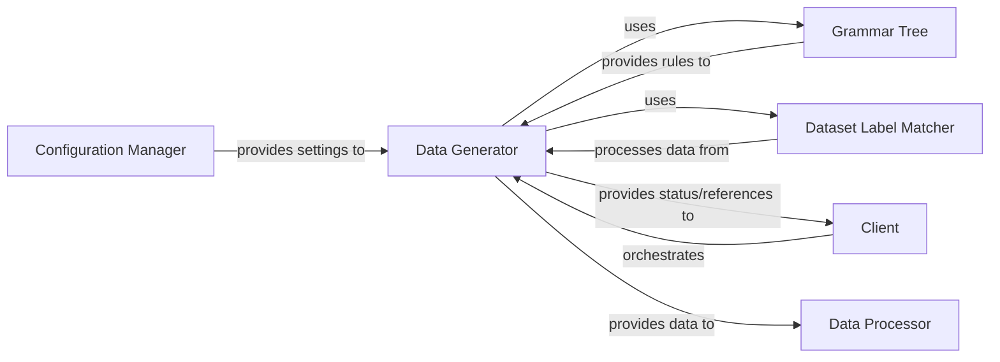

## Details

The `libra.data_generation` subsystem is designed to produce synthetic data, centered around the `Data Generator` component. This orchestrator leverages internal components like the `Grammar Tree` for defining data structures and the `Dataset Label Matcher` for ensuring label consistency. The subsystem operates by receiving configuration settings from an external `Configuration Manager` and is initiated by an external `Client`. Upon completion, the `Data Generator` provides the generated data to an external `Data Processor` and communicates status or references back to the `Client`, forming a clear input-process-output flow within the broader system architecture.

### Data Generator
This is the central orchestrator of the `data_generation` subsystem. It initiates and manages the synthetic data generation process, leveraging internal components like `Grammar Tree` and `Dataset Label Matcher` for specific tasks. It acts as the primary interface for external systems.

**Related Classes/Methods**:

- <a href="https://github.com/Palashio/libra/blob/master/libra/data_generation/dataGen.py#L1-L1000" target="_blank" rel="noopener noreferrer">`libra.data_generation.dataGen`:1-1000</a>

### Grammar Tree
An internal component responsible for defining and managing the structural rules or grammars that guide the synthetic data generation process. It provides the framework for producing structured and valid data instances.

**Related Classes/Methods**:

- <a href="https://github.com/Palashio/libra/blob/master/libra/data_generation/grammartree.py#L1-L1000" target="_blank" rel="noopener noreferrer">`libra.data_generation.grammartree`:1-1000</a>

### Dataset Label Matcher
An internal component focused on ensuring the consistency and correctness of labels within generated datasets. It validates and transforms labels to align with predefined schemas, crucial for downstream data processing.

**Related Classes/Methods**:

- <a href="https://github.com/Palashio/libra/blob/master/libra/data_generation/dataset_labelmatcher.py#L1-L1000" target="_blank" rel="noopener noreferrer">`libra.data_generation.dataset_labelmatcher`:1-1000</a>

### Client
Represents an external system or user interface that initiates the data generation process and receives feedback or references from the `Data Generator`.

**Related Classes/Methods**: _None_

### Data Processor
Represents an external system that consumes the synthetic data produced by the `Data Generator` for further processing or analysis.

**Related Classes/Methods**: _None_

### Configuration Manager
Represents an external system responsible for providing necessary settings and parameters to the `Data Generator` for its operation.

**Related Classes/Methods**: _None_

### [FAQ](https://github.com/CodeBoarding/GeneratedOnBoardings/tree/main?tab=readme-ov-file#faq)