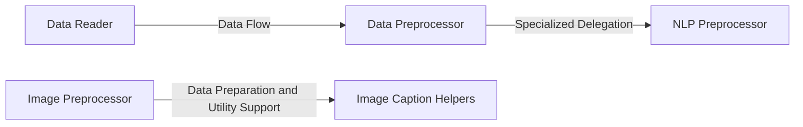

## Details

The `Data Management & Preprocessing` subsystem in `libra` is a critical part of the Machine Learning Library, responsible for preparing diverse raw data for model consumption. It is primarily defined by the `libra.preprocessing` package, encompassing modules and classes dedicated to data ingestion, cleaning, transformation, and feature engineering.

### Data Reader
This component is the initial entry point for raw data. It handles data ingestion from various sources and adapts the loading mechanism based on environmental factors (e.g., GPU availability) and the specific data type. It ensures raw data is efficiently loaded into the preprocessing pipeline.

**Related Classes/Methods**:

- <a href="https://github.com/Palashio/libra/blob/master/libra/preprocessing/data_reader.py" target="_blank" rel="noopener noreferrer">`libra.preprocessing.data_reader`</a>

### Data Preprocessor
Serving as the orchestrator for structured data, this component manages general cleaning, transformation, and feature engineering tasks. It acts as a central hub for preparing tabular or general structured datasets and delegates specialized text processing to the `NLP Preprocessing` component.

**Related Classes/Methods**:

- <a href="https://github.com/Palashio/libra/blob/master/libra/preprocessing/data_preprocessor.py" target="_blank" rel="noopener noreferrer">`libra.preprocessing.data_preprocessor`</a>

### NLP Preprocessor
This specialized component focuses exclusively on text-specific preprocessing. It performs tasks such as slang correction, tokenization, normalization, and general text clean-up, ensuring text data is properly formatted and ready for Natural Language Processing models.

**Related Classes/Methods**:

- <a href="https://github.com/Palashio/libra/blob/master/libra/preprocessing/NLP_preprocessing.py" target="_blank" rel="noopener noreferrer">`libra.preprocessing.NLP_preprocessing`</a>

### Image Preprocessor
This component is responsible for comprehensive preparation of image data. It handles tasks like resizing, organization, color adjustments, and format conversions, supporting various input structures (e.g., sets, CSV, single class). It ensures image data meets the quality and format requirements for image-based ML models.

**Related Classes/Methods**:

- <a href="https://github.com/Palashio/libra/blob/master/libra/preprocessing/image_preprocessor.py" target="_blank" rel="noopener noreferrer">`libra.preprocessing.image_preprocessor`</a>

### Image Caption Helpers
This utility component provides helper functions specifically designed for tasks related to image caption generation. It supports the `Image Preprocessor` by assisting with image loading, attention mechanism integration, and other specialized operations required for captioning workflows.

**Related Classes/Methods**:

- <a href="https://github.com/Palashio/libra/blob/master/libra/preprocessing/image_caption_helpers.py" target="_blank" rel="noopener noreferrer">`libra.preprocessing.image_caption_helpers`</a>

### [FAQ](https://github.com/CodeBoarding/GeneratedOnBoardings/tree/main?tab=readme-ov-file#faq)