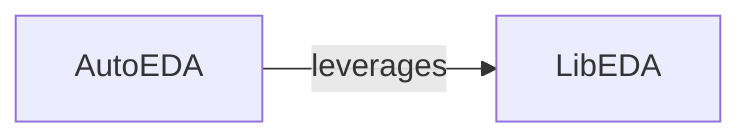

## Details

The `Interactive Data Exploration (EDA)` subsystem provides tools for users to visualize and understand their datasets. It adheres to the project's architectural bias towards usability and abstraction, offering both interactive and automated data exploration capabilities.

### LibEDA
This component serves as the primary interactive interface for users to perform exploratory data analysis. It encapsulates various plotting functionalities, acting as a facade over underlying visualization libraries. Its design emphasizes usability and abstraction, allowing non-technical users to easily generate diverse plots. This aligns with the "Facade Pattern" and provides a core "Client Interface" for data visualization within the Machine Learning Library.

**Related Classes/Methods**:

- <a href="https://github.com/Palashio/libra/blob/master/libra/dashboard/LibEDA.py" target="_blank" rel="noopener noreferrer">`libra.dashboard.LibEDA`</a>
- <a href="https://github.com/Palashio/libra/blob/master/libra/dashboard/LibEDA.py" target="_blank" rel="noopener noreferrer">`libra.dashboard.LibEDA:visualize_box`</a>
- <a href="https://github.com/Palashio/libra/blob/master/libra/dashboard/LibEDA.py" target="_blank" rel="noopener noreferrer">`libra.dashboard.LibEDA:visualize_line`</a>
- <a href="https://github.com/Palashio/libra/blob/master/libra/dashboard/LibEDA.py" target="_blank" rel="noopener noreferrer">`libra.dashboard.LibEDA:visualize_distribution`</a>
- <a href="https://github.com/Palashio/libra/blob/master/libra/dashboard/LibEDA.py" target="_blank" rel="noopener noreferrer">`libra.dashboard.LibEDA:visualize_heatmap`</a>
- <a href="https://github.com/Palashio/libra/blob/master/libra/dashboard/LibEDA.py" target="_blank" rel="noopener noreferrer">`libra.dashboard.LibEDA:visualize_bar`</a>

### AutoEDA
This component provides automated exploratory data analysis capabilities. It is designed to generate a comprehensive set of default visualizations or a report without requiring explicit, step-by-step user interaction for each plot type. It streamlines the initial data exploration phase, fitting into the "Pipeline/Workflow" pattern by automating a common data analysis step.

**Related Classes/Methods**:

- <a href="https://github.com/Palashio/libra/blob/master/libra/dashboard/auto_eda.py" target="_blank" rel="noopener noreferrer">`libra.dashboard.auto_eda`</a>

### [FAQ](https://github.com/CodeBoarding/GeneratedOnBoardings/tree/main?tab=readme-ov-file#faq)