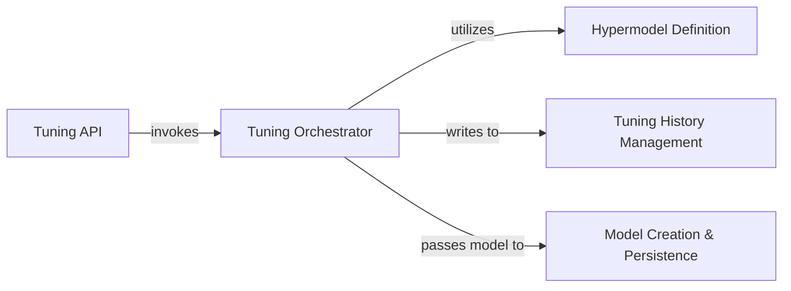

## Details

The `Model Training & Tuning Engine` subsystem is responsible for the entire lifecycle of machine learning model training, hyperparameter optimization, evaluation, and persistence within the `libra` project. It embodies the project's architectural bias towards usability and abstraction, providing a streamlined interface for complex ML tasks.

### Tuning API
Serves as the primary external interface or entry point for users or other system components to initiate a model tuning task. It abstracts the underlying complexity of the tuning engine, providing a simplified interaction point.

**Related Classes/Methods**:

- <a href="https://github.com/Palashio/libra/blob/master/libra/queries.py#L670-L742" target="_blank" rel="noopener noreferrer">`libra.queries.tune`:670-742</a>

### Tuning Orchestrator
Manages and executes the hyperparameter tuning process for various machine learning model types (e.g., regression, classification, CNNs) and tuning algorithms (e.g., Hyperband). It encapsulates the core logic for optimizing model performance and coordinating the tuning workflow.

**Related Classes/Methods**:

- <a href="https://github.com/Palashio/libra/blob/master/libra/modeling/tuner.py" target="_blank" rel="noopener noreferrer">`libra.modeling.tuner:tuneReg`</a>
- <a href="https://github.com/Palashio/libra/blob/master/libra/modeling/tuner.py" target="_blank" rel="noopener noreferrer">`libra.modeling.tuner:tuneClass`</a>
- <a href="https://github.com/Palashio/libra/blob/master/libra/modeling/tuner.py" target="_blank" rel="noopener noreferrer">`libra.modeling.tuner:tuneCNN`</a>
- <a href="https://github.com/Palashio/libra/blob/master/libra/modeling/tuner.py" target="_blank" rel="noopener noreferrer">`libra.modeling.tuner:tuneHyperband`</a>

### Hypermodel Definition
Defines the specific architectural structure and the search space for hyperparameters relevant to different machine learning model types, such as Convolutional Neural Networks. This component provides the blueprints for models that the Tuning Orchestrator will optimize.

**Related Classes/Methods**:

- <a href="https://github.com/Palashio/libra/blob/master/libra/modeling/tuner.py" target="_blank" rel="noopener noreferrer">`libra.modeling.tuner:CNNHyperModel`</a>

### Tuning History Management
Provides a centralized mechanism for recording and managing historical data, metrics, and results generated during tuning sessions. This component is crucial for tracking experiment progress, reproducibility, and analysis of tuning outcomes.

**Related Classes/Methods**:

- <a href="https://github.com/Palashio/libra/blob/master/libra/modeling/tuner.py" target="_blank" rel="noopener noreferrer">`libra.modeling.tuner:tuner_hist`</a>

### Model Creation & Persistence
Handles the final creation, saving, and loading of trained machine learning models, ensuring they can be persisted and reused across different sessions or deployments. This component is crucial for the "model persistence" aspect of the engine.

**Related Classes/Methods**:

- <a href="https://github.com/Palashio/libra/blob/master/libra/modeling/prediction_model_creation.py" target="_blank" rel="noopener noreferrer">`libra.modeling.prediction_model_creation`</a>

### [FAQ](https://github.com/CodeBoarding/GeneratedOnBoardings/tree/main?tab=readme-ov-file#faq)