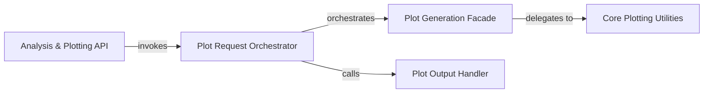

## Details

The plotting subsystem in libra is designed around a clear separation of concerns, facilitating robust and flexible data visualization. The Analysis & Plotting API serves as the primary entry point, allowing users to initiate high-level analytical and plotting workflows. This API invokes the Plot Request Orchestrator, which acts as a crucial intermediary. The Plot Request Orchestrator is responsible for preparing data and parameters for plotting, and then orchestrates the Plot Generation Facade to initiate the actual plot creation. Additionally, the Plot Request Orchestrator coordinates with the Plot Output Handler to manage the rendering and saving of generated plots. The Plot Generation Facade provides a simplified interface for plot generation, abstracting complexities and dispatching requests to the Core Plotting Utilities. These utilities encapsulate the concrete logic for generating various plot types, performing the actual data visualization and rendering operations. This architecture ensures a streamlined flow from user request to plot output, with clear responsibilities for each component.

### Plot Generation Facade
Provides a unified, simplified interface for initiating plot generation, abstracting the underlying complexities of specific plotting utilities for both Keras and non-Keras models. It acts as a dispatcher to the concrete plotting functions based on the model type.

**Related Classes/Methods**:

- <a href="https://github.com/Palashio/libra/blob/master/libra/plotting/generate_plots.py" target="_blank" rel="noopener noreferrer">`libra.plotting.generate_plots`</a>
- <a href="https://github.com/Palashio/libra/blob/master/libra/plotting/nonkeras_generate_plots.py" target="_blank" rel="noopener noreferrer">`libra.plotting.nonkeras_generate_plots`</a>

### Core Plotting Utilities
Encapsulates the concrete logic for generating various types of plots, such as loss curves, accuracy plots, elbow cluster graphs, and multi-class ROC curves. These utilities perform the actual data visualization and rendering operations.

**Related Classes/Methods**:

- <a href="https://github.com/Palashio/libra/blob/master/libra/plotting/generate_plots.py#L238-L252" target="_blank" rel="noopener noreferrer">`libra.plotting.generate_plots.plot_loss`:238-252</a>
- <a href="https://github.com/Palashio/libra/blob/master/libra/plotting/generate_plots.py#L275-L289" target="_blank" rel="noopener noreferrer">`libra.plotting.generate_plots.plot_acc`:275-289</a>
- <a href="https://github.com/Palashio/libra/blob/master/libra/plotting/generate_plots.py#L109-L125" target="_blank" rel="noopener noreferrer">`libra.plotting.generate_plots.elbow_cluster_graph`:109-125</a>
- <a href="https://github.com/Palashio/libra/blob/master/libra/plotting/generate_plots.py#L292-L370" target="_blank" rel="noopener noreferrer">`libra.plotting.generate_plots.plot_mc_roc`:292-370</a>

### Plot Request Orchestrator
Serves as an intermediary for high-level plot requests, abstracting the details of how plots are generated and saved from the higher-level query components. It prepares the necessary data and parameters for the plotting process and coordinates with the plot rendering and saving mechanisms.

**Related Classes/Methods**:

- <a href="https://github.com/Palashio/libra/blob/master/libra/query/supplementaries.py#L411-L435" target="_blank" rel="noopener noreferrer">`libra.query.supplementaries.get_plots`:411-435</a>

### Plot Output Handler
Manages the final stages of visualization, including rendering the generated plots to a visual format (e.g., displaying them) and persisting them to a specified location (e.g., saving to a file).

**Related Classes/Methods**:

- <a href="https://github.com/Palashio/libra/blob/master/libra/query/supplementaries.py#L439-L449" target="_blank" rel="noopener noreferrer">`libra.query.supplementaries.save_and_plot`:439-449</a>

### Analysis & Plotting API
Provides the primary entry points for users or other modules to initiate comprehensive analytical and plotting workflows. It acts as the high-level interface through which the client object (the user's primary interaction point) accesses the visualization capabilities.

**Related Classes/Methods**:

- <a href="https://github.com/Palashio/libra/blob/master/libra/queries.py#L1218-L1228" target="_blank" rel="noopener noreferrer">`libra.queries.plots`:1218-1228</a>
- <a href="https://github.com/Palashio/libra/blob/master/libra/queries.py#L1231-L1239" target="_blank" rel="noopener noreferrer">`libra.queries.analyze`:1231-1239</a>

### [FAQ](https://github.com/CodeBoarding/GeneratedOnBoardings/tree/main?tab=readme-ov-file#faq)