```mermaid
graph LR
    Client_API["Client API"]
    Data_Management_Preprocessing["Data Management & Preprocessing"]
    Model_Training_Tuning_Engine["Model Training & Tuning Engine"]
    Core_ML_Model_Repository["Core ML Model Repository"]
    Result_Visualization_Analysis["Result Visualization & Analysis"]
    Interactive_Data_Exploration_EDA_["Interactive Data Exploration (EDA)"]
    Data_Generation_Synthesis["Data Generation & Synthesis"]
    Client_API -- "Initiates data loading and preprocessing requests." --> Data_Management_Preprocessing
    Client_API -- "Initiates model training and hyperparameter tuning." --> Model_Training_Tuning_Engine
    Client_API -- "Requests model execution (prediction/inference)." --> Core_ML_Model_Repository
    Client_API -- "Requests visualization of results." --> Result_Visualization_Analysis
    Client_API -- "Initiates interactive data exploration sessions." --> Interactive_Data_Exploration_EDA_
    Data_Management_Preprocessing -- "Provides processed data for model training." --> Model_Training_Tuning_Engine
    Data_Management_Preprocessing -- "Provides processed data for model inference." --> Core_ML_Model_Repository
    Data_Management_Preprocessing -- "Provides processed data for EDA." --> Interactive_Data_Exploration_EDA_
    Model_Training_Tuning_Engine -- "Outputs trained models/parameters for use." --> Core_ML_Model_Repository
    Core_ML_Model_Repository -- "Returns model outputs/results." --> Client_API
    Core_ML_Model_Repository -- "Provides model metrics/results for plotting." --> Result_Visualization_Analysis
    Data_Generation_Synthesis -- "Provides synthetic data for further processing." --> Data_Management_Preprocessing
    Data_Generation_Synthesis -- "Provides synthetic data for direct training." --> Model_Training_Tuning_Engine
    click Client_API href "https://github.com/CodeBoarding/GeneratedOnBoardings/blob/main/libra/Client_API.md" "Details"
    click Data_Management_Preprocessing href "https://github.com/CodeBoarding/GeneratedOnBoardings/blob/main/libra/Data_Management_Preprocessing.md" "Details"
    click Model_Training_Tuning_Engine href "https://github.com/CodeBoarding/GeneratedOnBoardings/blob/main/libra/Model_Training_Tuning_Engine.md" "Details"
    click Core_ML_Model_Repository href "https://github.com/CodeBoarding/GeneratedOnBoardings/blob/main/libra/Core_ML_Model_Repository.md" "Details"
    click Result_Visualization_Analysis href "https://github.com/CodeBoarding/GeneratedOnBoardings/blob/main/libra/Result_Visualization_Analysis.md" "Details"
    click Interactive_Data_Exploration_EDA_ href "https://github.com/CodeBoarding/GeneratedOnBoardings/blob/main/libra/Interactive_Data_Exploration_EDA_.md" "Details"
    click Data_Generation_Synthesis href "https://github.com/CodeBoarding/GeneratedOnBoardings/blob/main/libra/Data_Generation_Synthesis.md" "Details"
```

## Details

The `libra` architecture is designed around a central `Client API` that serves as the user's primary interaction point, embodying a Facade pattern to simplify complex machine learning workflows. User queries flow into the `Client API`, which then orchestrates operations across specialized components. Data is first handled by the `Data Management & Preprocessing` component, preparing it for consumption by the `Model Training & Tuning Engine` for model development or directly by the `Core ML Model Repository` for inference. The `Core ML Model Repository` houses various ML algorithms and returns results back to the `Client API`. For analytical insights, results can be routed to the `Result Visualization & Analysis` component, while the `Interactive Data Exploration (EDA)` component offers pre-modeling data insights. The `Data Generation & Synthesis` component supports the creation of new datasets, feeding into the data pipeline. This structure emphasizes a clear, modular data and control flow, optimized for usability and abstraction, making it ideal for visual representation as a pipeline-driven system with the `Client API` at its core.

### Client API [[Expand]](./Client_API.md)
The primary user-facing component, providing a high-level abstraction for interacting with the ML library. It acts as the central orchestrator, receiving user queries, managing the overall workflow, and presenting results. This component embodies the Facade Pattern, simplifying access to underlying complexities.

**Related Classes/Methods**:

- <a href="https://github.com/Palashio/libra/blob/master/libra/queries.py" target="_blank" rel="noopener noreferrer">`libra.queries`</a>

### Data Management & Preprocessing [[Expand]](./Data_Management_Preprocessing.md)
Handles all aspects of data ingestion, cleaning, transformation, and feature engineering for various data types (structured, text, image). It prepares raw data for consumption by ML models, ensuring data quality and format compatibility.

**Related Classes/Methods**:

- <a href="https://github.com/Palashio/libra/blob/master/libra/preprocessing/data_reader.py" target="_blank" rel="noopener noreferrer">`libra.preprocessing.data_reader`</a>
- <a href="https://github.com/Palashio/libra/blob/master/libra/preprocessing/data_preprocessor.py" target="_blank" rel="noopener noreferrer">`libra.preprocessing.data_preprocessor`</a>
- <a href="https://github.com/Palashio/libra/blob/master/libra/preprocessing/NLP_preprocessing.py" target="_blank" rel="noopener noreferrer">`libra.preprocessing.NLP_preprocessing`</a>
- <a href="https://github.com/Palashio/libra/blob/master/libra/preprocessing/image_preprocessor.py" target="_blank" rel="noopener noreferrer">`libra.preprocessing.image_preprocessor`</a>
- <a href="https://github.com/Palashio/libra/blob/master/libra/preprocessing/image_caption_helpers.py" target="_blank" rel="noopener noreferrer">`libra.preprocessing.image_caption_helpers`</a>

### Model Training & Tuning Engine [[Expand]](./Model_Training_Tuning_Engine.md)
Manages the training lifecycle of machine learning models, including hyperparameter optimization, model evaluation, and model persistence. It ensures models are effectively trained and optimized for performance.

**Related Classes/Methods**:

- <a href="https://github.com/Palashio/libra/blob/master/libra/modeling/tuner.py" target="_blank" rel="noopener noreferrer">`libra.modeling.tuner`</a>
- <a href="https://github.com/Palashio/libra/blob/master/libra/modeling/prediction_model_creation.py" target="_blank" rel="noopener noreferrer">`libra.modeling.prediction_model_creation`</a>

### Core ML Model Repository [[Expand]](./Core_ML_Model_Repository.md)
Encapsulates a diverse collection of machine learning algorithms, including traditional ML, deep learning (feedforward, CNN, GANs), generative models, recommender systems, and NLP models. This component executes the actual ML computations (prediction/inference).

**Related Classes/Methods**:

- <a href="https://github.com/Palashio/libra/blob/master/libra/query/classification_models.py" target="_blank" rel="noopener noreferrer">`libra.query.classification_models`</a>
- <a href="https://github.com/Palashio/libra/blob/master/libra/query/feedforward_nn.py" target="_blank" rel="noopener noreferrer">`libra.query.feedforward_nn`</a>
- <a href="https://github.com/Palashio/libra/blob/master/libra/query/generative_models.py" target="_blank" rel="noopener noreferrer">`libra.query.generative_models`</a>
- <a href="https://github.com/Palashio/libra/blob/master/libra/query/recommender_systems.py" target="_blank" rel="noopener noreferrer">`libra.query.recommender_systems`</a>
- <a href="https://github.com/Palashio/libra/blob/master/libra/query/nlp_queries.py" target="_blank" rel="noopener noreferrer">`libra.query.nlp_queries`</a>
- <a href="https://github.com/Palashio/libra/blob/master/libra/query/dimensionality_red_queries.py" target="_blank" rel="noopener noreferrer">`libra.query.dimensionality_red_queries`</a>

### Result Visualization & Analysis [[Expand]](./Result_Visualization_Analysis.md)
Generates various plots, charts, and reports to visualize model performance, data distributions, and other analytical insights. This component aids in the interpretation and understanding of model outputs and data characteristics.

**Related Classes/Methods**:

- <a href="https://github.com/Palashio/libra/blob/master/libra/plotting/generate_plots.py" target="_blank" rel="noopener noreferrer">`libra.plotting.generate_plots`</a>
- <a href="https://github.com/Palashio/libra/blob/master/libra/plotting/nonkeras_generate_plots.py" target="_blank" rel="noopener noreferrer">`libra.plotting.nonkeras_generate_plots`</a>

### Interactive Data Exploration (EDA) [[Expand]](./Interactive_Data_Exploration_EDA_.md)
Provides an interactive environment for exploratory data analysis (EDA) and visualization of raw or preprocessed data. This allows users to gain insights into their datasets before or after modeling.

**Related Classes/Methods**:

- <a href="https://github.com/Palashio/libra/blob/master/libra/dashboard/LibEDA.py" target="_blank" rel="noopener noreferrer">`libra.dashboard.LibEDA`</a>
- <a href="https://github.com/Palashio/libra/blob/master/libra/dashboard/auto_eda.py" target="_blank" rel="noopener noreferrer">`libra.dashboard.auto_eda`</a>

### Data Generation & Synthesis [[Expand]](./Data_Generation_Synthesis.md)
Responsible for generating synthetic datasets or augmenting existing ones. This component is useful for testing, training models with limited real data, or specific ML tasks requiring diverse data inputs.

**Related Classes/Methods**:

- <a href="https://github.com/Palashio/libra/blob/master/libra/data_generation/dataGen.py" target="_blank" rel="noopener noreferrer">`libra.data_generation.dataGen`</a>
- <a href="https://github.com/Palashio/libra/blob/master/libra/data_generation/dataset_labelmatcher.py" target="_blank" rel="noopener noreferrer">`libra.data_generation.dataset_labelmatcher`</a>
- <a href="https://github.com/Palashio/libra/blob/master/libra/data_generation/grammartree.py" target="_blank" rel="noopener noreferrer">`libra.data_generation.grammartree`</a>

### [FAQ](https://github.com/CodeBoarding/GeneratedOnBoardings/tree/main?tab=readme-ov-file#faq)