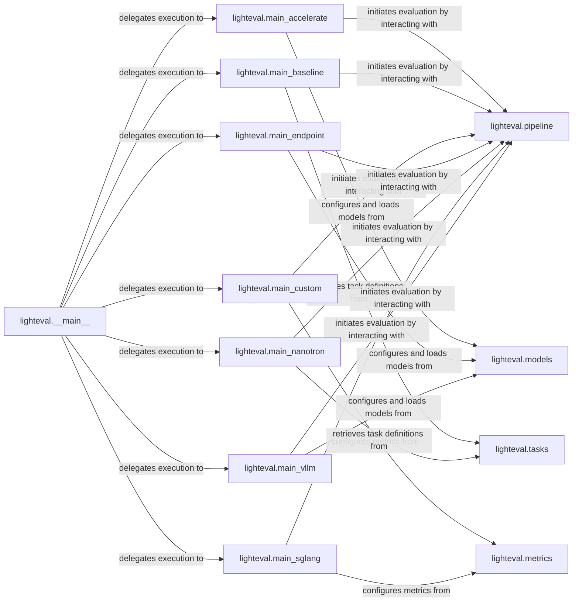

## Details

One paragraph explaining the functionality which is represented by this graph. What the main flow is and what is its purpose.

### lighteval.__main__
The core entry point and dispatcher for the entire lighteval CLI. It is responsible for parsing top-level commands and delegating control to the appropriate specialized main_*.py script based on the user's input. This aligns with the CLI Pattern, providing a unified interface.

**Related Classes/Methods**:

- <a href="https://github.com/huggingface/lighteval/blob/main/src/lighteval/__main__.py" target="_blank" rel="noopener noreferrer">`lighteval.__main__`</a>

### lighteval.main_accelerate
Handles evaluations specifically for models leveraging Hugging Face Accelerate for distributed inference. It manages Accelerate-specific setup and model loading.

**Related Classes/Methods**:

- <a href="https://github.com/huggingface/lighteval/blob/main/src/lighteval/main_accelerate.py" target="_blank" rel="noopener noreferrer">`lighteval.main_accelerate`</a>

### lighteval.main_baseline
Manages baseline evaluations, likely for quick comparisons using default or pre-defined configurations.

**Related Classes/Methods**:

- <a href="https://github.com/huggingface/lighteval/blob/main/src/lighteval/main_baseline.py" target="_blank" rel="noopener noreferrer">`lighteval.main_baseline`</a>

### lighteval.main_custom
Provides an entry point for highly customizable evaluations, allowing users to define custom models, tasks, or evaluation logic.

**Related Classes/Methods**:

- <a href="https://github.com/huggingface/lighteval/blob/main/src/lighteval/main_custom.py" target="_blank" rel="noopener noreferrer">`lighteval.main_custom`</a>

### lighteval.main_endpoint
Facilitates evaluations against external model endpoints (e.g., OpenAI API, TGI), handling API interactions.

**Related Classes/Methods**:

- <a href="https://github.com/huggingface/lighteval/blob/main/src/lighteval/main_endpoint.py" target="_blank" rel="noopener noreferrer">`lighteval.main_endpoint`</a>

### lighteval.main_nanotron
Integrates with the Nanotron framework for model inference, tailored for its distributed capabilities.

**Related Classes/Methods**:

- <a href="https://github.com/huggingface/lighteval/blob/main/src/lighteval/main_nanotron.py" target="_blank" rel="noopener noreferrer">`lighteval.main_nanotron`</a>

### lighteval.main_sglang
Manages evaluations using the SGLang inference engine, optimized for specific LLM serving patterns.

**Related Classes/Methods**:

- <a href="https://github.com/huggingface/lighteval/blob/main/src/lighteval/main_sglang.py" target="_blank" rel="noopener noreferrer">`lighteval.main_sglang`</a>

### lighteval.main_vllm
Configures and runs evaluations using the vLLM inference engine, leveraging its high-throughput serving.

**Related Classes/Methods**:

- <a href="https://github.com/huggingface/lighteval/blob/main/src/lighteval/main_vllm.py" target="_blank" rel="noopener noreferrer">`lighteval.main_vllm`</a>

### lighteval.pipeline
Core component for initiating evaluations.

**Related Classes/Methods**:

- <a href="https://github.com/huggingface/lighteval/blob/main/src/lighteval/pipeline.py" target="_blank" rel="noopener noreferrer">`lighteval.pipeline`</a>

### lighteval.models
Handles configuration and loading of models.

**Related Classes/Methods**:

- <a href="https://github.com/huggingface/lighteval/blob/main/src/lighteval/models" target="_blank" rel="noopener noreferrer">`lighteval.models`</a>

### lighteval.tasks
Manages task definitions for evaluations.

**Related Classes/Methods**:

- <a href="https://github.com/huggingface/lighteval/blob/main/src/lighteval/tasks" target="_blank" rel="noopener noreferrer">`lighteval.tasks`</a>

### lighteval.metrics
Configures and manages evaluation metrics.

**Related Classes/Methods**:

- <a href="https://github.com/huggingface/lighteval/blob/main/src/lighteval/metrics" target="_blank" rel="noopener noreferrer">`lighteval.metrics`</a>

### [FAQ](https://github.com/CodeBoarding/GeneratedOnBoardings/tree/main?tab=readme-ov-file#faq)