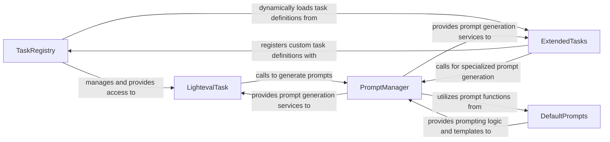

## Details

The `lighteval.tasks` subsystem orchestrates the definition, management, and execution of evaluation tasks within the Lighteval framework. At its core, the `TaskRegistry` acts as a central catalog, managing and providing access to various `LightevalTask` implementations and their configurations, including dynamically loading specialized tasks from `ExtendedTasks`. All evaluation tasks, whether standard or extended, rely on the `LightevalTask` abstract interface for common functionalities. Prompt generation, a critical step for language model evaluation, is handled by the `PromptManager`, which dynamically formats prompts and leverages predefined prompt functions from `DefaultPrompts`. This structured interaction ensures flexible task management and efficient prompt preparation for diverse evaluation scenarios.

### TaskRegistry
Acts as the central catalog and manager for all evaluation tasks. It is responsible for registering, retrieving, and expanding task configurations. This includes dynamically loading custom tasks and resolving task groups, making it the core repository for available evaluation tasks.

**Related Classes/Methods**:

- <a href="https://github.com/huggingface/lighteval/blob/main/src/lighteval/tasks/registry.py" target="_blank" rel="noopener noreferrer">`lighteval.tasks.registry`</a>

### LightevalTask
Defines the abstract interface and common functionalities that all evaluation tasks must implement. This includes mechanisms for loading datasets, managing few-shot examples, and handling different data splits required for evaluation. It serves as the blueprint for individual evaluation tasks.

**Related Classes/Methods**:

- <a href="https://github.com/huggingface/lighteval/blob/main/src/lighteval/tasks/lighteval_task.py" target="_blank" rel="noopener noreferrer">`lighteval.tasks.lighteval_task`</a>

### PromptManager
Manages the dynamic generation and formatting of prompts for language models. It supports various prompt styles (e.g., chat templates, plain text) and different strategies for sampling few-shot examples, ensuring prompts are correctly prepared for inference.

**Related Classes/Methods**:

- <a href="https://github.com/huggingface/lighteval/blob/main/src/lighteval/tasks/prompt_manager.py" target="_blank" rel="noopener noreferrer">`lighteval.tasks.prompt_manager`</a>

### DefaultPrompts
Provides a library of predefined prompt functions for a wide range of standard evaluation benchmarks. These functions encapsulate specific prompting logic and data transformations, offering reusable prompt templates.

**Related Classes/Methods**:

- <a href="https://github.com/huggingface/lighteval/blob/main/src/lighteval/tasks/default_prompts.py" target="_blank" rel="noopener noreferrer">`lighteval.tasks.default_prompts`</a>

### ExtendedTasks
Extends the core task framework by providing specialized implementations for complex or custom evaluation tasks. These tasks may require unique data processing, prompting, or metric calculation logic beyond the standard LightevalTask interface.

**Related Classes/Methods**:

- <a href="https://github.com/huggingface/lighteval/blob/main/src/lighteval/tasks/extended/" target="_blank" rel="noopener noreferrer">`lighteval.tasks.extended`</a>

### [FAQ](https://github.com/CodeBoarding/GeneratedOnBoardings/tree/main?tab=readme-ov-file#faq)