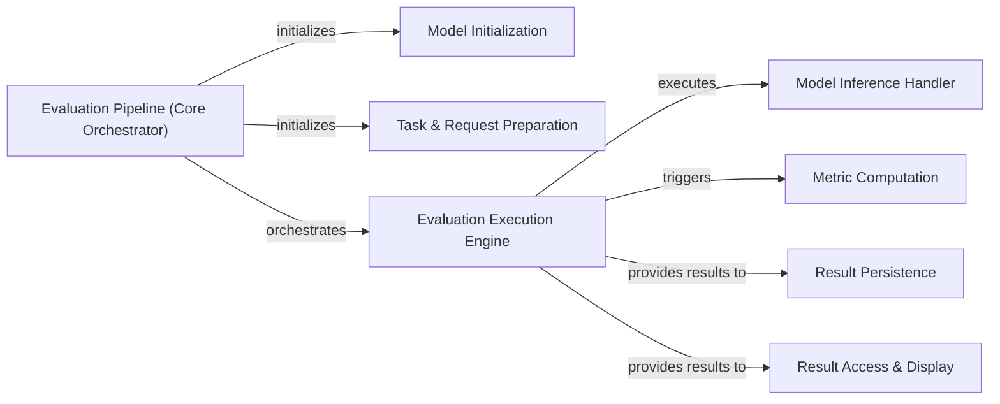

## Details

The `Evaluation Pipeline Core` subsystem is the central orchestrator of the end-to-end evaluation process within `lighteval`. It manages the flow from running models with prepared prompts to collecting responses and initiating metric computations, handling both synchronous and asynchronous model runs.

### Evaluation Pipeline (Core Orchestrator)
The overarching component that initializes the evaluation environment, manages model loading, sets up tasks, and orchestrates the entire evaluation flow. It serves as the main entry point for initiating an evaluation run.

**Related Classes/Methods**:

- <a href="https://github.com/huggingface/lighteval/blob/main/src/lighteval/pipeline.py#L152-L462" target="_blank" rel="noopener noreferrer">`lighteval.pipeline.Pipeline`:152-462</a>

### Model Initialization
Responsible for dynamically loading and configuring the Language Model (LLM) to be evaluated, preparing it for inference based on the provided evaluation parameters.

**Related Classes/Methods**:

- <a href="https://github.com/huggingface/lighteval/blob/main/src/lighteval/pipeline.py" target="_blank" rel="noopener noreferrer">`lighteval.pipeline.Pipeline:_init_model`</a>

### Task & Request Preparation
Prepares and manages the specific evaluation tasks and generates the corresponding input requests (prompts) that will be fed to the model. This component ensures that tasks are correctly formatted and ready for execution.

**Related Classes/Methods**:

- <a href="https://github.com/huggingface/lighteval/blob/main/src/lighteval/pipeline.py" target="_blank" rel="noopener noreferrer">`lighteval.pipeline.Pipeline:_init_tasks_and_requests`</a>

### Evaluation Execution Engine
Drives the core evaluation loop. It orchestrates the sequence of operations, including dispatching model inference calls, collecting responses, and triggering metric computations. This is the heart of the evaluation process.

**Related Classes/Methods**:

- <a href="https://github.com/huggingface/lighteval/blob/main/src/lighteval/pipeline.py" target="_blank" rel="noopener noreferrer">`lighteval.pipeline.Pipeline:evaluate`</a>

### Model Inference Handler
Abstracts and dispatches model inference calls to the underlying LLM. It handles the specifics of interacting with different model backends, supporting both synchronous (`_run_model_sync`) and asynchronous (`_run_model_async`) execution.

**Related Classes/Methods**:

- <a href="https://github.com/huggingface/lighteval/blob/main/src/lighteval/pipeline.py" target="_blank" rel="noopener noreferrer">`lighteval.pipeline.Pipeline:_run_model`</a>
- <a href="https://github.com/huggingface/lighteval/blob/main/src/lighteval/pipeline.py" target="_blank" rel="noopener noreferrer">`lighteval.pipeline.Pipeline:_run_model_sync`</a>
- <a href="https://github.com/huggingface/lighteval/blob/main/src/lighteval/pipeline.py" target="_blank" rel="noopener noreferrer">`lighteval.pipeline.Pipeline:_run_model_async`</a>

### Metric Computation
Calculates various evaluation metrics based on the model's generated responses and the ground truth data associated with each task. This component is responsible for quantifying model performance.

**Related Classes/Methods**:

- <a href="https://github.com/huggingface/lighteval/blob/main/src/lighteval/pipeline.py" target="_blank" rel="noopener noreferrer">`lighteval.pipeline.Pipeline:_compute_metrics`</a>

### Result Persistence
Manages the saving of evaluation results. This includes writing results to local storage and optionally pushing them to remote repositories such as Hugging Face Hub or Amazon S3 for sharing and long-term storage.

**Related Classes/Methods**:

- <a href="https://github.com/huggingface/lighteval/blob/main/src/lighteval/pipeline.py" target="_blank" rel="noopener noreferrer">`lighteval.pipeline.Pipeline:save_and_push_results`</a>

### Result Access & Display
Provides programmatic access to the final evaluation results and formats them for clear and concise display to the user, enabling easy analysis and comparison of model performance.

**Related Classes/Methods**:

- <a href="https://github.com/huggingface/lighteval/blob/main/src/lighteval/pipeline.py" target="_blank" rel="noopener noreferrer">`lighteval.pipeline.Pipeline:get_results`</a>
- <a href="https://github.com/huggingface/lighteval/blob/main/src/lighteval/pipeline.py" target="_blank" rel="noopener noreferrer">`lighteval.pipeline.Pipeline:show_results`</a>

### [FAQ](https://github.com/CodeBoarding/GeneratedOnBoardings/tree/main?tab=readme-ov-file#faq)