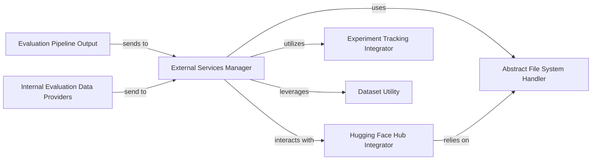

## Details

The lighteval project's logging and evaluation subsystem is centered around the External Services Manager, primarily embodied by the EvaluationTracker class. This manager acts as a central hub, collecting comprehensive evaluation data from various Internal Evaluation Data Providers (e.g., DetailsLogger, MetricsLogger) and the aggregated Evaluation Pipeline Output. Once collected, the External Services Manager orchestrates the dissemination of this data to external platforms. It interacts with the Hugging Face Hub Integrator to publish results and details to the Hugging Face Hub, and with the Experiment Tracking Integrator for logging to tools like Weights & Biases and TensorBoard. The subsystem also leverages a Dataset Utility to format data appropriately for external consumption and an Abstract File System Handler to ensure flexible and unified file operations across different storage backends. This architecture ensures that evaluation results are thoroughly captured, processed, and made accessible for analysis and collaboration through various external services.

### External Services Manager
The core orchestrator of the subsystem. It receives evaluation results and detailed logs, then dispatches them to appropriate external platforms (e.g., Hugging Face Hub, Weights & Biases, TensorBoard) for storage, visualization, and collaboration. It acts as the primary interface for externalizing evaluation outcomes.

**Related Classes/Methods**:

- <a href="https://github.com/huggingface/lighteval/blob/main/src/lighteval/logging/evaluation_tracker.py#L87-L713" target="_blank" rel="noopener noreferrer">`src.lighteval.logging.evaluation_tracker.EvaluationTracker`:87-713</a>

### Evaluation Pipeline Output
Represents the aggregated final evaluation results and configurations generated by the main evaluation pipeline. This component acts as the primary upstream data source for the External Services Manager.

**Related Classes/Methods**:

### Internal Evaluation Data Providers
A conceptual component grouping various internal loggers (DetailsLogger, MetricsLogger, VersionsLogger, GeneralConfigLogger, TaskConfigLogger) that collect granular, detailed aspects of an evaluation run. These providers feed specific data points to the External Services Manager for comprehensive external logging.

**Related Classes/Methods**:

- <a href="https://github.com/huggingface/lighteval/blob/main/src/lighteval/logging/info_loggers.py#L129-L319" target="_blank" rel="noopener noreferrer">`src.lighteval.logging.info_loggers.DetailsLogger`:129-319</a>
- <a href="https://github.com/huggingface/lighteval/blob/main/src/lighteval/logging/info_loggers.py#L322-L420" target="_blank" rel="noopener noreferrer">`src.lighteval.logging.info_loggers.MetricsLogger`:322-420</a>
- <a href="https://github.com/huggingface/lighteval/blob/main/src/lighteval/logging/info_loggers.py#L423-L439" target="_blank" rel="noopener noreferrer">`src.lighteval.logging.info_loggers.VersionsLogger`:423-439</a>
- <a href="https://github.com/huggingface/lighteval/blob/main/src/lighteval/logging/info_loggers.py#L48-L126" target="_blank" rel="noopener noreferrer">`src.lighteval.logging.info_loggers.GeneralConfigLogger`:48-126</a>
- <a href="https://github.com/huggingface/lighteval/blob/main/src/lighteval/logging/info_loggers.py#L442-L458" target="_blank" rel="noopener noreferrer">`src.lighteval.logging.info_loggers.TaskConfigLogger`:442-458</a>

### Hugging Face Hub Integrator
Encapsulates the functionalities required to interact with the Hugging Face Hub. This includes managing repositories, uploading evaluation results, models, and associated metadata, facilitating sharing and collaboration within the Hugging Face ecosystem.

**Related Classes/Methods**:

### Experiment Tracking Integrator
Manages the interface with general-purpose experiment tracking and visualization platforms, such as Weights & Biases (wandb) and TensorBoard. It handles logging metrics, configurations, and potentially artifacts for detailed experiment analysis and comparison.

**Related Classes/Methods**:

### Dataset Utility
Provides functionalities for creating, manipulating, and saving datasets. Within this subsystem, it's primarily used to prepare evaluation results or related data into a suitable dataset format before being pushed to external platforms (e.g., Hugging Face Hub).

**Related Classes/Methods**:

### Abstract File System Handler
Offers a unified and abstract interface for interacting with various file systems (e.g., local, cloud storage like Amazon S3). It enables the External Services Manager and other integrators to perform file operations (read, write, upload) without being coupled to specific storage backends.

**Related Classes/Methods**:

### [FAQ](https://github.com/CodeBoarding/GeneratedOnBoardings/tree/main?tab=readme-ov-file#faq)