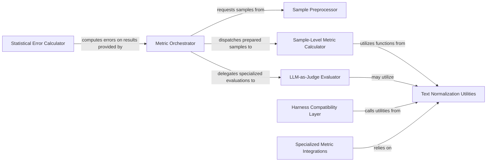

## Details

The `lighteval` metrics subsystem is orchestrated by the `Metric Orchestrator`, which directs the flow of evaluation. Raw data is first processed by the `Sample Preprocessor` to ensure consistent formatting. Metric computations are then performed by the `Sample-Level Metric Calculator` for standard NLP metrics, or delegated to the `LLM-as-Judge Evaluator` for LLM-based assessments. The `Text Normalization Utilities` provide essential standardization across various metric calculations. For external compatibility, the `Harness Compatibility Layer` integrates with other evaluation frameworks, while `Specialized Metric Integrations` bridge to advanced third-party metrics. Finally, the `Statistical Error Calculator` provides robustness analysis for the computed results. This modular design ensures flexibility and extensibility in evaluating language models.

### Metric Orchestrator
Serves as the central coordinator for all metric computations. It manages the overall flow, dispatching evaluation tasks to appropriate metric calculators and aggregating results. This component is crucial for a pipeline architecture, ensuring a coherent evaluation process.

**Related Classes/Methods**:

- <a href="https://github.com/huggingface/lighteval/blob/main/src/lighteval/metrics/metrics_corpus.py" target="_blank" rel="noopener noreferrer">`src/lighteval/metrics/metrics_corpus.py:compute`</a>

### Sample Preprocessor
Standardizes and transforms raw evaluation samples into the specific input formats required by various metric functions (e.g., `LogprobCorpusMetricInput`, `GenerativeCorpusMetricInput`). This ensures data consistency across different metric types.

**Related Classes/Methods**:

- <a href="https://github.com/huggingface/lighteval/blob/main/src/lighteval/metrics/sample_preparator.py" target="_blank" rel="noopener noreferrer">`src/lighteval/metrics/sample_preparator.py`</a>

### Sample-Level Metric Calculator
Implements a broad range of common NLP metrics (e.g., Rouge, BLEU, Pass@k, edit similarity) that are computed on individual samples or batches. It represents the core quantitative scoring functionality.

**Related Classes/Methods**:

- <a href="https://github.com/huggingface/lighteval/blob/main/src/lighteval/metrics/metrics_sample.py" target="_blank" rel="noopener noreferrer">`src/lighteval/metrics/metrics_sample.py`</a>

### LLM-as-Judge Evaluator
Manages the specialized logic for metrics where an LLM itself acts as a judge. It handles interactions with various LLM inference backends (e.g., Hugging Face Inference API, LiteLLM, vLLM, Transformers) to obtain judgments.

**Related Classes/Methods**:

- <a href="https://github.com/huggingface/lighteval/blob/main/src/lighteval/metrics/llm_as_judge.py" target="_blank" rel="noopener noreferrer">`src/lighteval/metrics/llm_as_judge.py`</a>

### Text Normalization Utilities
Provides a collection of reusable text normalization functions (e.g., `helm_normalizer`, `math_normalizer`) to standardize text inputs and outputs before metric calculation. This ensures consistency and comparability of results across different evaluations.

**Related Classes/Methods**:

- <a href="https://github.com/huggingface/lighteval/blob/main/src/lighteval/metrics/normalizations.py" target="_blank" rel="noopener noreferrer">`src/lighteval/metrics/normalizations.py`</a>

### Harness Compatibility Layer
Adapts lighteval's metric computation to be compatible with specific metric implementations found in other evaluation harnesses (e.g., EleutherAI's LM Harness for TruthfulQA, DROP). This facilitates interoperability and leverages existing benchmarks.

**Related Classes/Methods**:

- <a href="https://github.com/huggingface/lighteval/blob/main/src/lighteval/metrics/harness_compatibility/" target="_blank" rel="noopener noreferrer">`src/lighteval/metrics/harness_compatibility/`</a>

### Specialized Metric Integrations
Integrates advanced or domain-specific metrics from external libraries, such as BERTScore for semantic similarity and SUMMAC for summarization consistency. This component acts as a bridge to third-party metric implementations.

**Related Classes/Methods**:

- <a href="https://github.com/huggingface/lighteval/blob/main/src/lighteval/metrics/imports/" target="_blank" rel="noopener noreferrer">`lighteval.metrics.imports`</a>

### Statistical Error Calculator
Computes statistical measures of error, such as standard deviation and bootstrap standard error, for the calculated metrics. This provides confidence intervals and robustness analysis for evaluation results.

**Related Classes/Methods**:

- <a href="https://github.com/huggingface/lighteval/blob/main/src/lighteval/metrics/stderr.py" target="_blank" rel="noopener noreferrer">`src/lighteval/metrics/stderr.py`</a>

### [FAQ](https://github.com/CodeBoarding/GeneratedOnBoardings/tree/main?tab=readme-ov-file#faq)