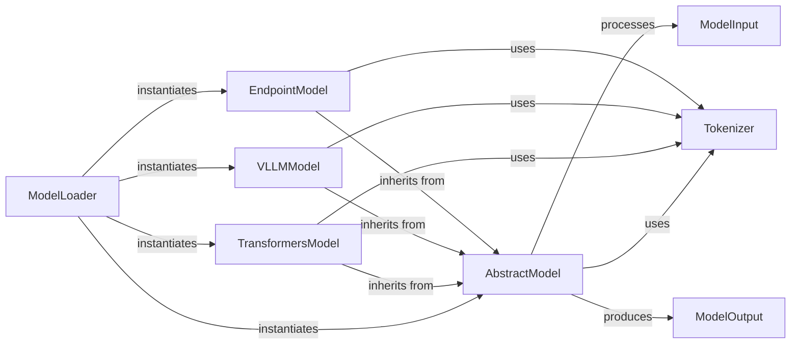

## Details

The `lighteval` model subsystem is designed around a flexible and extensible architecture for integrating various language models. The `AbstractModel` serves as the central interface, defining a consistent contract for all model implementations. The `ModelLoader` acts as a factory, dynamically instantiating concrete model types such as `TransformersModel`, `VLLMModel`, and `EndpointModel` based on configuration. `ModelInput` and `ModelOutput` components standardize data flow, ensuring uniform input preparation and output interpretation across different models. The `Tokenizer` component, represented by the `WordTokenizer` abstract class and its implementations, is crucial for text processing, enabling models to handle raw text by converting it into a tokenized format and vice-versa. This modular design allows for easy integration of new model backends and ensures consistent evaluation workflows.

### AbstractModel
The foundational abstract class that defines the unified interface for all language models, ensuring consistent interaction regardless of the backend. This serves as the core 'Model Adapter' interface.

**Related Classes/Methods**:

- <a href="https://github.com/huggingface/lighteval/blob/main/src/lighteval/models/model_input.py" target="_blank" rel="noopener noreferrer">`lighteval.models.model_input.ModelInput`</a>
- <a href="https://github.com/huggingface/lighteval/blob/main/src/lighteval/models/model_output.py" target="_blank" rel="noopener noreferrer">`lighteval.models.model_output.ModelOutput`</a>
- <a href="https://github.com/huggingface/lighteval/blob/main/src/lighteval/metrics/utils/linguistic_tokenizers.py#L46-L57" target="_blank" rel="noopener noreferrer">`lighteval.metrics.utils.linguistic_tokenizers.WordTokenizer`:46-57</a>

### ModelLoader
A central factory responsible for dynamically loading and instantiating concrete `AbstractModel` implementations based on configuration, abstracting model initialization complexities.

**Related Classes/Methods**:

- <a href="https://github.com/huggingface/lighteval/blob/main/src/lighteval/models/abstract_model.py" target="_blank" rel="noopener noreferrer">`lighteval.models.abstract_model.AbstractModel`</a>
- <a href="https://github.com/huggingface/lighteval/blob/main/src/lighteval/models/transformers/vlm_transformers_model.py" target="_blank" rel="noopener noreferrer">`lighteval.models.transformers.vlm_transformers_model.TransformersModel`</a>
- <a href="https://github.com/huggingface/lighteval/blob/main/src/lighteval/models/vllm/vllm_model.py#L174-L532" target="_blank" rel="noopener noreferrer">`lighteval.models.vllm.vllm_model.VLLMModel`:174-532</a>
- <a href="https://github.com/huggingface/lighteval/blob/main/src/lighteval/models/endpoints/endpoint_model.py" target="_blank" rel="noopener noreferrer">`lighteval.models.endpoints.endpoint_model.EndpointModel`</a>

### TransformersModel
A concrete implementation of `AbstractModel` for models leveraging the Hugging Face Transformers library.

**Related Classes/Methods**:

- <a href="https://github.com/huggingface/lighteval/blob/main/src/lighteval/models/abstract_model.py" target="_blank" rel="noopener noreferrer">`lighteval.models.abstract_model.AbstractModel`</a>
- <a href="https://github.com/huggingface/lighteval/blob/main/src/lighteval/metrics/utils/linguistic_tokenizers.py#L46-L57" target="_blank" rel="noopener noreferrer">`lighteval.metrics.utils.linguistic_tokenizers.WordTokenizer`:46-57</a>

### VLLMModel
A concrete implementation of `AbstractModel` for vLLM-optimized inference.

**Related Classes/Methods**:

- <a href="https://github.com/huggingface/lighteval/blob/main/src/lighteval/models/abstract_model.py" target="_blank" rel="noopener noreferrer">`lighteval.models.abstract_model.AbstractModel`</a>
- <a href="https://github.com/huggingface/lighteval/blob/main/src/lighteval/metrics/utils/linguistic_tokenizers.py#L46-L57" target="_blank" rel="noopener noreferrer">`lighteval.metrics.utils.linguistic_tokenizers.WordTokenizer`:46-57</a>

### EndpointModel
An abstract base class extending `AbstractModel` to handle interactions with external LLM inference endpoints (e.g., commercial APIs, Text Generation Inference).

**Related Classes/Methods**:

- <a href="https://github.com/huggingface/lighteval/blob/main/src/lighteval/models/abstract_model.py" target="_blank" rel="noopener noreferrer">`lighteval.models.abstract_model.AbstractModel`</a>
- <a href="https://github.com/huggingface/lighteval/blob/main/src/lighteval/metrics/utils/linguistic_tokenizers.py#L46-L57" target="_blank" rel="noopener noreferrer">`lighteval.metrics.utils.linguistic_tokenizers.WordTokenizer`:46-57</a>

### ModelInput
Defines standardized data structures for inputs to all model implementations, ensuring consistency across different backends.

**Related Classes/Methods**:

- <a href="https://github.com/huggingface/lighteval/blob/main/src/lighteval/models/model_input.py" target="_blank" rel="noopener noreferrer">`lighteval.models.model_input.ModelInput`</a>

### ModelOutput
Defines standardized data structures for outputs from all model implementations, providing a uniform format for evaluation.

**Related Classes/Methods**:

- <a href="https://github.com/huggingface/lighteval/blob/main/src/lighteval/models/model_output.py" target="_blank" rel="noopener noreferrer">`lighteval.models.model_output.ModelOutput`</a>

### Tokenizer
Handles the conversion of raw text to token IDs and vice-versa, fundamental for preparing inputs for LLMs and interpreting their outputs.

**Related Classes/Methods**:

- <a href="https://github.com/huggingface/lighteval/blob/main/src/lighteval/metrics/utils/linguistic_tokenizers.py#L46-L57" target="_blank" rel="noopener noreferrer">`lighteval.metrics.utils.linguistic_tokenizers.WordTokenizer`:46-57</a>

### [FAQ](https://github.com/CodeBoarding/GeneratedOnBoardings/tree/main?tab=readme-ov-file#faq)