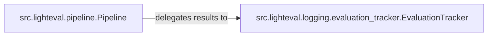

## Details

This subsystem is responsible for the persistence, loading, and presentation of evaluation results, ensuring that detailed responses and aggregated scores are managed effectively and can be integrated with external platforms for visualization and sharing.

### src.lighteval.pipeline.Pipeline
This component orchestrates the final stages of the evaluation pipeline, focusing on preparing, computing, and initiating the display and saving of results. It acts as the high-level controller for ensuring results are ready for output and presentation. Its responsibilities include post-processing outputs, computing final metrics, and triggering the persistence and reporting mechanisms.

**Related Classes/Methods**:

- <a href="https://github.com/huggingface/lighteval/blob/main/src/lighteval/pipeline.py" target="_blank" rel="noopener noreferrer">`src.lighteval.pipeline.Pipeline:_post_process_outputs`</a>
- <a href="https://github.com/huggingface/lighteval/blob/main/src/lighteval/pipeline.py" target="_blank" rel="noopener noreferrer">`src.lighteval.pipeline.Pipeline:_compute_metrics`</a>
- <a href="https://github.com/huggingface/lighteval/blob/main/src/lighteval/pipeline.py" target="_blank" rel="noopener noreferrer">`src.lighteval.pipeline.Pipeline:save_and_push_results`</a>
- <a href="https://github.com/huggingface/lighteval/blob/main/src/lighteval/pipeline.py" target="_blank" rel="noopener noreferrer">`src.lighteval.pipeline.Pipeline:show_results`</a>
- <a href="https://github.com/huggingface/lighteval/blob/main/src/lighteval/pipeline.py" target="_blank" rel="noopener noreferrer">`src.lighteval.pipeline.Pipeline:get_results`</a>

### src.lighteval.logging.evaluation_tracker.EvaluationTracker
This component manages the actual storage, loading, and external integration of evaluation results and detailed responses. It handles the low-level persistence mechanisms (e.g., saving to disk) and interfaces with various external reporting platforms such as Hugging Face Hub, TensorBoard, and Weights & Biases. It ensures the long-term availability and shareability of evaluation outcomes.

**Related Classes/Methods**:

- <a href="https://github.com/huggingface/lighteval/blob/main/src/lighteval/logging/evaluation_tracker.py" target="_blank" rel="noopener noreferrer">`src.lighteval.logging.evaluation_tracker.EvaluationTracker:save`</a>
- <a href="https://github.com/huggingface/lighteval/blob/main/src/lighteval/logging/evaluation_tracker.py" target="_blank" rel="noopener noreferrer">`src.lighteval.logging.evaluation_tracker.EvaluationTracker:save_details`</a>
- <a href="https://github.com/huggingface/lighteval/blob/main/src/lighteval/logging/evaluation_tracker.py" target="_blank" rel="noopener noreferrer">`src.lighteval.logging.evaluation_tracker.EvaluationTracker:save_results`</a>
- <a href="https://github.com/huggingface/lighteval/blob/main/src/lighteval/logging/evaluation_tracker.py" target="_blank" rel="noopener noreferrer">`src.lighteval.logging.evaluation_tracker.EvaluationTracker:push_to_tensorboard`</a>
- <a href="https://github.com/huggingface/lighteval/blob/main/src/lighteval/logging/evaluation_tracker.py" target="_blank" rel="noopener noreferrer">`src.lighteval.logging.evaluation_tracker.EvaluationTracker:push_to_wandb`</a>
- <a href="https://github.com/huggingface/lighteval/blob/main/src/lighteval/logging/evaluation_tracker.py" target="_blank" rel="noopener noreferrer">`src.lighteval.logging.evaluation_tracker.EvaluationTracker:push_to_hub`</a>
- <a href="https://github.com/huggingface/lighteval/blob/main/src/lighteval/logging/evaluation_tracker.py" target="_blank" rel="noopener noreferrer">`src.lighteval.logging.evaluation_tracker.EvaluationTracker:load_details_datasets`</a>
- <a href="https://github.com/huggingface/lighteval/blob/main/src/lighteval/logging/evaluation_tracker.py" target="_blank" rel="noopener noreferrer">`src.lighteval.logging.evaluation_tracker.EvaluationTracker:recreate_metadata_card`</a>

### [FAQ](https://github.com/CodeBoarding/GeneratedOnBoardings/tree/main?tab=readme-ov-file#faq)