```mermaid
graph LR
    Command_Line_Interface_CLI_["Command-Line Interface (CLI)"]
    Configuration_Task_Registry["Configuration & Task Registry"]
    Data_Prompt_Preparation["Data & Prompt Preparation"]
    Model_Interface_Inference_Backends["Model Interface & Inference Backends"]
    Evaluation_Pipeline_Core["Evaluation Pipeline Core"]
    Metric_Computation_Engine["Metric Computation Engine"]
    Result_Management_Reporting["Result Management & Reporting"]
    External_Services["External Services"]
    Command_Line_Interface_CLI_ -- "loads from" --> Configuration_Task_Registry
    Configuration_Task_Registry -- "provides to" --> Data_Prompt_Preparation
    Data_Prompt_Preparation -- "supplies to" --> Evaluation_Pipeline_Core
    Evaluation_Pipeline_Core -- "requests from" --> Model_Interface_Inference_Backends
    Model_Interface_Inference_Backends -- "returns to" --> Evaluation_Pipeline_Core
    Evaluation_Pipeline_Core -- "sends to" --> Metric_Computation_Engine
    Metric_Computation_Engine -- "returns to" --> Evaluation_Pipeline_Core
    Evaluation_Pipeline_Core -- "sends to" --> Result_Management_Reporting
    Result_Management_Reporting -- "pushes to" --> External_Services
    click Command_Line_Interface_CLI_ href "https://github.com/CodeBoarding/GeneratedOnBoardings/blob/main/lighteval/Command_Line_Interface_CLI_.md" "Details"
    click Configuration_Task_Registry href "https://github.com/CodeBoarding/GeneratedOnBoardings/blob/main/lighteval/Configuration_Task_Registry.md" "Details"
    click Data_Prompt_Preparation href "https://github.com/CodeBoarding/GeneratedOnBoardings/blob/main/lighteval/Data_Prompt_Preparation.md" "Details"
    click Model_Interface_Inference_Backends href "https://github.com/CodeBoarding/GeneratedOnBoardings/blob/main/lighteval/Model_Interface_Inference_Backends.md" "Details"
    click Evaluation_Pipeline_Core href "https://github.com/CodeBoarding/GeneratedOnBoardings/blob/main/lighteval/Evaluation_Pipeline_Core.md" "Details"
    click Metric_Computation_Engine href "https://github.com/CodeBoarding/GeneratedOnBoardings/blob/main/lighteval/Metric_Computation_Engine.md" "Details"
    click Result_Management_Reporting href "https://github.com/CodeBoarding/GeneratedOnBoardings/blob/main/lighteval/Result_Management_Reporting.md" "Details"
    click External_Services href "https://github.com/CodeBoarding/GeneratedOnBoardings/blob/main/lighteval/External_Services.md" "Details"
```

## Details

The `lighteval` project is structured around a clear, modular pipeline for evaluating Large Language Models (LLMs). The process begins with the **Command-Line Interface (CLI)**, which serves as the primary entry point for users to define and initiate evaluation runs. The CLI interacts with the **Configuration & Task Registry** to load predefined evaluation tasks, including datasets, prompts, and metric configurations. Once tasks are defined, the **Data & Prompt Preparation** component takes over, responsible for loading raw data, preparing it, and generating prompts suitable for LLM inference. The prepared data and prompts are then fed into the **Evaluation Pipeline Core**, the central orchestrator that manages the end-to-end evaluation flow. This core component interacts with the **Model Interface & Inference Backends** to perform actual LLM inference, abstracting away the complexities of different model types and inference systems. Model outputs are then passed to the **Metric Computation Engine**, which calculates various evaluation metrics. Finally, the results are handled by the **Result Management & Reporting** component, which stores, loads, and presents the evaluation outcomes. This component also integrates with **External Services** to push results to platforms like Hugging Face Hub, Weights & Biases, and TensorBoard for enhanced storage, visualization, and collaboration.

### Command-Line Interface (CLI) [[Expand]](./Command_Line_Interface_CLI_.md)
The primary user interface for initiating evaluations, handling command-line argument parsing, and loading initial configurations. It acts as the orchestrator for different evaluation modes.

**Related Classes/Methods**:

- <a href="https://github.com/huggingface/lighteval/blob/main/src/lighteval/__main__.py" target="_blank" rel="noopener noreferrer">`src/lighteval/__main__.py`</a>
- <a href="https://github.com/huggingface/lighteval/blob/main/src/lighteval/main_accelerate.py" target="_blank" rel="noopener noreferrer">`src/lighteval/main_accelerate.py`</a>
- <a href="https://github.com/huggingface/lighteval/blob/main/src/lighteval/main_baseline.py" target="_blank" rel="noopener noreferrer">`src/lighteval/main_baseline.py`</a>
- <a href="https://github.com/huggingface/lighteval/blob/main/src/lighteval/main_custom.py" target="_blank" rel="noopener noreferrer">`src/lighteval/main_custom.py`</a>
- <a href="https://github.com/huggingface/lighteval/blob/main/src/lighteval/main_endpoint.py" target="_blank" rel="noopener noreferrer">`src/lighteval/main_endpoint.py`</a>
- <a href="https://github.com/huggingface/lighteval/blob/main/src/lighteval/main_nanotron.py" target="_blank" rel="noopener noreferrer">`src/lighteval/main_nanotron.py`</a>
- <a href="https://github.com/huggingface/lighteval/blob/main/src/lighteval/main_sglang.py" target="_blank" rel="noopener noreferrer">`src/lighteval/main_sglang.py`</a>
- <a href="https://github.com/huggingface/lighteval/blob/main/src/lighteval/main_tasks.py" target="_blank" rel="noopener noreferrer">`src/lighteval/main_tasks.py`</a>
- <a href="https://github.com/huggingface/lighteval/blob/main/src/lighteval/main_vllm.py" target="_blank" rel="noopener noreferrer">`src/lighteval/main_vllm.py`</a>

### Configuration & Task Registry [[Expand]](./Configuration_Task_Registry.md)
Defines and manages evaluation tasks, including their associated datasets, prompts, and metric configurations. It serves as a central repository for all available evaluation tasks.

**Related Classes/Methods**:

- <a href="https://github.com/huggingface/lighteval/blob/main/src/lighteval/tasks/registry.py" target="_blank" rel="noopener noreferrer">`src/lighteval/tasks/registry.py`</a>
- <a href="https://github.com/huggingface/lighteval/blob/main/src/lighteval/tasks/default_prompts.py" target="_blank" rel="noopener noreferrer">`src/lighteval/tasks/default_prompts.py`</a>
- <a href="https://github.com/huggingface/lighteval/blob/main/src/lighteval/tasks/extended/" target="_blank" rel="noopener noreferrer">`src/lighteval/tasks/extended/`</a>
- <a href="https://github.com/huggingface/lighteval/blob/main/src/lighteval/tasks/lighteval_task.py" target="_blank" rel="noopener noreferrer">`src/lighteval/tasks/lighteval_task.py`</a>

### Data & Prompt Preparation [[Expand]](./Data_Prompt_Preparation.md)
Responsible for loading raw datasets, preparing them for evaluation, and generating prompts tailored for LLMs based on task definitions. It ensures data is in the correct format for model inference.

**Related Classes/Methods**:

- <a href="https://github.com/huggingface/lighteval/blob/main/src/lighteval/tasks/lighteval_task.py" target="_blank" rel="noopener noreferrer">`src/lighteval/tasks/lighteval_task.py`</a>
- <a href="https://github.com/huggingface/lighteval/blob/main/src/lighteval/tasks/prompt_manager.py" target="_blank" rel="noopener noreferrer">`src/lighteval/tasks/prompt_manager.py`</a>
- <a href="https://github.com/huggingface/lighteval/blob/main/src/lighteval/data.py" target="_blank" rel="noopener noreferrer">`src/lighteval/data.py`</a>

### Model Interface & Inference Backends [[Expand]](./Model_Interface_Inference_Backends.md)
Provides a unified, abstract interface (`AbstractModel`) for interacting with various LLM inference systems. It encapsulates the logic for loading models and performing inference (greedy generation, log-likelihood computation) across different backends.

**Related Classes/Methods**:

- <a href="https://github.com/huggingface/lighteval/blob/main/src/lighteval/models/model_loader.py" target="_blank" rel="noopener noreferrer">`src/lighteval/models/model_loader.py`</a>
- <a href="https://github.com/huggingface/lighteval/blob/main/src/lighteval/models/abstract_model.py" target="_blank" rel="noopener noreferrer">`src/lighteval/models/abstract_model.py`</a>
- <a href="https://github.com/huggingface/lighteval/blob/main/src/lighteval/models/transformers/transformers_model.py" target="_blank" rel="noopener noreferrer">`src/lighteval/models/transformers/transformers_model.py`</a>
- <a href="https://github.com/huggingface/lighteval/blob/main/src/lighteval/models/vllm/vllm_model.py" target="_blank" rel="noopener noreferrer">`src/lighteval/models/vllm/vllm_model.py`</a>
- <a href="https://github.com/huggingface/lighteval/blob/main/src/lighteval/models/nanotron/nanotron_model.py" target="_blank" rel="noopener noreferrer">`src/lighteval/models/nanotron/nanotron_model.py`</a>
- <a href="https://github.com/huggingface/lighteval/blob/main/src/lighteval/models/sglang/sglang_model.py" target="_blank" rel="noopener noreferrer">`src/lighteval/models/sglang/sglang_model.py`</a>
- <a href="https://github.com/huggingface/lighteval/blob/main/src/lighteval/models/endpoints/" target="_blank" rel="noopener noreferrer">`src/lighteval/models/endpoints/`</a>
- <a href="https://github.com/huggingface/lighteval/blob/main/src/lighteval/models/custom/custom_model.py" target="_blank" rel="noopener noreferrer">`src/lighteval/models/custom/custom_model.py`</a>
- <a href="https://github.com/huggingface/lighteval/blob/main/src/lighteval/models/dummy/dummy_model.py" target="_blank" rel="noopener noreferrer">`src/lighteval/models/dummy/dummy_model.py`</a>

### Evaluation Pipeline Core [[Expand]](./Evaluation_Pipeline_Core.md)
The central orchestrator of the end-to-end evaluation process. It manages the flow from running models with prepared prompts to collecting responses and initiating metric computations. It handles both synchronous and asynchronous model runs.

**Related Classes/Methods**:

- <a href="https://github.com/huggingface/lighteval/blob/main/src/lighteval/pipeline.py" target="_blank" rel="noopener noreferrer">`src/lighteval/pipeline.py`</a>

### Metric Computation Engine [[Expand]](./Metric_Computation_Engine.md)
Implements a wide array of evaluation metrics, including standard NLP metrics, LLM-as-a-judge paradigms, and specialized metrics. It takes model outputs and ground truth to compute quantitative scores.

**Related Classes/Methods**:

- <a href="https://github.com/huggingface/lighteval/blob/main/src/lighteval/metrics/metrics_corpus.py" target="_blank" rel="noopener noreferrer">`src/lighteval/metrics/metrics_corpus.py`</a>
- <a href="https://github.com/huggingface/lighteval/blob/main/src/lighteval/metrics/metrics_sample.py" target="_blank" rel="noopener noreferrer">`src/lighteval/metrics/metrics_sample.py`</a>
- <a href="https://github.com/huggingface/lighteval/blob/main/src/lighteval/metrics/llm_as_judge.py" target="_blank" rel="noopener noreferrer">`src/lighteval/metrics/llm_as_judge.py`</a>
- <a href="https://github.com/huggingface/lighteval/blob/main/src/lighteval/metrics/normalizations.py" target="_blank" rel="noopener noreferrer">`src/lighteval/metrics/normalizations.py`</a>
- <a href="https://github.com/huggingface/lighteval/blob/main/src/lighteval/metrics/harness_compatibility/" target="_blank" rel="noopener noreferrer">`src/lighteval/metrics/harness_compatibility/`</a>
- <a href="https://github.com/huggingface/lighteval/blob/main/src/lighteval/metrics/metrics.py" target="_blank" rel="noopener noreferrer">`src/lighteval/metrics/metrics.py`</a>

### Result Management & Reporting [[Expand]](./Result_Management_Reporting.md)
Handles the storage, loading, and presentation of evaluation results. It manages the persistence of detailed responses and aggregated scores, and facilitates integration with external platforms for visualization and sharing.

**Related Classes/Methods**:

- <a href="https://github.com/huggingface/lighteval/blob/main/src/lighteval/logging/evaluation_tracker.py" target="_blank" rel="noopener noreferrer">`src/lighteval/logging/evaluation_tracker.py`</a>
- <a href="https://github.com/huggingface/lighteval/blob/main/src/lighteval/pipeline.py" target="_blank" rel="noopener noreferrer">`src/lighteval/pipeline.py`</a>

### External Services [[Expand]](./External_Services.md)
Manages the pushing of evaluation results and details to external platforms and services for enhanced storage, visualization, and collaboration (e.g., Hugging Face Hub, Weights & Biases, TensorBoard, Amazon S3).

**Related Classes/Methods**:

- <a href="https://github.com/huggingface/lighteval/blob/main/src/lighteval/logging/evaluation_tracker.py#L87-L713" target="_blank" rel="noopener noreferrer">`src.lighteval.logging.evaluation_tracker.EvaluationTracker`:87-713</a>

### [FAQ](https://github.com/CodeBoarding/GeneratedOnBoardings/tree/main?tab=readme-ov-file#faq)