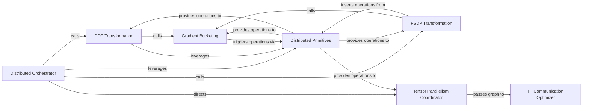

## Details

The Distributed Optimization Module is a dedicated subsystem within lightning-thunder responsible for applying transformations and utilities to optimize communication and memory usage in distributed training environments. It specifically supports Distributed Data Parallel (DDP), Fully Sharded Data Parallel (FSDP), and Tensor Parallelism, acting as a specialized optimization pass invoked by the Graph Transformation & Optimization Engine. Its scope is confined to distributed aspects, interacting with lower-level distributed primitives and higher-level orchestration.

### Distributed Orchestrator
Serves as the main entry point for distributed functionalities, orchestrating the application of various distributed transformations and managing parameter distribution. It acts as the high-level coordinator for applying distributed optimization strategies.

**Related Classes/Methods**:

- <a href="https://github.com/Lightning-AI/lightning-thunder/blob/main/thunder/distributed/__init__.py" target="_blank" rel="noopener noreferrer">`thunder.distributed`</a>

### Distributed Primitives
Defines the fundamental, low-level distributed communication primitives (e.g., all_gather_meta, all_reduce_meta, reduce_scatter). It acts as the interface to the underlying distributed backend, providing the building blocks for higher-level distributed operations.

**Related Classes/Methods**:

- <a href="https://github.com/Lightning-AI/lightning-thunder/blob/main/thunder/distributed/prims.py" target="_blank" rel="noopener noreferrer">`thunder.distributed.prims`</a>

### FSDP Transformation
Implements Fully Sharded Data Parallel (FSDP) specific graph transformations. This includes sharding parameters, inserting necessary communication operations (like all-gather, reduce-scatter), and integrating gradient bucketing for optimized memory and communication.

**Related Classes/Methods**:

- <a href="https://github.com/Lightning-AI/lightning-thunder/blob/main/thunder/distributed/transforms/fsdp.py" target="_blank" rel="noopener noreferrer">`thunder.distributed.transforms.fsdp`</a>

### DDP Transformation
Handles Distributed Data Parallel (DDP) specific optimizations, primarily focusing on efficient gradient synchronization in the backward pass through bucketing and all-reduce operations.

**Related Classes/Methods**:

- <a href="https://github.com/Lightning-AI/lightning-thunder/blob/main/thunder/distributed/transforms/ddp.py" target="_blank" rel="noopener noreferrer">`thunder.distributed.transforms.ddp`</a>

### Tensor Parallelism Coordinator
Provides shared logic and initial graph adjustments for tensor parallelism. It coordinates the application of specific tensor parallelism strategies (column-wise, row-wise).

**Related Classes/Methods**:

- <a href="https://github.com/Lightning-AI/lightning-thunder/blob/main/thunder/distributed/tensor_parallel/common.py" target="_blank" rel="noopener noreferrer">`thunder.distributed.tensor_parallel.common`</a>

### Gradient Bucketing
Manages the aggregation of gradients into larger chunks (buckets) before performing communication operations, which helps reduce communication overhead and improve efficiency.

**Related Classes/Methods**:

- <a href="https://github.com/Lightning-AI/lightning-thunder/blob/main/thunder/distributed/bucketing.py" target="_blank" rel="noopener noreferrer">`thunder.distributed.bucketing`</a>

### TP Communication Optimizer
Focuses on optimizing communication within tensor parallel graphs by analyzing and removing redundant communication operations, thereby improving performance.

**Related Classes/Methods**:

- <a href="https://github.com/Lightning-AI/lightning-thunder/blob/main/thunder/distributed/tensor_parallel/optimize_comm.py" target="_blank" rel="noopener noreferrer">`thunder.distributed.tensor_parallel.optimize_comm`</a>

### [FAQ](https://github.com/CodeBoarding/GeneratedOnBoardings/tree/main?tab=readme-ov-file#faq)