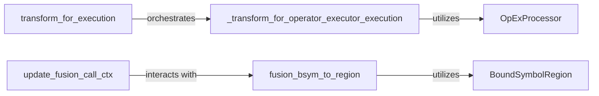

## Details

This subsystem defines the standardized interface and mechanisms for integrating various hardware-specific or specialized execution engines within the Thunder framework. It acts as a dispatcher, routing the optimized Intermediate Representation (IR) to the appropriate backend for final execution, embodying a crucial part of the compiler pipeline's backend stage.

### transform_for_execution
Serves as the primary entry point and orchestrator for preparing optimized IR for final execution. It dispatches the IR to specialized components responsible for backend-specific transformations, acting as the high-level interface for the execution pipeline.

**Related Classes/Methods**:

- <a href="https://github.com/Lightning-AI/lightning-thunder/blob/main/thunder/common.py#L640-L662" target="_blank" rel="noopener noreferrer">`transform_for_execution`:640-662</a>

### _transform_for_operator_executor_execution
Performs core, detailed IR transformation specifically for operator-level executors. This component adapts the IR's structure and content to meet the precise requirements of various backend execution engines, ensuring compatibility and optimization.

**Related Classes/Methods**:

- <a href="https://github.com/Lightning-AI/lightning-thunder/blob/main/thunder/executors/passes.py#L32-L104" target="_blank" rel="noopener noreferrer">`_transform_for_operator_executor_execution`:32-104</a>

### OpExProcessor
A dedicated processor encapsulating operator-level execution details and transformations. It embodies the Plugin/Strategy Pattern, allowing different execution backends to be integrated and managed through a unified interface, handling the specifics of each backend's requirements.

**Related Classes/Methods**:

- <a href="https://github.com/Lightning-AI/lightning-thunder/blob/main/thunder/executors/passes.py#L44-L92" target="_blank" rel="noopener noreferrer">`OpExProcessor`:44-92</a>

### update_fusion_call_ctx
Manages and updates the context for fusion operations. This is critical for optimizing and grouping operations before dispatching them to execution backends, ensuring that the execution backend interface is properly integrated with the fusion process.

**Related Classes/Methods**:

- <a href="https://github.com/Lightning-AI/lightning-thunder/blob/main/thunder/executors/passes.py#L151-L183" target="_blank" rel="noopener noreferrer">`update_fusion_call_ctx`:151-183</a>

### fusion_bsym_to_region
Defines and manages regions of operations intended for fusion. This component maps bound symbols (representing operations) to specific fusion regions, enabling efficient grouping and execution by the backend.

**Related Classes/Methods**:

- <a href="https://github.com/Lightning-AI/lightning-thunder/blob/main/thunder/executors/passes.py#L174-L179" target="_blank" rel="noopener noreferrer">`fusion_bsym_to_region`:174-179</a>

### BoundSymbolRegion
Provides the structural definition for fusion regions. This data structure is fundamental for `fusion_bsym_to_region` to organize and represent groups of operations that can be fused and executed together by a backend.

**Related Classes/Methods**:

- <a href="https://github.com/Lightning-AI/lightning-thunder/blob/main/thunder/executors/passes.py#L161-L165" target="_blank" rel="noopener noreferrer">`BoundSymbolRegion`:161-165</a>

### [FAQ](https://github.com/CodeBoarding/GeneratedOnBoardings/tree/main?tab=readme-ov-file#faq)