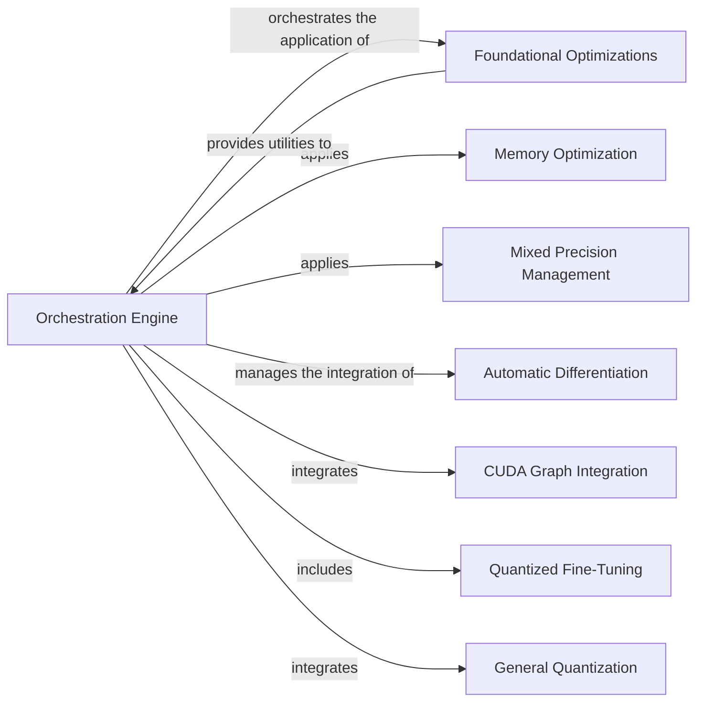

## Details

The `Graph Transformation & Optimization Engine` subsystem is the core of `lightning-thunder` responsible for applying a series of general and specialized graph-level optimizations to the captured Intermediate Representation (IR). Its boundaries encompass the central orchestration logic and various distinct optimization passes, including memory, precision, and hardware-specific transformations.

### Orchestration Engine
The central component defining and managing the overall flow of graph transformations and optimizations on the Intermediate Representation (IR). It acts as the primary coordinator for applying various optimization passes in a structured pipeline.

**Related Classes/Methods**:

- <a href="https://github.com/Lightning-AI/lightning-thunder/blob/main/thunder/common.py" target="_blank" rel="noopener noreferrer">`thunder.common`</a>
- <a href="https://github.com/Lightning-AI/lightning-thunder/blob/main/thunder/core/transforms.py#L1523-L1557" target="_blank" rel="noopener noreferrer">`thunder.core.transforms.transform_traces_pre_prologue`:1523-1557</a>
- <a href="https://github.com/Lightning-AI/lightning-thunder/blob/main/thunder/core/transforms.py#L502-L524" target="_blank" rel="noopener noreferrer">`thunder.core.transforms.transform_trace_post_optimization`:502-524</a>
- <a href="https://github.com/Lightning-AI/lightning-thunder/blob/main/thunder/core/transforms.py#L128-L203" target="_blank" rel="noopener noreferrer">`thunder.core.transforms.bsym_list_to_dag`:128-203</a>

### Foundational Optimizations
Provides essential, general-purpose graph optimization algorithms (e.g., Dead Code Elimination, Common Subexpression Elimination) and utilities for basic IR manipulation. These serve as fundamental building blocks for more complex transformations.

**Related Classes/Methods**:

- <a href="https://github.com/Lightning-AI/lightning-thunder/blob/main/thunder/core/transform_common.py" target="_blank" rel="noopener noreferrer">`thunder.core.transform_common`</a>

### Memory Optimization
Specializes in reducing memory consumption by recomputing intermediate values (rematerialization) instead of storing them, optimizing for memory-constrained environments.

**Related Classes/Methods**:

- <a href="https://github.com/Lightning-AI/lightning-thunder/blob/main/thunder/executors/nvfuserex_impl.py" target="_blank" rel="noopener noreferrer">`thunder.executors.nvfuserex_impl:rematerialization`</a>

### Mixed Precision Management
Handles Automatic Mixed Precision (AMP) transformations, dynamically adjusting data types (e.g., float32 to float16) for improved performance and memory efficiency without significant loss of accuracy.

**Related Classes/Methods**:

- <a href="https://github.com/Lightning-AI/lightning-thunder/blob/main/thunder/transforms/autocast.py" target="_blank" rel="noopener noreferrer">`thunder.transforms.autocast`</a>

### Automatic Differentiation
Transforms the computational graph to enable efficient gradient computation for training, typically by inserting backward pass operations.

**Related Classes/Methods**:

- <a href="https://github.com/Lightning-AI/lightning-thunder/blob/main/thunder/transforms/autodiff.py" target="_blank" rel="noopener noreferrer">`thunder.transforms.autodiff`</a>

### CUDA Graph Integration
Integrates with NVIDIA CUDA Graphs to capture and replay entire computational graphs, significantly reducing CPU overhead for repetitive execution patterns.

**Related Classes/Methods**:

- <a href="https://github.com/Lightning-AI/lightning-thunder/blob/main/thunder/transforms/cudagraph.py" target="_blank" rel="noopener noreferrer">`thunder.transforms.cudagraph`</a>

### General Quantization
Provides methods for reducing the precision of numerical representations in the IR (e.g., to INT8) for smaller model size and faster inference, applicable to various models.

**Related Classes/Methods**:

- <a href="https://github.com/Lightning-AI/lightning-thunder/blob/main/thunder/transforms/quantization.py" target="_blank" rel="noopener noreferrer">`thunder.transforms.quantization`</a>

### Quantized Fine-Tuning
Implements QLoRA (Quantized Low-Rank Adapters) for efficient fine-tuning of large language models by quantizing the base model and training small, low-rank adapters.

**Related Classes/Methods**:

- <a href="https://github.com/Lightning-AI/lightning-thunder/blob/main/thunder/transforms/qlora.py" target="_blank" rel="noopener noreferrer">`thunder.transforms.qlora`</a>

### [FAQ](https://github.com/CodeBoarding/GeneratedOnBoardings/tree/main?tab=readme-ov-file#faq)