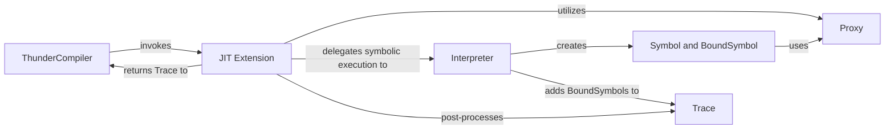

## Details

This subsystem is responsible for capturing PyTorch model operations and converting them into Thunder's internal symbolic representation (IR), integrating with PyTorch Dynamo for dynamic graph capture.

### ThunderCompiler
Acts as the primary entry point for PyTorch models, integrating with PyTorch Dynamo to initiate the dynamic graph capture and compilation process. It orchestrates the overall tracing and compilation flow.

**Related Classes/Methods**:

- <a href="https://github.com/Lightning-AI/lightning-thunder/blob/main/thunder/dynamo/compiler.py#L1-L9999" target="_blank" rel="noopener noreferrer">`thunder.dynamo.compiler`:1-9999</a>

### JIT Extension
Extends PyTorch's JIT capabilities to intercept and proxy operations. It orchestrates the tracing process, manages the JIT context, and handles the conversion of concrete PyTorch operations into Thunder's symbolic representation. It also performs post-processing on the generated trace.

**Related Classes/Methods**:

- <a href="https://github.com/Lightning-AI/lightning-thunder/blob/main/thunder/core/jit_ext.py#L1-L9999" target="_blank" rel="noopener noreferrer">`thunder.core.jit_ext`:1-9999</a>

### Interpreter
The core symbolic execution engine. It interprets Python bytecode and PyTorch operations, wrapping concrete values into symbolic proxies and recording operations as BoundSymbols to build the IR.

**Related Classes/Methods**:

- <a href="https://github.com/Lightning-AI/lightning-thunder/blob/main/thunder/core/interpreter.py#L1-L9999" target="_blank" rel="noopener noreferrer">`thunder.core.interpreter`:1-9999</a>

### Proxy
Provides symbolic representations for Python objects and PyTorch tensors during tracing. These proxies capture metadata and intercept operations to trigger the recording of symbolic operations.

**Related Classes/Methods**:

- <a href="https://github.com/Lightning-AI/lightning-thunder/blob/main/thunder/core/proxies.py#L1-L9999" target="_blank" rel="noopener noreferrer">`thunder.core.proxies`:1-9999</a>

### Symbol and BoundSymbol
Defines the fundamental building blocks of Thunder's IR. Symbol represents an abstract operation, while BoundSymbol is a concrete instance of an operation with specific symbolic inputs and outputs.

**Related Classes/Methods**:

- <a href="https://github.com/Lightning-AI/lightning-thunder/blob/main/thunder/core/symbol.py#L1-L9999" target="_blank" rel="noopener noreferrer">`thunder.core.symbol`:1-9999</a>

### Trace
Collects and manages the ordered sequence of BoundSymbols, effectively constructing the computational graph (IR) of the traced model.

**Related Classes/Methods**:

- <a href="https://github.com/Lightning-AI/lightning-thunder/blob/main/thunder/core/trace.py#L1-L9999" target="_blank" rel="noopener noreferrer">`thunder.core.trace`:1-9999</a>

### [FAQ](https://github.com/CodeBoarding/GeneratedOnBoardings/tree/main?tab=readme-ov-file#faq)