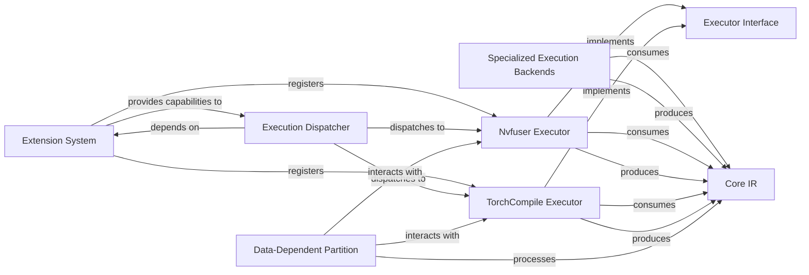

## Details

The Thunder framework's execution subsystem is designed around a flexible, pluggable architecture centered on its Core IR. This IR, represented by BoundSymbol and TensorProxy, flows through a "Compiler Pipeline" where it undergoes transformations and optimizations. The Extension System acts as a central registry, enabling the dynamic integration of various Specialized Execution Backends (e.g., Nvfuser Executor, TorchCompile Executor). These backends adhere to a common Executor Interface, ensuring seamless interoperability. The Execution Dispatcher intelligently analyzes the Core IR and, leveraging the capabilities registered by the Extension System, dispatches segments of the IR to the most appropriate specialized backend for optimized execution. Additionally, the Data-Dependent Partition component provides crucial graph fusion capabilities, acting as a pre-processing step to further optimize the Core IR before it is consumed by the specialized executors. This modular design facilitates extensibility and allows Thunder to leverage diverse hardware and software optimizations.

### Specialized Execution Backends [[Expand]](./Specialized_Execution_Backends.md)
A logical grouping of high-performance execution engines, representing the final stage of the compiler pipeline where optimized Intermediate Representation (IR) is translated and executed on specific hardware or through specialized libraries.

**Related Classes/Methods**:

- <a href="https://github.com/Lightning-AI/lightning-thunder/blob/main/thunder/executors/nvfuserex_impl.py#L1-L9999" target="_blank" rel="noopener noreferrer">`nvfuserex_impl`:1-9999</a>
- <a href="https://github.com/Lightning-AI/lightning-thunder/blob/main/thunder/benchmarks/benchmark_litgpt.py" target="_blank" rel="noopener noreferrer">`torch_compile`</a>
- <a href="https://github.com/Lightning-AI/lightning-thunder/blob/main/thunder/executors/cudnn_layernormex.py#L1-L9999" target="_blank" rel="noopener noreferrer">`cudnn_layernormex`:1-9999</a>
- <a href="https://github.com/Lightning-AI/lightning-thunder/blob/main/thunder/executors/transformer_engine_v2ex.py#L1-L9999" target="_blank" rel="noopener noreferrer">`transformer_engine_v2ex`:1-9999</a>
- <a href="https://github.com/Lightning-AI/lightning-thunder/blob/main/thunder/executors/triton_crossentropy_impl.py#L1-L9999" target="_blank" rel="noopener noreferrer">`triton_crossentropy_impl`:1-9999</a>
- <a href="https://github.com/Lightning-AI/lightning-thunder/blob/main/thunder/executors/cudnn_sdpa.py#L1-L9999" target="_blank" rel="noopener noreferrer">`cudnn_sdpa`:1-9999</a>
- <a href="https://github.com/Lightning-AI/lightning-thunder/blob/main/thunder/executors/sdpaex.py#L1-L9999" target="_blank" rel="noopener noreferrer">`sdpaex`:1-9999</a>

### Executor Interface
A standardized interface that all specialized executors implement, ensuring a common contract for interaction with the broader Thunder framework. This is crucial for the "Plugin/Strategy Pattern."

**Related Classes/Methods**:

- <a href="https://github.com/Lightning-AI/lightning-thunder/blob/main/examples/coverage/jit_coverage_hf.py" target="_blank" rel="noopener noreferrer">`Executor`</a>

### Extension System
The system responsible for registering and managing executor capabilities, making them discoverable and selectable by the Execution Dispatcher. This acts as the registry for the "Plugin/Strategy Pattern."

**Related Classes/Methods**:

- <a href="https://github.com/Lightning-AI/lightning-thunder/blob/main/thunder/core/proxies.py#L571-L572" target="_blank" rel="noopener noreferrer">`extend`:571-572</a>

### Execution Dispatcher
Identifies suitable IR segments and dispatches them to the appropriate registered specialized executor for optimized execution. This component orchestrates the flow within the "Compiler Pipeline."

**Related Classes/Methods**:

- <a href="https://github.com/Lightning-AI/lightning-thunder/blob/main/thunder/executors/passes.py#L1-L9999" target="_blank" rel="noopener noreferrer">`thunder.executors.passes`:1-9999</a>

### Nvfuser Executor
Converts Thunder IR to NVFuser format, applies NVFuser-specific optimizations (e.g., kernel fusion), orchestrates execution on GPU, and translates results back to Thunder IR. A concrete example of a specialized backend.

**Related Classes/Methods**:

- <a href="https://github.com/Lightning-AI/lightning-thunder/blob/main/thunder/executors/nvfuserex_impl.py#L1-L9999" target="_blank" rel="noopener noreferrer">`nvfuserex_impl`:1-9999</a>

### TorchCompile Executor
Converts Thunder IR to PyTorch's torch.compile format, applies torch.compile-specific optimizations, orchestrates execution, and translates results back to Thunder IR. Another concrete example of a specialized backend.

**Related Classes/Methods**:

- <a href="https://github.com/Lightning-AI/lightning-thunder/blob/main/thunder/benchmarks/benchmark_litgpt.py" target="_blank" rel="noopener noreferrer">`torch_compile`</a>

### Core IR
Represents the Intermediate Representation of Thunder, including BoundSymbol and TensorProxy, which executors consume as input and produce as output. This is the central data structure processed by the "Compiler Pipeline."

**Related Classes/Methods**:

- <a href="https://github.com/Lightning-AI/lightning-thunder/blob/main/thunder/core/symbol.py#L358-L716" target="_blank" rel="noopener noreferrer">`thunder.core.symbol.BoundSymbol`:358-716</a>
- <a href="https://github.com/Lightning-AI/lightning-thunder/blob/main/thunder/core/proxies.py#L1991-L2036" target="_blank" rel="noopener noreferrer">`thunder.core.proxies.TensorProxy`:1991-2036</a>

### Data-Dependent Partition
Provides general graph fusion capabilities (consecutive and dataflow fusion) used as a pre-processing step for further optimization by some executors. It's a key optimization pass before execution.

**Related Classes/Methods**:

- <a href="https://github.com/Lightning-AI/lightning-thunder/blob/main/thunder/executors/data_dependent_partition.py#L1-L9999" target="_blank" rel="noopener noreferrer">`data_dependent_partition`:1-9999</a>

### [FAQ](https://github.com/CodeBoarding/GeneratedOnBoardings/tree/main?tab=readme-ov-file#faq)