```mermaid
graph LR
    Model_Tracing_IR_Generation["Model Tracing & IR Generation"]
    Graph_Transformation_Optimization_Engine["Graph Transformation & Optimization Engine"]
    Distributed_Optimization_Module["Distributed Optimization Module"]
    Execution_Backends_Interface["Execution Backends Interface"]
    Specialized_Execution_Backends["Specialized Execution Backends"]
    Model_Tracing_IR_Generation -- "passes IR to" --> Graph_Transformation_Optimization_Engine
    Graph_Transformation_Optimization_Engine -- "orchestrates and applies optimizations from" --> Distributed_Optimization_Module
    Distributed_Optimization_Module -- "returns optimized graph segments to" --> Graph_Transformation_Optimization_Engine
    Graph_Transformation_Optimization_Engine -- "sends optimized IR to" --> Execution_Backends_Interface
    Execution_Backends_Interface -- "dispatches optimized IR to" --> Specialized_Execution_Backends
    click Model_Tracing_IR_Generation href "https://github.com/CodeBoarding/GeneratedOnBoardings/blob/main/lightning-thunder/Model_Tracing_IR_Generation.md" "Details"
    click Graph_Transformation_Optimization_Engine href "https://github.com/CodeBoarding/GeneratedOnBoardings/blob/main/lightning-thunder/Graph_Transformation_Optimization_Engine.md" "Details"
    click Distributed_Optimization_Module href "https://github.com/CodeBoarding/GeneratedOnBoardings/blob/main/lightning-thunder/Distributed_Optimization_Module.md" "Details"
    click Execution_Backends_Interface href "https://github.com/CodeBoarding/GeneratedOnBoardings/blob/main/lightning-thunder/Execution_Backends_Interface.md" "Details"
    click Specialized_Execution_Backends href "https://github.com/CodeBoarding/GeneratedOnBoardings/blob/main/lightning-thunder/Specialized_Execution_Backends.md" "Details"
```

## Details

Thunder's architecture is designed for efficient and flexible PyTorch model optimization and execution. It begins with the `Model Tracing & IR Generation` component, which captures PyTorch operations and translates them into Thunder's internal symbolic representation (IR). This IR then flows into the `Graph Transformation & Optimization Engine`, the core orchestrator responsible for applying a wide array of graph-level optimizations, including those provided by the `Distributed Optimization Module` for distributed training scenarios. Once optimized, the IR is passed to the `Execution Backends Interface`, which acts as a dispatcher, routing the optimized graph to the appropriate `Specialized Execution Backends` for high-performance execution on various hardware or specialized engines.

### Model Tracing & IR Generation [[Expand]](./Model_Tracing_IR_Generation.md)
The entry point for PyTorch models, responsible for capturing operations and converting them into Thunder's internal symbolic representation (IR). This component integrates with PyTorch Dynamo for dynamic graph capture.

**Related Classes/Methods**:

- <a href="https://github.com/Lightning-AI/lightning-thunder/blob/main/thunder/core/recipe.py" target="_blank" rel="noopener noreferrer">`interpreter`</a>
- <a href="https://github.com/Lightning-AI/lightning-thunder/blob/main/thunder/core/jit_ext.py" target="_blank" rel="noopener noreferrer">`jit_ext`</a>
- <a href="https://github.com/Lightning-AI/lightning-thunder/blob/main/thunder/common.py" target="_blank" rel="noopener noreferrer">`proxies`</a>
- <a href="https://github.com/Lightning-AI/lightning-thunder/blob/main/thunder/core/rematerialization.py" target="_blank" rel="noopener noreferrer">`symbol`</a>
- <a href="https://github.com/Lightning-AI/lightning-thunder/blob/main/thunder/benchmarks/benchmark_hf.py" target="_blank" rel="noopener noreferrer">`trace`</a>
- <a href="https://github.com/Lightning-AI/lightning-thunder/blob/main/thunder/dynamo/compiler.py#L58-L206" target="_blank" rel="noopener noreferrer">`compiler`:58-206</a>

### Graph Transformation & Optimization Engine [[Expand]](./Graph_Transformation_Optimization_Engine.md)
The central orchestrator for applying general and specialized graph-level optimizations to the captured IR. This includes techniques like automatic mixed precision (AMP), various quantization methods, rematerialization, and integration with CUDA Graphs.

**Related Classes/Methods**:

- <a href="https://github.com/Lightning-AI/lightning-thunder/blob/main/thunder/common.py" target="_blank" rel="noopener noreferrer">`transforms`</a>
- <a href="https://github.com/Lightning-AI/lightning-thunder/blob/main/thunder/core/transform_common.py" target="_blank" rel="noopener noreferrer">`transform_common`</a>
- <a href="https://github.com/Lightning-AI/lightning-thunder/blob/main/thunder/executors/nvfuserex_impl.py" target="_blank" rel="noopener noreferrer">`rematerialization`</a>
- <a href="https://github.com/Lightning-AI/lightning-thunder/blob/main/thunder/transforms/quantization.py" target="_blank" rel="noopener noreferrer">`quantization`</a>
- <a href="https://github.com/Lightning-AI/lightning-thunder/blob/main/thunder/transforms/qlora.py" target="_blank" rel="noopener noreferrer">`qlora`</a>
- <a href="https://github.com/Lightning-AI/lightning-thunder/blob/main/thunder/transforms/cudagraph.py" target="_blank" rel="noopener noreferrer">`cudagraph`</a>

### Distributed Optimization Module [[Expand]](./Distributed_Optimization_Module.md)
A dedicated module providing transformations and utilities specifically designed to optimize communication patterns and memory usage in distributed training environments, supporting DDP, FSDP, and Tensor Parallelism. It is invoked by the Graph Transformation & Optimization Engine.

**Related Classes/Methods**:

- <a href="https://github.com/Lightning-AI/lightning-thunder/blob/main/thunder/distributed/transforms/fsdp.py#L440-L741" target="_blank" rel="noopener noreferrer">`bucketing`:440-741</a>
- <a href="https://github.com/Lightning-AI/lightning-thunder/blob/main/thunder/common.py" target="_blank" rel="noopener noreferrer">`ddp`</a>
- <a href="https://github.com/Lightning-AI/lightning-thunder/blob/main/thunder/benchmarks/benchmark_litgpt.py" target="_blank" rel="noopener noreferrer">`fsdp`</a>
- <a href="https://github.com/Lightning-AI/lightning-thunder/blob/main/thunder/core/proxies.py" target="_blank" rel="noopener noreferrer">`column_wise`</a>
- <a href="https://github.com/Lightning-AI/lightning-thunder/blob/main/thunder/core/proxies.py" target="_blank" rel="noopener noreferrer">`row_wise`</a>

### Execution Backends Interface [[Expand]](./Execution_Backends_Interface.md)
Defines the standardized interface and mechanisms for integrating various hardware-specific or specialized execution engines. It acts as a dispatcher, routing the optimized IR to the appropriate backend for final execution.

**Related Classes/Methods**:

- <a href="https://github.com/Lightning-AI/lightning-thunder/blob/main/thunder/executors/passes.py" target="_blank" rel="noopener noreferrer">`passes`</a>

### Specialized Execution Backends [[Expand]](./Specialized_Execution_Backends.md)
A logical grouping representing various high-performance execution engines that process the optimized IR. This includes integrations with NVIDIA NVFuser, PyTorch's `torch.compile`, NVIDIA cuDNN, NVIDIA Transformer Engine, and Triton for custom GPU kernels.

**Related Classes/Methods**:

- <a href="https://github.com/Lightning-AI/lightning-thunder/blob/main/thunder/executors/nvfuserex_impl.py" target="_blank" rel="noopener noreferrer">`nvfuserex_impl`</a>
- <a href="https://github.com/Lightning-AI/lightning-thunder/blob/main/thunder/benchmarks/benchmark_litgpt.py" target="_blank" rel="noopener noreferrer">`torch_compile`</a>
- <a href="https://github.com/Lightning-AI/lightning-thunder/blob/main/thunder/executors/cudnn_layernormex.py" target="_blank" rel="noopener noreferrer">`cudnn_layernormex`</a>
- <a href="https://github.com/Lightning-AI/lightning-thunder/blob/main/thunder/executors/transformer_engine_v2ex.py" target="_blank" rel="noopener noreferrer">`transformer_engineex`</a>
- <a href="https://github.com/Lightning-AI/lightning-thunder/blob/main/thunder/executors/triton_crossentropy_impl.py" target="_blank" rel="noopener noreferrer">`triton_crossentropy_impl`</a>

### [FAQ](https://github.com/CodeBoarding/GeneratedOnBoardings/tree/main?tab=readme-ov-file#faq)