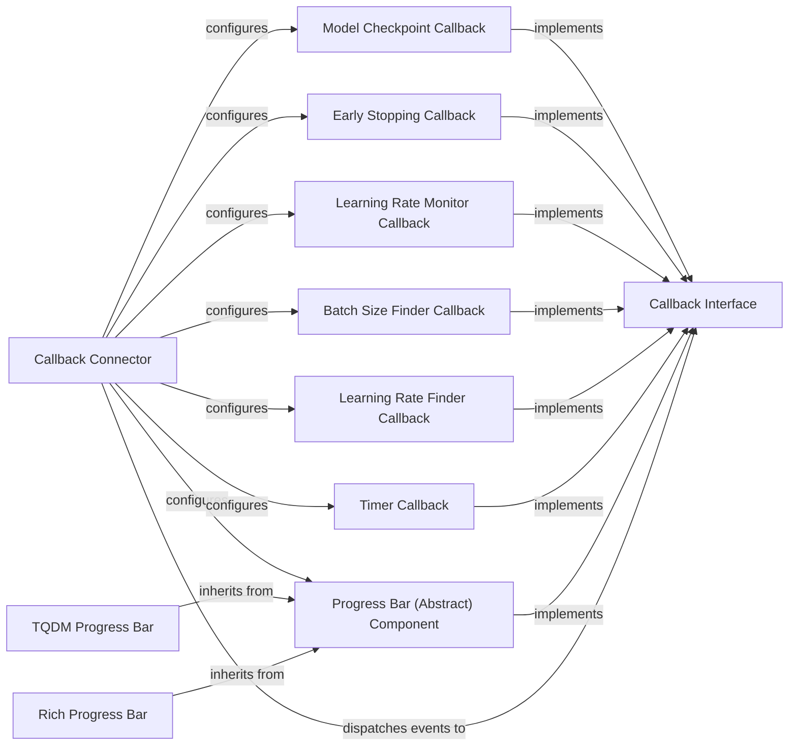

## Component Details

The Callbacks & Extension subsystem in PyTorch Lightning provides a flexible mechanism for users to inject custom logic and monitor various aspects of the training lifecycle. It is centered around the `Callback Interface`, which defines the contract for all callbacks, and the `Callback Connector`, responsible for managing and orchestrating these callbacks. Various specialized callbacks, such as `Model Checkpoint`, `Early Stopping`, `Learning Rate Monitor`, `Progress Bars`, `Timer`, `Batch Size Finder`, and `Learning Rate Finder`, extend the core functionality by implementing the `Callback Interface` to perform specific tasks during training, validation, testing, and prediction.

### Callback Interface
Defines the abstract interface and lifecycle hooks that all concrete callback implementations must adhere to. It serves as the contract for extending the Trainer's behavior.

**Related Classes/Methods**:

- <a href="https://github.com/Lightning-AI/lightning/blob/master/src/lightning/pytorch/callbacks/callback.py#L25-L286" target="_blank" rel="noopener noreferrer">`lightning.src.lightning.pytorch.callbacks.callback.Callback` (25:286)</a>

### Callback Connector
Manages the registration, configuration, and interaction of various callbacks with the Trainer.

**Related Classes/Methods**:

- <a href="https://github.com/Lightning-AI/lightning/blob/master/src/lightning/pytorch/trainer/connectors/callback_connector.py#L46-L244" target="_blank" rel="noopener noreferrer">`lightning.src.lightning.pytorch.trainer.connectors.callback_connector._CallbackConnector` (46:244)</a>

### Model Checkpoint Callback
Saves the model's state periodically during training, based on various criteria like monitoring a metric or saving the last epoch.

**Related Classes/Methods**:

- <a href="https://github.com/Lightning-AI/lightning/blob/master/src/lightning/pytorch/callbacks/model_checkpoint.py#L50-L805" target="_blank" rel="noopener noreferrer">`lightning.src.lightning.pytorch.callbacks.model_checkpoint.ModelCheckpoint` (50:805)</a>

### Early Stopping Callback
Stops training early if a monitored quantity has stopped improving.

**Related Classes/Methods**:

- <a href="https://github.com/Lightning-AI/lightning/blob/master/src/lightning/pytorch/callbacks/early_stopping.py#L37-L273" target="_blank" rel="noopener noreferrer">`lightning.src.lightning.pytorch.callbacks.early_stopping.EarlyStopping` (37:273)</a>

### Learning Rate Monitor Callback
Logs and monitors the learning rates of optimizers during training.

**Related Classes/Methods**:

- <a href="https://github.com/Lightning-AI/lightning/blob/master/src/lightning/pytorch/callbacks/lr_monitor.py#L38-L364" target="_blank" rel="noopener noreferrer">`lightning.src.lightning.pytorch.callbacks.lr_monitor.LearningRateMonitor` (38:364)</a>

### Progress Bar (Abstract) Component
Provides a base class for progress bar implementations, defining common functionalities.

**Related Classes/Methods**:

- <a href="https://github.com/Lightning-AI/lightning/blob/master/src/lightning/pytorch/callbacks/progress/progress_bar.py#L23-L207" target="_blank" rel="noopener noreferrer">`lightning.src.lightning.pytorch.callbacks.progress.progress_bar.ProgressBar` (23:207)</a>

### TQDM Progress Bar
A concrete implementation of a progress bar using the TQDM library, inheriting from the abstract Progress Bar component.

**Related Classes/Methods**:

- <a href="https://github.com/Lightning-AI/lightning/blob/master/src/lightning/pytorch/callbacks/progress/tqdm_progress.py#L64-L442" target="_blank" rel="noopener noreferrer">`lightning.src.lightning.pytorch.callbacks.progress.tqdm_progress.TQDMProgressBar` (64:442)</a>

### Rich Progress Bar
A concrete implementation of a progress bar using the Rich library, inheriting from the abstract Progress Bar component.

**Related Classes/Methods**:

- <a href="https://github.com/Lightning-AI/lightning/blob/master/src/lightning/pytorch/callbacks/progress/rich_progress.py#L222-L651" target="_blank" rel="noopener noreferrer">`lightning.src.lightning.pytorch.callbacks.progress.rich_progress.RichProgressBar` (222:651)</a>

### Timer Callback
Tracks and logs the time elapsed during different stages of training.

**Related Classes/Methods**:

- <a href="https://github.com/Lightning-AI/lightning/blob/master/src/lightning/pytorch/callbacks/timer.py#L42-L205" target="_blank" rel="noopener noreferrer">`lightning.src.lightning.pytorch.callbacks.timer.Timer` (42:205)</a>

### Batch Size Finder Callback
Automatically finds the largest batch size that fits into memory.

**Related Classes/Methods**:

- <a href="https://github.com/Lightning-AI/lightning/blob/master/src/lightning/pytorch/callbacks/batch_size_finder.py#L33-L206" target="_blank" rel="noopener noreferrer">`lightning.src.lightning.pytorch.callbacks.batch_size_finder.BatchSizeFinder` (33:206)</a>

### Learning Rate Finder Callback
Helps find an optimal learning rate for the model by performing a learning rate range test.

**Related Classes/Methods**:

- <a href="https://github.com/Lightning-AI/lightning/blob/master/src/lightning/pytorch/callbacks/lr_finder.py#L32-L130" target="_blank" rel="noopener noreferrer">`lightning.src.lightning.pytorch.callbacks.lr_finder.LearningRateFinder` (32:130)</a>

### [FAQ](https://github.com/CodeBoarding/GeneratedOnBoardings/tree/main?tab=readme-ov-file#faq)