```mermaid
graph LR
    Trainer_Orchestration["Trainer Orchestration"]
    Checkpoint_Connector["Checkpoint Connector"]
    Checkpoint_I_O_Plugins["Checkpoint I/O Plugins"]
    Strategy_Checkpointing_Adapters["Strategy Checkpointing Adapters"]
    Core_Module_DataModule_State_Management["Core Module/DataModule State Management"]
    Callback_and_Hook_System["Callback and Hook System"]
    File_System_and_Cloud_Utilities["File System and Cloud Utilities"]
    Checkpoint_Migration_and_Compatibility["Checkpoint Migration and Compatibility"]
    Distributed_Communication_Utilities["Distributed Communication Utilities"]
    Strategy_Specific_Checkpoint_Helpers["Strategy-Specific Checkpoint Helpers"]
    Trainer_Orchestration -- "initiates checkpointing via" --> Checkpoint_Connector
    Checkpoint_Connector -- "orchestrates state restoration/dumping using" --> Strategy_Checkpointing_Adapters
    Checkpoint_Connector -- "invokes hooks through" --> Callback_and_Hook_System
    Checkpoint_Connector -- "utilizes" --> Checkpoint_Migration_and_Compatibility
    Checkpoint_Connector -- "uses" --> File_System_and_Cloud_Utilities
    Strategy_Checkpointing_Adapters -- "delegates I/O to" --> Checkpoint_I_O_Plugins
    Strategy_Checkpointing_Adapters -- "uses" --> Distributed_Communication_Utilities
    Strategy_Checkpointing_Adapters -- "leverages" --> Strategy_Specific_Checkpoint_Helpers
    Core_Module_DataModule_State_Management -- "is used by" --> Checkpoint_Connector
    Core_Module_DataModule_State_Management -- "uses" --> Checkpoint_Migration_and_Compatibility
    Core_Module_DataModule_State_Management -- "uses" --> File_System_and_Cloud_Utilities
    Checkpoint_I_O_Plugins -- "interacts with" --> File_System_and_Cloud_Utilities
    Callback_and_Hook_System -- "is invoked by" --> Checkpoint_Connector
    Checkpoint_Migration_and_Compatibility -- "is used by" --> Checkpoint_Connector
    Checkpoint_Migration_and_Compatibility -- "is used by" --> Core_Module_DataModule_State_Management
    File_System_and_Cloud_Utilities -- "is used by" --> Checkpoint_I_O_Plugins
    File_System_and_Cloud_Utilities -- "is used by" --> Strategy_Checkpointing_Adapters
    File_System_and_Cloud_Utilities -- "is used by" --> Core_Module_DataModule_State_Management
    Distributed_Communication_Utilities -- "is used by" --> Strategy_Checkpointing_Adapters
    Strategy_Specific_Checkpoint_Helpers -- "are used by" --> Strategy_Checkpointing_Adapters
```

## Component Details

This component overview describes the Checkpointing & Persistence subsystem within the Lightning framework. Its primary purpose is to manage the saving and loading of model checkpoints, encompassing state dictionaries, and supporting various file systems and formats. The main flow involves the `Trainer Orchestration` initiating checkpoint operations, which are then handled by the `Checkpoint Connector`. The connector orchestrates state management, leveraging `Strategy Checkpointing Adapters` for distributed environments, `Checkpoint I/O Plugins` for file operations, and `Core Module/DataModule State Management` for handling model and data states. The system also integrates with `Callback and Hook System` for custom logic, `Checkpoint Migration and Compatibility` for backward compatibility, and `File System and Cloud Utilities` for storage interactions. `Distributed Communication Utilities` and `Strategy-Specific Checkpoint Helpers` provide essential support for distributed checkpointing.

### Trainer Orchestration
The core `Trainer` class responsible for managing the overall training, validation, testing, and prediction workflows, and initiating checkpointing processes.

**Related Classes/Methods**:

- <a href="https://github.com/Lightning-AI/lightning/blob/master/src/lightning/pytorch/trainer/trainer.py#L89-L1727" target="_blank" rel="noopener noreferrer">`lightning.src.lightning.pytorch.trainer.trainer.Trainer` (89:1727)</a>

### Checkpoint Connector
Manages the high-level logic for checkpoint operations, including path selection, state restoration (model, datamodule, callbacks, optimizers, loops), and checkpoint dumping. It acts as an intermediary between the `Trainer` and the underlying checkpoint I/O and strategy-specific handling.

**Related Classes/Methods**:

- <a href="https://github.com/Lightning-AI/lightning/blob/master/src/lightning/pytorch/trainer/connectors/checkpoint_connector.py#L46-L558" target="_blank" rel="noopener noreferrer">`lightning.src.lightning.pytorch.trainer.connectors.checkpoint_connector._CheckpointConnector` (46:558)</a>

### Checkpoint I/O Plugins
Provides the concrete mechanisms for reading from and writing checkpoint files to various storage backends (e.g., local filesystem, cloud storage, XLA devices).

**Related Classes/Methods**:

- <a href="https://github.com/Lightning-AI/lightning/blob/master/src/lightning/fabric/plugins/io/torch_io.py#L28-L96" target="_blank" rel="noopener noreferrer">`lightning.src.lightning.fabric.plugins.io.torch_io.TorchCheckpointIO` (28:96)</a>
- <a href="https://github.com/Lightning-AI/lightning/blob/master/src/lightning/fabric/plugins/io/xla.py#L31-L74" target="_blank" rel="noopener noreferrer">`lightning.src.lightning.fabric.plugins.io.xla.XLACheckpointIO` (31:74)</a>
- <a href="https://github.com/Lightning-AI/lightning/blob/master/src/lightning/pytorch/plugins/io/async_plugin.py#L24-L65" target="_blank" rel="noopener noreferrer">`lightning.src.lightning.pytorch.plugins.io.async_plugin.AsyncCheckpointIO` (24:65)</a>

### Strategy Checkpointing Adapters
Abstract and concrete classes that adapt the checkpointing process to different distributed training strategies (e.g., DDP, FSDP, DeepSpeed, Model Parallel, XLA). They handle strategy-specific state serialization/deserialization and distributed communication during checkpoint operations.

**Related Classes/Methods**:

- <a href="https://github.com/Lightning-AI/lightning/blob/master/src/lightning/pytorch/strategies/single_xla.py#L33-L122" target="_blank" rel="noopener noreferrer">`lightning.src.lightning.pytorch.strategies.single_xla.SingleDeviceXLAStrategy` (33:122)</a>
- <a href="https://github.com/Lightning-AI/lightning/blob/master/src/lightning/pytorch/strategies/xla.py#L43-L362" target="_blank" rel="noopener noreferrer">`lightning.src.lightning.pytorch.strategies.xla.XLAStrategy` (43:362)</a>
- <a href="https://github.com/Lightning-AI/lightning/blob/master/src/lightning/pytorch/strategies/strategy.py#L47-L599" target="_blank" rel="noopener noreferrer">`lightning.src.lightning.pytorch.strategies.strategy.Strategy` (47:599)</a>
- <a href="https://github.com/Lightning-AI/lightning/blob/master/src/lightning/fabric/strategies/xla_fsdp.py#L53-L630" target="_blank" rel="noopener noreferrer">`lightning.src.lightning.fabric.strategies.xla_fsdp.XLAFSDPStrategy` (53:630)</a>
- <a href="https://github.com/Lightning-AI/lightning/blob/master/src/lightning/fabric/strategies/deepspeed.py#L53-L823" target="_blank" rel="noopener noreferrer">`lightning.src.lightning.fabric.strategies.deepspeed.DeepSpeedStrategy` (53:823)</a>
- <a href="https://github.com/Lightning-AI/lightning/blob/master/src/lightning/fabric/strategies/fsdp.py#L85-L676" target="_blank" rel="noopener noreferrer">`lightning.src.lightning.fabric.strategies.fsdp.FSDPStrategy` (85:676)</a>
- <a href="https://github.com/Lightning-AI/lightning/blob/master/src/lightning/fabric/strategies/model_parallel.py#L67-L316" target="_blank" rel="noopener noreferrer">`lightning.src.lightning.fabric.strategies.model_parallel.ModelParallelStrategy` (67:316)</a>

### Core Module/DataModule State Management
Provides the foundational utilities for loading and saving the state dictionaries of `LightningModule` and `LightningDataModule` instances, including handling of hyperparameters and migration of older checkpoint formats.

**Related Classes/Methods**:

- <a href="https://github.com/Lightning-AI/lightning/blob/master/src/lightning/pytorch/core/module.py#L1493-L1589" target="_blank" rel="noopener noreferrer">`lightning.src.lightning.pytorch.core.module.LightningModule:load_from_checkpoint` (1493:1589)</a>
- <a href="https://github.com/Lightning-AI/lightning/blob/master/src/lightning/pytorch/core/datamodule.py#L175-L247" target="_blank" rel="noopener noreferrer">`lightning.src.lightning.pytorch.core.datamodule.LightningDataModule:load_from_checkpoint` (175:247)</a>
- <a href="https://github.com/Lightning-AI/lightning/blob/master/src/lightning/pytorch/core/saving.py#L53-L101" target="_blank" rel="noopener noreferrer">`lightning.src.lightning.pytorch.core.saving._load_from_checkpoint` (53:101)</a>
- <a href="https://github.com/Lightning-AI/lightning/blob/master/src/lightning/pytorch/core/saving.py#L246-L265" target="_blank" rel="noopener noreferrer">`lightning.src.lightning.pytorch.core.saving.load_hparams_from_tags_csv` (246:265)</a>
- <a href="https://github.com/Lightning-AI/lightning/blob/master/src/lightning/pytorch/core/saving.py#L284-L315" target="_blank" rel="noopener noreferrer">`lightning.src.lightning.pytorch.core.saving.load_hparams_from_yaml` (284:315)</a>
- <a href="https://github.com/Lightning-AI/lightning/blob/master/src/lightning/pytorch/core/saving.py#L117-L199" target="_blank" rel="noopener noreferrer">`lightning.src.lightning.pytorch.core.saving._load_state` (117:199)</a>
- <a href="https://github.com/Lightning-AI/lightning/blob/master/src/lightning/fabric/fabric.py#L709-L741" target="_blank" rel="noopener noreferrer">`lightning.src.lightning.fabric.fabric.Fabric:save` (709:741)</a>
- <a href="https://github.com/Lightning-AI/lightning/blob/master/src/lightning/fabric/fabric.py#L743-L776" target="_blank" rel="noopener noreferrer">`lightning.src.lightning.fabric.fabric.Fabric:load` (743:776)</a>

### Callback and Hook System
Contains the mechanisms for invoking various hooks on callbacks, LightningModules, and DataModules at different stages of the checkpointing process, allowing for custom state handling.

**Related Classes/Methods**:

- <a href="https://github.com/Lightning-AI/lightning/blob/master/src/lightning/pytorch/trainer/call.py#L184-L199" target="_blank" rel="noopener noreferrer">`lightning.pytorch.trainer.call._call_lightning_datamodule_hook` (184:199)</a>
- <a href="https://github.com/Lightning-AI/lightning/blob/master/src/lightning/pytorch/trainer/call.py#L154-L181" target="_blank" rel="noopener noreferrer">`lightning.pytorch.trainer.call._call_lightning_module_hook` (154:181)</a>
- <a href="https://github.com/Lightning-AI/lightning/blob/master/src/lightning/pytorch/trainer/call.py#L261-L294" target="_blank" rel="noopener noreferrer">`lightning.pytorch.trainer.call._call_callbacks_on_load_checkpoint` (261:294)</a>
- <a href="https://github.com/Lightning-AI/lightning/blob/master/src/lightning/pytorch/trainer/call.py#L297-L308" target="_blank" rel="noopener noreferrer">`lightning.pytorch.trainer.call._call_callbacks_load_state_dict` (297:308)</a>
- <a href="https://github.com/Lightning-AI/lightning/blob/master/src/lightning/pytorch/trainer/call.py#L234-L242" target="_blank" rel="noopener noreferrer">`lightning.pytorch.trainer.call._call_callbacks_state_dict` (234:242)</a>
- <a href="https://github.com/Lightning-AI/lightning/blob/master/src/lightning/pytorch/trainer/call.py#L245-L258" target="_blank" rel="noopener noreferrer">`lightning.pytorch.trainer.call._call_callbacks_on_save_checkpoint` (245:258)</a>

### File System and Cloud Utilities
Provides abstractions and utilities for interacting with various file systems (local, cloud) for checkpoint storage and retrieval, including atomic save operations.

**Related Classes/Methods**:

- <a href="https://github.com/Lightning-AI/lightning/blob/master/src/lightning/fabric/utilities/cloud_io.py#L68-L70" target="_blank" rel="noopener noreferrer">`lightning.fabric.utilities.cloud_io.get_filesystem` (68:70)</a>
- <a href="https://github.com/Lightning-AI/lightning/blob/master/src/lightning/fabric/utilities/cloud_io.py#L34-L65" target="_blank" rel="noopener noreferrer">`lightning.fabric.utilities.cloud_io._load` (34:65)</a>
- <a href="https://github.com/Lightning-AI/lightning/blob/master/src/lightning/fabric/utilities/cloud_io.py#L73-L97" target="_blank" rel="noopener noreferrer">`lightning.fabric.utilities.cloud_io._atomic_save` (73:97)</a>

### Checkpoint Migration and Compatibility
Handles the migration of older checkpoint formats to newer ones, ensuring backward compatibility and proper loading of states from different Lightning versions.

**Related Classes/Methods**:

- <a href="https://github.com/Lightning-AI/lightning/blob/master/src/lightning/pytorch/utilities/migration/utils.py#L79-L134" target="_blank" rel="noopener noreferrer">`lightning.pytorch.utilities.migration.utils.pl_legacy_patch` (79:134)</a>
- <a href="https://github.com/Lightning-AI/lightning/blob/master/src/lightning/pytorch/utilities/migration/utils.py#L137-L159" target="_blank" rel="noopener noreferrer">`lightning.pytorch.utilities.migration.utils._pl_migrate_checkpoint` (137:159)</a>

### Distributed Communication Utilities
Includes functions for distributed operations like broadcasting, which are crucial for synchronized checkpointing in multi-device or multi-node training environments.

**Related Classes/Methods**:

- <a href="https://github.com/Lightning-AI/lightning/blob/master/src/lightning/fabric/fabric.py#L531-L540" target="_blank" rel="noopener noreferrer">`lightning.src.lightning.fabric.fabric.Fabric.barrier` (531:540)</a>
- <a href="https://github.com/Lightning-AI/lightning/blob/master/src/lightning/fabric/strategies/xla_fsdp.py#L374-L406" target="_blank" rel="noopener noreferrer">`lightning.src.lightning.fabric.strategies.xla_fsdp.XLAFSDPStrategy.broadcast` (374:406)</a>
- `lightning.src.lightning.fabric.strategies.deepspeed.DeepSpeedStrategy.broadcast` (full file reference)
- <a href="https://github.com/Lightning-AI/lightning/blob/master/src/lightning/fabric/strategies/fsdp.py#L382-L388" target="_blank" rel="noopener noreferrer">`lightning.src.lightning.fabric.strategies.fsdp.FSDPStrategy.broadcast` (382:388)</a>
- <a href="https://github.com/Lightning-AI/lightning/blob/master/src/lightning/fabric/strategies/model_parallel.py#L226-L232" target="_blank" rel="noopener noreferrer">`lightning.src.lightning.fabric.strategies.model_parallel.ModelParallelStrategy.broadcast` (226:232)</a>

### Strategy-Specific Checkpoint Helpers
Contains internal helper functions used by various strategies for specific checkpointing logic, such as handling sharded state dictionaries, validating keys, and rekeying optimizer states.

**Related Classes/Methods**:

- <a href="https://github.com/Lightning-AI/lightning/blob/master/src/lightning/fabric/strategies/strategy.py#L446-L454" target="_blank" rel="noopener noreferrer">`lightning.fabric.strategies.strategy._validate_keys_for_strict_loading` (446:454)</a>
- `lightning.fabric.strategies.strategy._convert_stateful_objects_in_state` (full file reference)
- <a href="https://github.com/Lightning-AI/lightning/blob/master/src/lightning/fabric/utilities/load.py#L223-L237" target="_blank" rel="noopener noreferrer">`lightning.fabric.utilities.load._move_state_into` (223:237)</a>
- <a href="https://github.com/Lightning-AI/lightning/blob/master/src/lightning/fabric/utilities/load.py#L207-L213" target="_blank" rel="noopener noreferrer">`lightning.fabric.utilities.load._lazy_load` (207:213)</a>
- <a href="https://github.com/Lightning-AI/lightning/blob/master/src/lightning/fabric/utilities/load.py#L216-L220" target="_blank" rel="noopener noreferrer">`lightning.fabric.utilities.load._materialize_tensors` (216:220)</a>
- <a href="https://github.com/Lightning-AI/lightning/blob/master/src/lightning/fabric/strategies/model_parallel.py#L586-L594" target="_blank" rel="noopener noreferrer">`lightning.fabric.strategies.model_parallel._rekey_optimizer_state_if_needed` (586:594)</a>
- <a href="https://github.com/Lightning-AI/lightning/blob/master/src/lightning/fabric/strategies/deepspeed.py#L826-L830" target="_blank" rel="noopener noreferrer">`lightning.src.lightning.fabric.strategies.deepspeed._get_deepspeed_engines_from_state` (826:830)</a>
- <a href="https://github.com/Lightning-AI/lightning/blob/master/src/lightning/fabric/strategies/deepspeed.py#L833-L857" target="_blank" rel="noopener noreferrer">`lightning.src.lightning.fabric.strategies.deepspeed._validate_state_keys` (833:857)</a>
- <a href="https://github.com/Lightning-AI/lightning/blob/master/src/lightning/fabric/strategies/deepspeed.py#L876-L908" target="_blank" rel="noopener noreferrer">`lightning.src.lightning.fabric.strategies.deepspeed._validate_checkpoint_directory` (876:908)</a>
- <a href="https://github.com/Lightning-AI/lightning/blob/master/src/lightning/fabric/strategies/fsdp.py#L828-L830" target="_blank" rel="noopener noreferrer">`lightning.src.lightning.fabric.strategies.fsdp._is_sharded_checkpoint` (828:830)</a>
- <a href="https://github.com/Lightning-AI/lightning/blob/master/src/lightning/fabric/strategies/fsdp.py#L837-L840" target="_blank" rel="noopener noreferrer">`lightning.src.lightning.fabric.strategies.fsdp._has_fsdp_modules` (837:840)</a>
- <a href="https://github.com/Lightning-AI/lightning/blob/master/src/lightning/fabric/strategies/fsdp.py#L794-L806" target="_blank" rel="noopener noreferrer">`lightning.src.lightning.fabric.strategies.fsdp._get_sharded_state_dict_context` (794:806)</a>
- <a href="https://github.com/Lightning-AI/lightning/blob/master/src/lightning/fabric/strategies/fsdp.py#L855-L871" target="_blank" rel="noopener noreferrer">`lightning.src.lightning.fabric.strategies.fsdp._distributed_checkpoint_save` (855:871)</a>
- <a href="https://github.com/Lightning-AI/lightning/blob/master/src/lightning/fabric/strategies/fsdp.py#L809-L825" target="_blank" rel="noopener noreferrer">`lightning.src.lightning.fabric.strategies.fsdp._get_full_state_dict_context` (809:825)</a>
- <a href="https://github.com/Lightning-AI/lightning/blob/master/src/lightning/fabric/strategies/fsdp.py#L874-L889" target="_blank" rel="noopener noreferrer">`lightning.src.lightning.fabric.strategies.fsdp._distributed_checkpoint_load` (874:889)</a>
- <a href="https://github.com/Lightning-AI/lightning/blob/master/src/lightning/fabric/strategies/fsdp.py#L833-L834" target="_blank" rel="noopener noreferrer">`lightning.src.lightning.fabric.strategies.fsdp._is_full_checkpoint` (833:834)</a>
- <a href="https://github.com/Lightning-AI/lightning/blob/master/src/lightning/fabric/strategies/model_parallel.py#L345-L403" target="_blank" rel="noopener noreferrer">`lightning.src.lightning.fabric.strategies.model_parallel._save_checkpoint` (345:403)</a>
- <a href="https://github.com/Lightning-AI/lightning/blob/master/src/lightning/fabric/strategies/model_parallel.py#L406-L497" target="_blank" rel="noopener noreferrer">`lightning.src.lightning.fabric.strategies.model_parallel._load_checkpoint` (406:497)</a>
- <a href="https://github.com/Lightning-AI/lightning/blob/master/src/lightning/fabric/strategies/model_parallel.py#L521-L524" target="_blank" rel="noopener noreferrer">`lightning.src.lightning.fabric.strategies.model_parallel._has_dtensor_modules` (521:524)</a>
- <a href="https://github.com/Lightning-AI/lightning/blob/master/src/lightning/fabric/strategies/model_parallel.py#L539-L572" target="_blank" rel="noopener noreferrer">`lightning.src.lightning.fabric.strategies.model_parallel._load_raw_module_state` (539:572)</a>
- <a href="https://github.com/Lightning-AI/lightning/blob/master/src/lightning/fabric/strategies/model_parallel.py#L527-L536" target="_blank" rel="noopener noreferrer">`lightning.src.lightning.fabric.strategies.model_parallel._load_raw_module_state_from_path` (527:536)</a>
- <a href="https://github.com/Lightning-AI/lightning/blob/master/src/lightning/pytorch/utilities/model_registry.py#L29-L50" target="_blank" rel="noopener noreferrer">`lightning.pytorch.utilities.model_registry._is_registry` (29:50)</a>
- <a href="https://github.com/Lightning-AI/lightning/blob/master/src/lightning/pytorch/utilities/model_registry.py#L144-L156" target="_blank" rel="noopener noreferrer">`lightning.pytorch.utilities.model_registry.find_model_local_ckpt_path` (144:156)</a>
- <a href="https://github.com/Lightning-AI/lightning/blob/master/src/lightning/fabric/plugins/environments/slurm.py#L103-L113" target="_blank" rel="noopener noreferrer">`lightning.fabric.plugins.environments.slurm.SLURMEnvironment.detect` (103:113)</a>
- <a href="https://github.com/Lightning-AI/lightning/blob/master/src/lightning/fabric/wrappers.py#L330-L345" target="_blank" rel="noopener noreferrer">`lightning.fabric.wrappers._unwrap_objects` (330:345)</a>
- <a href="https://github.com/Lightning-AI/lightning/blob/master/src/lightning/fabric/wrappers.py#L348-L361" target="_blank" rel="noopener noreferrer">`lightning.fabric.wrappers._unwrap_compiled` (348:361)</a>
- <a href="https://github.com/Lightning-AI/lightning/blob/master/src/lightning/fabric/utilities/exceptions.py#L16-L17" target="_blank" rel="noopener noreferrer">`lightning.fabric.utilities.exceptions.MisconfigurationException` (16:17)</a>

### [FAQ](https://github.com/CodeBoarding/GeneratedOnBoardings/tree/main?tab=readme-ov-file#faq)