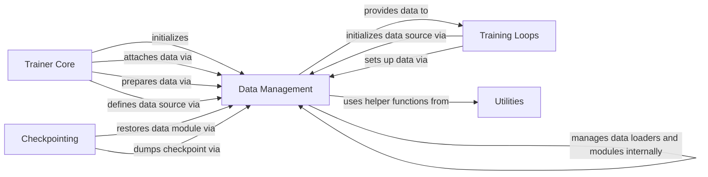

## Component Details

The provided analysis outlines the core components of a Lightning-based training system, focusing on the interactions between the central Trainer Core, Data Management, Training Loops, Checkpointing, and various Utilities to orchestrate the entire machine learning workflow from data handling to model training and persistence.

### Trainer Core
The central orchestrator of the Lightning training process, responsible for managing the entire lifecycle of model training, validation, testing, and prediction. It initializes data connectors and invokes various training loops.

**Related Classes/Methods**:

- <a href="https://github.com/Lightning-AI/lightning/blob/master/src/lightning/pytorch/trainer/trainer.py#L89-L1727" target="_blank" rel="noopener noreferrer">`lightning.src.lightning.pytorch.trainer.trainer.Trainer` (89:1727)</a>

### Data Management
This component is responsible for handling all aspects of data loading, preparation, and attachment within the Lightning ecosystem. It ensures that data is correctly formatted, distributed, and accessible to the training loops. It also manages data modules and data loader sources.

**Related Classes/Methods**:

- <a href="https://github.com/Lightning-AI/lightning/blob/master/src/lightning/pytorch/core/datamodule.py#L34-L319" target="_blank" rel="noopener noreferrer">`lightning.src.lightning.pytorch.core.datamodule.LightningDataModule` (34:319)</a>
- <a href="https://github.com/Lightning-AI/lightning/blob/master/src/lightning/pytorch/trainer/connectors/data_connector.py#L46-L226" target="_blank" rel="noopener noreferrer">`lightning.src.lightning.pytorch.trainer.connectors.data_connector._DataConnector` (46:226)</a>
- <a href="https://github.com/Lightning-AI/lightning/blob/master/src/lightning/pytorch/trainer/connectors/data_connector.py#L264-L311" target="_blank" rel="noopener noreferrer">`lightning.src.lightning.pytorch.trainer.connectors.data_connector._DataLoaderSource` (264:311)</a>
- <a href="https://github.com/Lightning-AI/lightning/blob/master/src/lightning/pytorch/trainer/connectors/data_connector.py#L330-L373" target="_blank" rel="noopener noreferrer">`lightning.src.lightning.pytorch.trainer.connectors.data_connector._DataHookSelector` (330:373)</a>
- <a href="https://github.com/Lightning-AI/lightning/blob/master/src/lightning/pytorch/core/hooks.py#L347-L667" target="_blank" rel="noopener noreferrer">`lightning.src.lightning.pytorch.core.hooks.DataHooks` (347:667)</a>
- <a href="https://github.com/Lightning-AI/lightning/blob/master/src/lightning/pytorch/utilities/combined_loader.py#L222-L394" target="_blank" rel="noopener noreferrer">`lightning.src.lightning.pytorch.utilities.combined_loader.CombinedLoader` (222:394)</a>
- <a href="https://github.com/Lightning-AI/lightning/blob/master/src/lightning/fabric/utilities/data.py#L75-L77" target="_blank" rel="noopener noreferrer">`lightning.src.lightning.fabric.utilities.data._update_dataloader` (75:77)</a>
- <a href="https://github.com/Lightning-AI/lightning/blob/master/src/lightning/pytorch/overrides/distributed.py#L223-L232" target="_blank" rel="noopener noreferrer">`lightning.src.lightning.pytorch.overrides.distributed.UnrepeatedDistributedSamplerWrapper` (223:232)</a>

### Training Loops
This component encapsulates the core logic for different phases of model training and evaluation, including fitting, prediction, and general evaluation. Each loop manages its specific data setup and processing.

**Related Classes/Methods**:

- <a href="https://github.com/Lightning-AI/lightning/blob/master/src/lightning/pytorch/loops/fit_loop.py#L58-L529" target="_blank" rel="noopener noreferrer">`lightning.src.lightning.pytorch.loops.fit_loop._FitLoop` (58:529)</a>
- <a href="https://github.com/Lightning-AI/lightning/blob/master/src/lightning/pytorch/loops/prediction_loop.py#L47-L404" target="_blank" rel="noopener noreferrer">`lightning.src.lightning.pytorch.loops.prediction_loop._PredictionLoop` (47:404)</a>
- <a href="https://github.com/Lightning-AI/lightning/blob/master/src/lightning/pytorch/loops/evaluation_loop.py#L57-L613" target="_blank" rel="noopener noreferrer">`lightning.src.lightning.pytorch.loops.evaluation_loop._EvaluationLoop` (57:613)</a>

### Checkpointing
This component handles the saving and restoring of the training state, including model weights, optimizer states, and data module states, enabling the continuation of training from a saved point.

**Related Classes/Methods**:

- <a href="https://github.com/Lightning-AI/lightning/blob/master/src/lightning/pytorch/trainer/connectors/checkpoint_connector.py#L46-L558" target="_blank" rel="noopener noreferrer">`lightning.src.lightning.pytorch.trainer.connectors.checkpoint_connector._CheckpointConnector` (46:558)</a>

### Utilities
A collection of helper functions and classes that provide common functionalities across the Lightning framework, such as exception handling, distributed computing utilities, data manipulation, and model introspection.

**Related Classes/Methods**:

- <a href="https://github.com/Lightning-AI/lightning/blob/master/src/lightning/fabric/utilities/exceptions.py#L16-L17" target="_blank" rel="noopener noreferrer">`lightning.fabric.utilities.exceptions.MisconfigurationException` (16:17)</a>
- <a href="https://github.com/Lightning-AI/lightning/blob/master/src/lightning/pytorch/utilities/model_helpers.py#L29-L46" target="_blank" rel="noopener noreferrer">`lightning.pytorch.utilities.model_helpers.is_overridden` (29:46)</a>
- <a href="https://github.com/Lightning-AI/lightning/blob/master/src/lightning/fabric/utilities/distributed.py#L407-L433" target="_blank" rel="noopener noreferrer">`lightning.fabric.utilities.distributed._InfiniteBarrier` (407:433)</a>
- <a href="https://github.com/Lightning-AI/lightning/blob/master/src/lightning/pytorch/trainer/call.py#L184-L199" target="_blank" rel="noopener noreferrer">`lightning.pytorch.trainer.call._call_lightning_datamodule_hook` (184:199)</a>
- <a href="https://github.com/Lightning-AI/lightning/blob/master/src/lightning/pytorch/trainer/call.py#L154-L181" target="_blank" rel="noopener noreferrer">`lightning.pytorch.trainer.call._call_lightning_module_hook` (154:181)</a>
- <a href="https://github.com/Lightning-AI/lightning/blob/master/src/lightning/fabric/utilities/data.py#L44-L45" target="_blank" rel="noopener noreferrer">`lightning.fabric.utilities.data.has_iterable_dataset` (44:45)</a>
- <a href="https://github.com/Lightning-AI/lightning/blob/master/src/lightning/fabric/utilities/distributed.py#L365-L384" target="_blank" rel="noopener noreferrer">`lightning.fabric.utilities.distributed.DistributedSamplerWrapper` (365:384)</a>
- <a href="https://github.com/Lightning-AI/lightning/blob/master/src/lightning/fabric/utilities/data.py#L359-L387" target="_blank" rel="noopener noreferrer">`lightning.fabric.utilities.data._replace_dunder_methods` (359:387)</a>
- <a href="https://github.com/Lightning-AI/lightning/blob/master/src/lightning/pytorch/utilities/data.py#L339-L361" target="_blank" rel="noopener noreferrer">`lightning.pytorch.utilities.data._is_dataloader_shuffled` (339:361)</a>
- <a href="https://github.com/Lightning-AI/lightning/blob/master/src/lightning/fabric/utilities/data.py#L439-L451" target="_blank" rel="noopener noreferrer">`lightning.fabric.utilities.data.suggested_max_num_workers` (439:451)</a>
- <a href="https://github.com/Lightning-AI/lightning/blob/master/src/lightning/fabric/utilities/data.py#L246-L250" target="_blank" rel="noopener noreferrer">`lightning.fabric.utilities.data._auto_add_worker_init_fn` (246:250)</a>
- <a href="https://github.com/Lightning-AI/lightning/blob/master/src/lightning/fabric/utilities/data.py#L415-L436" target="_blank" rel="noopener noreferrer">`lightning.fabric.utilities.data._set_sampler_epoch` (415:436)</a>
- <a href="https://github.com/Lightning-AI/lightning/blob/master/src/lightning/pytorch/core/saving.py#L53-L101" target="_blank" rel="noopener noreferrer">`lightning.pytorch.core.saving._load_from_checkpoint` (53:101)</a>

### [FAQ](https://github.com/CodeBoarding/GeneratedOnBoardings/tree/main?tab=readme-ov-file#faq)