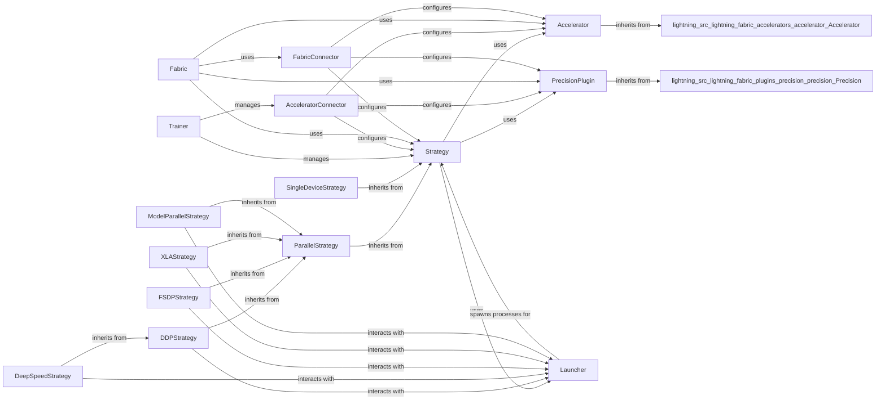

## Component Details

This component overview describes the 'Hardware Abstraction & Strategy' subsystem within the Lightning framework. This subsystem is crucial for abstracting hardware interactions and implementing various distributed training paradigms. It manages device setup, model and optimizer distribution, and precision settings, providing a flexible and scalable foundation for training machine learning models. The core flow involves the `Trainer` or `Fabric` orchestrating the training process, which in turn utilizes an `AcceleratorConnector` (for `Trainer`) or `FabricConnector` (for `Fabric`) to configure the appropriate `Accelerator`, `Strategy`, and `PrecisionPlugin` based on the user's hardware and distributed training requirements. The `Strategy` then leverages the `Accelerator` for device-specific operations and the `PrecisionPlugin` for precision handling, while also interacting with `Launcher` components for distributed process management. This modular design allows Lightning to support a wide range of hardware and distributed training setups efficiently.

### Strategy
The base class for all strategies in Lightning, defining the fundamental interface for how models are trained, validated, and tested. It handles device placement, precision settings, optimizer setup, and checkpointing, providing a flexible framework for various training paradigms.

**Related Classes/Methods**:

- <a href="https://github.com/Lightning-AI/lightning/blob/master/src/lightning/fabric/strategies/strategy.py#L42-L412" target="_blank" rel="noopener noreferrer">`lightning.src.lightning.fabric.strategies.strategy.Strategy` (42:412)</a>
- <a href="https://github.com/Lightning-AI/lightning/blob/master/src/lightning/pytorch/strategies/strategy.py#L47-L599" target="_blank" rel="noopener noreferrer">`lightning.src.lightning.pytorch.strategies.strategy.Strategy` (47:599)</a>
- <a href="https://github.com/Lightning-AI/lightning/blob/master/src/lightning/pytorch/strategies/strategy.py#L602-L649" target="_blank" rel="noopener noreferrer">`lightning.src.lightning.pytorch.strategies.strategy._ForwardRedirection` (602:649)</a>

### ParallelStrategy
An intermediate base class for strategies that involve parallel processing, such as Distributed Data Parallel (DDP), Fully Sharded Data Parallel (FSDP), and Model Parallel. It extends the base Strategy with functionalities specific to parallel execution.

**Related Classes/Methods**:

- <a href="https://github.com/Lightning-AI/lightning/blob/master/src/lightning/fabric/strategies/parallel.py#L30-L114" target="_blank" rel="noopener noreferrer">`lightning.src.lightning.fabric.strategies.parallel.ParallelStrategy` (30:114)</a>
- <a href="https://github.com/Lightning-AI/lightning/blob/master/src/lightning/pytorch/strategies/parallel.py#L31-L134" target="_blank" rel="noopener noreferrer">`lightning.src.lightning.pytorch.strategies.parallel.ParallelStrategy` (31:134)</a>

### DDPStrategy
A strategy for distributed data parallel training, leveraging PyTorch's DistributedDataParallel module. It manages the setup of distributed environments, model wrapping for DDP, and synchronization of model states and gradients across multiple processes.

**Related Classes/Methods**:

- <a href="https://github.com/Lightning-AI/lightning/blob/master/src/lightning/pytorch/strategies/ddp.py#L68-L419" target="_blank" rel="noopener noreferrer">`lightning.src.lightning.pytorch.strategies.ddp.DDPStrategy` (68:419)</a>
- <a href="https://github.com/Lightning-AI/lightning/blob/master/src/lightning/pytorch/strategies/ddp.py#L422-L433" target="_blank" rel="noopener noreferrer">`lightning.src.lightning.pytorch.strategies.ddp._DDPForwardRedirection` (422:433)</a>
- <a href="https://github.com/Lightning-AI/lightning/blob/master/src/lightning/fabric/strategies/ddp.py#L52-L229" target="_blank" rel="noopener noreferrer">`lightning.src.lightning.fabric.strategies.ddp.DDPStrategy` (52:229)</a>

### DeepSpeedStrategy
A strategy that integrates DeepSpeed for large-scale model training, offering optimizations like ZeRO (Zero Redundancy Optimizer) for memory efficiency. It manages DeepSpeed configuration, distributed environment setup, and checkpointing specific to DeepSpeed.

**Related Classes/Methods**:

- <a href="https://github.com/Lightning-AI/lightning/blob/master/src/lightning/pytorch/strategies/deepspeed.py#L74-L922" target="_blank" rel="noopener noreferrer">`lightning.src.lightning.pytorch.strategies.deepspeed.DeepSpeedStrategy` (74:922)</a>
- <a href="https://github.com/Lightning-AI/lightning/blob/master/src/lightning/pytorch/strategies/deepspeed.py#L63-L71" target="_blank" rel="noopener noreferrer">`lightning.src.lightning.pytorch.strategies.deepspeed.remove_module_hooks` (63:71)</a>
- <a href="https://github.com/Lightning-AI/lightning/blob/master/src/lightning/fabric/strategies/deepspeed.py#L53-L823" target="_blank" rel="noopener noreferrer">`lightning.src.lightning.fabric.strategies.deepspeed.DeepSpeedStrategy` (53:823)</a>

### FSDPStrategy
A strategy utilizing PyTorch's Fully Sharded Data Parallel (FSDP) for sharding model parameters, gradients, and optimizer states across devices. It provides advanced memory optimization and scaling capabilities for very large models.

**Related Classes/Methods**:

- <a href="https://github.com/Lightning-AI/lightning/blob/master/src/lightning/pytorch/strategies/fsdp.py#L92-L673" target="_blank" rel="noopener noreferrer">`lightning.src.lightning.pytorch.strategies.fsdp.FSDPStrategy` (92:673)</a>
- <a href="https://github.com/Lightning-AI/lightning/blob/master/src/lightning/fabric/strategies/fsdp.py#L85-L676" target="_blank" rel="noopener noreferrer">`lightning.src.lightning.fabric.strategies.fsdp.FSDPStrategy` (85:676)</a>

### SingleDeviceStrategy
A strategy for training on a single device (CPU, GPU, etc.), handling basic device placement and precision settings without distributed overhead.

**Related Classes/Methods**:

- <a href="https://github.com/Lightning-AI/lightning/blob/master/src/lightning/pytorch/strategies/single_device.py#L30-L101" target="_blank" rel="noopener noreferrer">`lightning.src.lightning.pytorch.strategies.single_device.SingleDeviceStrategy` (30:101)</a>
- <a href="https://github.com/Lightning-AI/lightning/blob/master/src/lightning/fabric/strategies/single_device.py#L29-L88" target="_blank" rel="noopener noreferrer">`lightning.src.lightning.fabric.strategies.single_device.SingleDeviceStrategy` (29:88)</a>

### XLAStrategy
A strategy for training on XLA devices (like TPUs), managing XLA-specific distributed environment setup and data handling.

**Related Classes/Methods**:

- <a href="https://github.com/Lightning-AI/lightning/blob/master/src/lightning/pytorch/strategies/xla.py#L43-L362" target="_blank" rel="noopener noreferrer">`lightning.src.lightning.pytorch.strategies.xla.XLAStrategy` (43:362)</a>
- <a href="https://github.com/Lightning-AI/lightning/blob/master/src/lightning/fabric/strategies/xla.py#L39-L304" target="_blank" rel="noopener noreferrer">`lightning.src.lightning.fabric.strategies.xla.XLAStrategy` (39:304)</a>

### ModelParallelStrategy
A strategy for model parallel training, where different parts of the model are placed on different devices.

**Related Classes/Methods**:

- <a href="https://github.com/Lightning-AI/lightning/blob/master/src/lightning/pytorch/strategies/model_parallel.py#L60-L364" target="_blank" rel="noopener noreferrer">`lightning.src.lightning.pytorch.strategies.model_parallel.ModelParallelStrategy` (60:364)</a>
- <a href="https://github.com/Lightning-AI/lightning/blob/master/src/lightning/fabric/strategies/model_parallel.py#L67-L316" target="_blank" rel="noopener noreferrer">`lightning.src.lightning.fabric.strategies.model_parallel.ModelParallelStrategy` (67:316)</a>

### Accelerator
The base class for hardware accelerators in Lightning, providing an interface for device setup, statistics retrieval, and device parsing. Concrete implementations exist for CPU, CUDA, MPS, and XLA.

**Related Classes/Methods**:

- <a href="https://github.com/Lightning-AI/lightning/blob/master/src/lightning/pytorch/accelerators/accelerator.py#L22-L47" target="_blank" rel="noopener noreferrer">`lightning.src.lightning.pytorch.accelerators.accelerator.Accelerator` (22:47)</a>
- <a href="https://github.com/Lightning-AI/lightning/blob/master/src/lightning/pytorch/accelerators/cuda.py#L34-L114" target="_blank" rel="noopener noreferrer">`lightning.src.lightning.pytorch.accelerators.cuda.CUDAAccelerator` (34:114)</a>
- <a href="https://github.com/Lightning-AI/lightning/blob/master/src/lightning/pytorch/accelerators/cpu.py#L27-L81" target="_blank" rel="noopener noreferrer">`lightning.src.lightning.pytorch.accelerators.cpu.CPUAccelerator` (27:81)</a>
- <a href="https://github.com/Lightning-AI/lightning/blob/master/src/lightning/pytorch/accelerators/mps.py#L28-L88" target="_blank" rel="noopener noreferrer">`lightning.src.lightning.pytorch.accelerators.mps.MPSAccelerator` (28:88)</a>
- <a href="https://github.com/Lightning-AI/lightning/blob/master/src/lightning/pytorch/accelerators/xla.py#L24-L55" target="_blank" rel="noopener noreferrer">`lightning.src.lightning.pytorch.accelerators.xla.XLAAccelerator` (24:55)</a>
- <a href="https://github.com/Lightning-AI/lightning/blob/master/src/lightning/fabric/accelerators/accelerator.py#L22-L61" target="_blank" rel="noopener noreferrer">`lightning.src.lightning.fabric.accelerators.accelerator.Accelerator` (22:61)</a>

### PrecisionPlugin
The base class for precision-specific handling in Lightning, managing mixed precision training, gradient clipping, and context managers for different training steps. Subclasses implement specific precision policies like AMP, DeepSpeed, FSDP, and XLA precision.

**Related Classes/Methods**:

- <a href="https://github.com/Lightning-AI/lightning/blob/master/src/lightning/pytorch/plugins/precision/precision.py#L33-L190" target="_blank" rel="noopener noreferrer">`lightning.src.lightning.pytorch.plugins.precision.precision.Precision` (33:190)</a>
- <a href="https://github.com/Lightning-AI/lightning/blob/master/src/lightning/pytorch/plugins/precision/amp.py#L30-L133" target="_blank" rel="noopener noreferrer">`lightning.src.lightning.pytorch.plugins.precision.amp.MixedPrecision` (30:133)</a>
- <a href="https://github.com/Lightning-AI/lightning/blob/master/src/lightning/pytorch/plugins/precision/deepspeed.py#L40-L148" target="_blank" rel="noopener noreferrer">`lightning.src.lightning.pytorch.plugins.precision.deepspeed.DeepSpeedPrecision` (40:148)</a>
- <a href="https://github.com/Lightning-AI/lightning/blob/master/src/lightning/pytorch/plugins/precision/fsdp.py#L36-L185" target="_blank" rel="noopener noreferrer">`lightning.src.lightning.pytorch.plugins.precision.fsdp.FSDPPrecision` (36:185)</a>
- <a href="https://github.com/Lightning-AI/lightning/blob/master/src/lightning/pytorch/plugins/precision/xla.py#L29-L97" target="_blank" rel="noopener noreferrer">`lightning.src.lightning.pytorch.plugins.precision.xla.XLAPrecision` (29:97)</a>
- <a href="https://github.com/Lightning-AI/lightning/blob/master/src/lightning/pytorch/plugins/precision/half.py#L28-L71" target="_blank" rel="noopener noreferrer">`lightning.src.lightning.pytorch.plugins.precision.half.HalfPrecision` (28:71)</a>
- <a href="https://github.com/Lightning-AI/lightning/blob/master/src/lightning/pytorch/plugins/precision/double.py#L31-L61" target="_blank" rel="noopener noreferrer">`lightning.src.lightning.pytorch.plugins.precision.double.DoublePrecision` (31:61)</a>
- <a href="https://github.com/Lightning-AI/lightning/blob/master/src/lightning/fabric/plugins/precision/precision.py#L39-L162" target="_blank" rel="noopener noreferrer">`lightning.src.lightning.fabric.plugins.precision.precision.Precision` (39:162)</a>

### Trainer
The central orchestrator in Lightning, responsible for automating the entire training, validation, testing, and prediction workflows. It integrates with strategies, accelerators, loggers, and callbacks to provide a comprehensive and customizable training loop.

**Related Classes/Methods**:

- <a href="https://github.com/Lightning-AI/lightning/blob/master/src/lightning/pytorch/trainer/trainer.py#L89-L1727" target="_blank" rel="noopener noreferrer">`lightning.src.lightning.pytorch.trainer.trainer.Trainer` (89:1727)</a>
- <a href="https://github.com/Lightning-AI/lightning/blob/master/src/lightning/pytorch/trainer/setup.py#L144-L189" target="_blank" rel="noopener noreferrer">`lightning.src.lightning.pytorch.trainer.setup._log_device_info` (144:189)</a>

### AcceleratorConnector
A component within the Trainer responsible for parsing and validating accelerator, strategy, device, and plugin configurations. It instantiates the appropriate Accelerator, Strategy, and Precision plugins based on user inputs and system availability.

**Related Classes/Methods**:

- <a href="https://github.com/Lightning-AI/lightning/blob/master/src/lightning/pytorch/trainer/connectors/accelerator_connector.py#L75-L628" target="_blank" rel="noopener noreferrer">`lightning.src.lightning.pytorch.trainer.connectors.accelerator_connector._AcceleratorConnector` (75:628)</a>
- <a href="https://github.com/Lightning-AI/lightning/blob/master/src/lightning/pytorch/trainer/connectors/accelerator_connector.py#L631-L653" target="_blank" rel="noopener noreferrer">`lightning.src.lightning.pytorch.trainer.connectors.accelerator_connector._set_torch_flags` (631:653)</a>
- <a href="https://github.com/Lightning-AI/lightning/blob/master/src/lightning/pytorch/trainer/connectors/accelerator_connector.py#L656-L667" target="_blank" rel="noopener noreferrer">`lightning.src.lightning.pytorch.trainer.connectors.accelerator_connector._register_external_accelerators_and_strategies` (656:667)</a>

### Fabric
A lightweight alternative to the Trainer, providing core acceleration features for PyTorch code with minimal overhead. It handles device placement, mixed precision, and distributed training setup, allowing users to build custom training loops.

**Related Classes/Methods**:

- <a href="https://github.com/Lightning-AI/lightning/blob/master/src/lightning/fabric/fabric.py#L82-L1061" target="_blank" rel="noopener noreferrer">`lightning.src.lightning.fabric.fabric.Fabric` (82:1061)</a>
- <a href="https://github.com/Lightning-AI/lightning/blob/master/src/lightning/fabric/fabric.py#L78-L79" target="_blank" rel="noopener noreferrer">`lightning.src.lightning.fabric.fabric.Fabric._do_nothing` (78:79)</a>

### FabricConnector
Similar to the Trainer's AcceleratorConnector, this component in Fabric is responsible for parsing and instantiating the correct Accelerator, Strategy, and Precision plugins based on the provided configuration.

**Related Classes/Methods**:

- <a href="https://github.com/Lightning-AI/lightning/blob/master/src/lightning/fabric/connector.py#L74-L554" target="_blank" rel="noopener noreferrer">`lightning.src.lightning.fabric.connector._Connector` (74:554)</a>
- <a href="https://github.com/Lightning-AI/lightning/blob/master/src/lightning/fabric/connector.py#L557-L576" target="_blank" rel="noopener noreferrer">`lightning.src.lightning.fabric.connector._convert_precision_to_unified_args` (557:576)</a>
- <a href="https://github.com/Lightning-AI/lightning/blob/master/src/lightning/fabric/connector.py#L579-L580" target="_blank" rel="noopener noreferrer">`lightning.src.lightning.fabric.connector._is_using_cli` (579:580)</a>

### Launcher
The base class for process launchers, responsible for creating and managing subprocesses for distributed training. Subclasses implement specific launching mechanisms like subprocess scripts or multiprocessing.

**Related Classes/Methods**:

- <a href="https://github.com/Lightning-AI/lightning/blob/master/src/lightning/pytorch/strategies/launchers/subprocess_script.py#L37-L159" target="_blank" rel="noopener noreferrer">`lightning.src.lightning.pytorch.strategies.launchers.subprocess_script._SubprocessScriptLauncher` (37:159)</a>
- <a href="https://github.com/Lightning-AI/lightning/blob/master/src/lightning/pytorch/strategies/launchers/multiprocessing.py#L49-L271" target="_blank" rel="noopener noreferrer">`lightning.src.lightning.pytorch.strategies.launchers.multiprocessing._MultiProcessingLauncher` (49:271)</a>
- <a href="https://github.com/Lightning-AI/lightning/blob/master/src/lightning/pytorch/strategies/launchers/xla.py#L36-L176" target="_blank" rel="noopener noreferrer">`lightning.src.lightning.pytorch.strategies.launchers.xla._XLALauncher` (36:176)</a>
- <a href="https://github.com/Lightning-AI/lightning/blob/master/src/lightning/pytorch/strategies/launchers/launcher.py#L20-L23" target="_blank" rel="noopener noreferrer">`lightning.src.lightning.pytorch.strategies.launchers.launcher._Launcher` (20:23)</a>
- <a href="https://github.com/Lightning-AI/lightning/blob/master/src/lightning/fabric/strategies/launchers/launcher.py#L18-L36" target="_blank" rel="noopener noreferrer">`lightning.src.lightning.fabric.strategies.launchers.launcher._Launcher` (18:36)</a>

### [FAQ](https://github.com/CodeBoarding/GeneratedOnBoardings/tree/main?tab=readme-ov-file#faq)