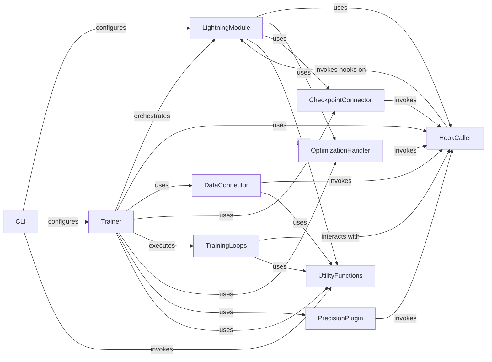

## Component Details

This component overview describes the core structure and interactions within the PyTorch Lightning framework, focusing on how a user-defined `LightningModule` is managed and executed by the `Trainer`. The `LightningModule` serves as the central definition for the neural network and its training logic. The `Trainer` orchestrates the entire training, validation, testing, and prediction lifecycle, leveraging various specialized components like `DataConnector` for data handling, `CheckpointConnector` for saving/loading states, and `TrainingLoops` for execution flow. `HookCaller` ensures that lifecycle hooks are invoked at appropriate times, while `OptimizationHandler` and `PrecisionPlugin` manage the optimization process and numerical precision. `UtilityFunctions` provide common helper functionalities, and the `CLI` enables command-line interaction for configuring and running models.

### LightningModule
The core component in Lightning, extending `torch.nn.Module` with additional functionalities for training, validation, testing, and prediction. It provides hooks for various stages of the training loop, logging capabilities, optimizer configuration, and checkpointing. It acts as the central model definition for users.

**Related Classes/Methods**:

- <a href="https://github.com/Lightning-AI/lightning/blob/master/src/lightning/pytorch/core/module.py#L88-L1595" target="_blank" rel="noopener noreferrer">`lightning.src.lightning.pytorch.core.module.LightningModule` (88:1595)</a>
- <a href="https://github.com/Lightning-AI/lightning/blob/master/src/lightning/pytorch/core/module.py#L123-L145" target="_blank" rel="noopener noreferrer">`lightning.src.lightning.pytorch.core.module.LightningModule:__init__` (123:145)</a>
- <a href="https://github.com/Lightning-AI/lightning/blob/master/src/lightning/pytorch/core/module.py#L148-L150" target="_blank" rel="noopener noreferrer">`lightning.src.lightning.pytorch.core.module.LightningModule:optimizers` (148:150)</a>
- <a href="https://github.com/Lightning-AI/lightning/blob/master/src/lightning/pytorch/core/module.py#L188-L207" target="_blank" rel="noopener noreferrer">`lightning.src.lightning.pytorch.core.module.LightningModule:lr_schedulers` (188:207)</a>
- <a href="https://github.com/Lightning-AI/lightning/blob/master/src/lightning/pytorch/core/module.py#L210-L215" target="_blank" rel="noopener noreferrer">`lightning.src.lightning.pytorch.core.module.LightningModule:trainer` (210:215)</a>
- <a href="https://github.com/Lightning-AI/lightning/blob/master/src/lightning/pytorch/core/module.py#L225-L226" target="_blank" rel="noopener noreferrer">`lightning.src.lightning.pytorch.core.module.LightningModule:fabric` (225:226)</a>
- <a href="https://github.com/Lightning-AI/lightning/blob/master/src/lightning/pytorch/core/module.py#L238-L250" target="_blank" rel="noopener noreferrer">`lightning.src.lightning.pytorch.core.module.LightningModule:example_input_array` (238:250)</a>
- <a href="https://github.com/Lightning-AI/lightning/blob/master/src/lightning/pytorch/core/module.py#L257-L259" target="_blank" rel="noopener noreferrer">`lightning.src.lightning.pytorch.core.module.LightningModule:current_epoch` (257:259)</a>
- <a href="https://github.com/Lightning-AI/lightning/blob/master/src/lightning/pytorch/core/module.py#L262-L268" target="_blank" rel="noopener noreferrer">`lightning.src.lightning.pytorch.core.module.LightningModule:global_step` (262:268)</a>
- <a href="https://github.com/Lightning-AI/lightning/blob/master/src/lightning/pytorch/core/module.py#L271-L273" target="_blank" rel="noopener noreferrer">`lightning.src.lightning.pytorch.core.module.LightningModule:global_rank` (271:273)</a>
- <a href="https://github.com/Lightning-AI/lightning/blob/master/src/lightning/pytorch/core/module.py#L276-L278" target="_blank" rel="noopener noreferrer">`lightning.src.lightning.pytorch.core.module.LightningModule:local_rank` (276:278)</a>
- <a href="https://github.com/Lightning-AI/lightning/blob/master/src/lightning/pytorch/core/module.py#L281-L287" target="_blank" rel="noopener noreferrer">`lightning.src.lightning.pytorch.core.module.LightningModule:on_gpu` (281:287)</a>
- <a href="https://github.com/Lightning-AI/lightning/blob/master/src/lightning/pytorch/core/module.py#L290-L292" target="_blank" rel="noopener noreferrer">`lightning.src.lightning.pytorch.core.module.LightningModule:automatic_optimization` (290:292)</a>
- <a href="https://github.com/Lightning-AI/lightning/blob/master/src/lightning/pytorch/core/module.py#L299-L302" target="_blank" rel="noopener noreferrer">`lightning.src.lightning.pytorch.core.module.LightningModule:strict_loading` (299:302)</a>
- <a href="https://github.com/Lightning-AI/lightning/blob/master/src/lightning/pytorch/core/module.py#L309-L313" target="_blank" rel="noopener noreferrer">`lightning.src.lightning.pytorch.core.module.LightningModule:logger` (309:313)</a>
- <a href="https://github.com/Lightning-AI/lightning/blob/master/src/lightning/pytorch/core/module.py#L316-L322" target="_blank" rel="noopener noreferrer">`lightning.src.lightning.pytorch.core.module.LightningModule:loggers` (316:322)</a>
- <a href="https://github.com/Lightning-AI/lightning/blob/master/src/lightning/pytorch/core/module.py#L325-L328" target="_blank" rel="noopener noreferrer">`lightning.src.lightning.pytorch.core.module.LightningModule:device_mesh` (325:328)</a>
- <a href="https://github.com/Lightning-AI/lightning/blob/master/src/lightning/pytorch/core/module.py#L330-L343" target="_blank" rel="noopener noreferrer">`lightning.src.lightning.pytorch.core.module.LightningModule:_call_batch_hook` (330:343)</a>
- <a href="https://github.com/Lightning-AI/lightning/blob/master/src/lightning/pytorch/core/module.py#L345-L346" target="_blank" rel="noopener noreferrer">`lightning.src.lightning.pytorch.core.module.LightningModule:_on_before_batch_transfer` (345:346)</a>
- <a href="https://github.com/Lightning-AI/lightning/blob/master/src/lightning/pytorch/core/module.py#L348-L354" target="_blank" rel="noopener noreferrer">`lightning.src.lightning.pytorch.core.module.LightningModule:_apply_batch_transfer_handler` (348:354)</a>
- <a href="https://github.com/Lightning-AI/lightning/blob/master/src/lightning/pytorch/core/module.py#L356-L374" target="_blank" rel="noopener noreferrer">`lightning.src.lightning.pytorch.core.module.LightningModule:print` (356:374)</a>
- <a href="https://github.com/Lightning-AI/lightning/blob/master/src/lightning/pytorch/core/module.py#L376-L540" target="_blank" rel="noopener noreferrer">`lightning.src.lightning.pytorch.core.module.LightningModule:log` (376:540)</a>
- <a href="https://github.com/Lightning-AI/lightning/blob/master/src/lightning/pytorch/core/module.py#L542-L620" target="_blank" rel="noopener noreferrer">`lightning.src.lightning.pytorch.core.module.LightningModule:log_dict` (542:620)</a>
- <a href="https://github.com/Lightning-AI/lightning/blob/master/src/lightning/pytorch/core/module.py#L622-L636" target="_blank" rel="noopener noreferrer">`lightning.src.lightning.pytorch.core.module.LightningModule:_log_dict_through_fabric` (622:636)</a>
- <a href="https://github.com/Lightning-AI/lightning/blob/master/src/lightning/pytorch/core/module.py#L639-L642" target="_blank" rel="noopener noreferrer">`lightning.src.lightning.pytorch.core.module.LightningModule:__check_not_nested` (639:642)</a>
- <a href="https://github.com/Lightning-AI/lightning/blob/master/src/lightning/pytorch/core/module.py#L645-L646" target="_blank" rel="noopener noreferrer">`lightning.src.lightning.pytorch.core.module.LightningModule:__check_allowed` (645:646)</a>
- <a href="https://github.com/Lightning-AI/lightning/blob/master/src/lightning/pytorch/core/module.py#L648-L660" target="_blank" rel="noopener noreferrer">`lightning.src.lightning.pytorch.core.module.LightningModule:__to_tensor` (648:660)</a>
- <a href="https://github.com/Lightning-AI/lightning/blob/master/src/lightning/pytorch/core/module.py#L662-L684" target="_blank" rel="noopener noreferrer">`lightning.src.lightning.pytorch.core.module.LightningModule:all_gather` (662:684)</a>
- <a href="https://github.com/Lightning-AI/lightning/blob/master/src/lightning/pytorch/core/module.py#L687-L698" target="_blank" rel="noopener noreferrer">`lightning.src.lightning.pytorch.core.module.LightningModule:forward` (687:698)</a>
- <a href="https://github.com/Lightning-AI/lightning/blob/master/src/lightning/pytorch/core/module.py#L700-L754" target="_blank" rel="noopener noreferrer">`lightning.src.lightning.pytorch.core.module.LightningModule:training_step` (700:754)</a>
- <a href="https://github.com/Lightning-AI/lightning/blob/master/src/lightning/pytorch/core/module.py#L756-L821" target="_blank" rel="noopener noreferrer">`lightning.src.lightning.pytorch.core.module.LightningModule:validation_step` (756:821)</a>
- <a href="https://github.com/Lightning-AI/lightning/blob/master/src/lightning/pytorch/core/module.py#L823-L888" target="_blank" rel="noopener noreferrer">`lightning.src.lightning.pytorch.core.module.LightningModule:test_step` (823:888)</a>
- <a href="https://github.com/Lightning-AI/lightning/blob/master/src/lightning/pytorch/core/module.py#L890-L928" target="_blank" rel="noopener noreferrer">`lightning.src.lightning.pytorch.core.module.LightningModule:predict_step` (890:928)</a>
- <a href="https://github.com/Lightning-AI/lightning/blob/master/src/lightning/pytorch/core/module.py#L930-L948" target="_blank" rel="noopener noreferrer">`lightning.src.lightning.pytorch.core.module.LightningModule:configure_callbacks` (930:948)</a>
- <a href="https://github.com/Lightning-AI/lightning/blob/master/src/lightning/pytorch/core/module.py#L950-L1050" target="_blank" rel="noopener noreferrer">`lightning.src.lightning.pytorch.core.module.LightningModule:configure_optimizers` (950:1050)</a>
- <a href="https://github.com/Lightning-AI/lightning/blob/master/src/lightning/pytorch/core/module.py#L1052-L1078" target="_blank" rel="noopener noreferrer">`lightning.src.lightning.pytorch.core.module.LightningModule:manual_backward` (1052:1078)</a>
- <a href="https://github.com/Lightning-AI/lightning/blob/master/src/lightning/pytorch/core/module.py#L1080-L1097" target="_blank" rel="noopener noreferrer">`lightning.src.lightning.pytorch.core.module.LightningModule:backward` (1080:1097)</a>
- <a href="https://github.com/Lightning-AI/lightning/blob/master/src/lightning/pytorch/core/module.py#L1099-L1126" target="_blank" rel="noopener noreferrer">`lightning.src.lightning.pytorch.core.module.LightningModule:toggle_optimizer` (1099:1126)</a>
- <a href="https://github.com/Lightning-AI/lightning/blob/master/src/lightning/pytorch/core/module.py#L1128-L1142" target="_blank" rel="noopener noreferrer">`lightning.src.lightning.pytorch.core.module.LightningModule:untoggle_optimizer` (1128:1142)</a>
- <a href="https://github.com/Lightning-AI/lightning/blob/master/src/lightning/pytorch/core/module.py#L1144-L1210" target="_blank" rel="noopener noreferrer">`lightning.src.lightning.pytorch.core.module.LightningModule:clip_gradients` (1144:1210)</a>
- <a href="https://github.com/Lightning-AI/lightning/blob/master/src/lightning/pytorch/core/module.py#L1212-L1241" target="_blank" rel="noopener noreferrer">`lightning.src.lightning.pytorch.core.module.LightningModule:configure_gradient_clipping` (1212:1241)</a>
- <a href="https://github.com/Lightning-AI/lightning/blob/master/src/lightning/pytorch/core/module.py#L1243-L1269" target="_blank" rel="noopener noreferrer">`lightning.src.lightning.pytorch.core.module.LightningModule:lr_scheduler_step` (1243:1269)</a>
- <a href="https://github.com/Lightning-AI/lightning/blob/master/src/lightning/pytorch/core/module.py#L1271-L1302" target="_blank" rel="noopener noreferrer">`lightning.src.lightning.pytorch.core.module.LightningModule:optimizer_step` (1271:1302)</a>
- <a href="https://github.com/Lightning-AI/lightning/blob/master/src/lightning/pytorch/core/module.py#L1304-L1325" target="_blank" rel="noopener noreferrer">`lightning.src.lightning.pytorch.core.module.LightningModule:optimizer_zero_grad` (1304:1325)</a>
- <a href="https://github.com/Lightning-AI/lightning/blob/master/src/lightning/pytorch/core/module.py#L1327-L1339" target="_blank" rel="noopener noreferrer">`lightning.src.lightning.pytorch.core.module.LightningModule:freeze` (1327:1339)</a>
- <a href="https://github.com/Lightning-AI/lightning/blob/master/src/lightning/pytorch/core/module.py#L1341-L1353" target="_blank" rel="noopener noreferrer">`lightning.src.lightning.pytorch.core.module.LightningModule:unfreeze` (1341:1353)</a>
- <a href="https://github.com/Lightning-AI/lightning/blob/master/src/lightning/pytorch/core/module.py#L1355-L1360" target="_blank" rel="noopener noreferrer">`lightning.src.lightning.pytorch.core.module.LightningModule:_verify_is_manual_optimization` (1355:1360)</a>
- <a href="https://github.com/Lightning-AI/lightning/blob/master/src/lightning/pytorch/core/module.py#L1363-L1406" target="_blank" rel="noopener noreferrer">`lightning.src.lightning.pytorch.core.module.LightningModule:to_onnx` (1363:1406)</a>
- <a href="https://github.com/Lightning-AI/lightning/blob/master/src/lightning/pytorch/core/module.py#L1409-L1490" target="_blank" rel="noopener noreferrer">`lightning.src.lightning.pytorch.core.module.LightningModule:to_torchscript` (1409:1490)</a>
- <a href="https://github.com/Lightning-AI/lightning/blob/master/src/lightning/pytorch/core/module.py#L1493-L1589" target="_blank" rel="noopener noreferrer">`lightning.src.lightning.pytorch.core.module.LightningModule:load_from_checkpoint` (1493:1589)</a>
- <a href="https://github.com/Lightning-AI/lightning/blob/master/src/lightning/pytorch/core/module.py#L1592-L1595" target="_blank" rel="noopener noreferrer">`lightning.src.lightning.pytorch.core.module.LightningModule:__getstate__` (1592:1595)</a>

### Trainer
The central orchestrator of the training, validation, testing, and prediction processes in Lightning. It manages the entire lifecycle of a model, including data loading, optimization, logging, checkpointing, and distributed training. It interacts with various connectors and loops to execute the training regimen.

**Related Classes/Methods**:

- <a href="https://github.com/Lightning-AI/lightning/blob/master/src/lightning/pytorch/trainer/trainer.py#L89-L1727" target="_blank" rel="noopener noreferrer">`lightning.src.lightning.pytorch.trainer.trainer.Trainer` (89:1727)</a>
- <a href="https://github.com/Lightning-AI/lightning/blob/master/src/lightning/pytorch/trainer/trainer.py#L941-L1038" target="_blank" rel="noopener noreferrer">`lightning.src.lightning.pytorch.trainer.trainer.Trainer:_run` (941:1038)</a>
- <a href="https://github.com/Lightning-AI/lightning/blob/master/src/lightning/pytorch/trainer/trainer.py#L1113-L1138" target="_blank" rel="noopener noreferrer">`lightning.src.lightning.pytorch.trainer.trainer.Trainer:init_module` (1113:1138)</a>
- <a href="https://github.com/Lightning-AI/lightning/blob/master/src/lightning/pytorch/trainer/trainer.py#L1295-L1301" target="_blank" rel="noopener noreferrer">`lightning.src.lightning.pytorch.trainer.trainer.Trainer:enable_validation` (1295:1301)</a>

### HookCaller
A utility component responsible for invoking various hooks defined within the LightningModule and other components. It centralizes the mechanism for calling lifecycle methods at appropriate times during the training, evaluation, and prediction loops.

**Related Classes/Methods**:

- <a href="https://github.com/Lightning-AI/lightning/blob/master/src/lightning/pytorch/trainer/call.py#L154-L181" target="_blank" rel="noopener noreferrer">`lightning.pytorch.trainer.call._call_lightning_module_hook` (154:181)</a>
- <a href="https://github.com/Lightning-AI/lightning/blob/master/src/lightning/pytorch/trainer/call.py#L75-L82" target="_blank" rel="noopener noreferrer">`lightning.src.lightning.pytorch.trainer.call:_interrupt` (75:82)</a>
- <a href="https://github.com/Lightning-AI/lightning/blob/master/src/lightning/pytorch/trainer/call.py#L85-L111" target="_blank" rel="noopener noreferrer">`lightning.src.lightning.pytorch.trainer.call:_call_setup_hook` (85:111)</a>
- <a href="https://github.com/Lightning-AI/lightning/blob/master/src/lightning/pytorch/trainer/call.py#L114-L128" target="_blank" rel="noopener noreferrer">`lightning.src.lightning.pytorch.trainer.call:_call_configure_model` (114:128)</a>
- <a href="https://github.com/Lightning-AI/lightning/blob/master/src/lightning/pytorch/trainer/call.py#L131-L151" target="_blank" rel="noopener noreferrer">`lightning.src.lightning.pytorch.trainer.call:_call_teardown_hook` (131:151)</a>

### DataConnector
Manages the data-related aspects of the training process, including preparing data, handling dataloaders, and ensuring proper data flow to the model. It interacts with the LightningModule's data hooks.

**Related Classes/Methods**:

- <a href="https://github.com/Lightning-AI/lightning/blob/master/src/lightning/pytorch/trainer/connectors/data_connector.py#L46-L226" target="_blank" rel="noopener noreferrer">`lightning.src.lightning.pytorch.trainer.connectors.data_connector._DataConnector` (46:226)</a>
- <a href="https://github.com/Lightning-AI/lightning/blob/master/src/lightning/pytorch/trainer/connectors/data_connector.py#L79-L101" target="_blank" rel="noopener noreferrer">`lightning.src.lightning.pytorch.trainer.connectors.data_connector._DataConnector:prepare_data` (79:101)</a>
- <a href="https://github.com/Lightning-AI/lightning/blob/master/src/lightning/pytorch/trainer/connectors/data_connector.py#L297-L303" target="_blank" rel="noopener noreferrer">`lightning.src.lightning.pytorch.trainer.connectors.data_connector._DataLoaderSource:is_defined` (297:303)</a>
- <a href="https://github.com/Lightning-AI/lightning/blob/master/src/lightning/pytorch/trainer/connectors/data_connector.py#L283-L295" target="_blank" rel="noopener noreferrer">`lightning.src.lightning.pytorch.trainer.connectors.data_connector._DataLoaderSource:dataloader` (283:295)</a>
- <a href="https://github.com/Lightning-AI/lightning/blob/master/src/lightning/pytorch/trainer/connectors/data_connector.py#L350-L373" target="_blank" rel="noopener noreferrer">`lightning.src.lightning.pytorch.trainer.connectors.data_connector._DataHookSelector:get_instance` (350:373)</a>
- <a href="https://github.com/Lightning-AI/lightning/blob/master/src/lightning/pytorch/trainer/connectors/data_connector.py#L376-L405" target="_blank" rel="noopener noreferrer">`lightning.src.lightning.pytorch.trainer.connectors.data_connector:_check_dataloader_iterable` (376:405)</a>
- <a href="https://github.com/Lightning-AI/lightning/blob/master/src/lightning/pytorch/core/hooks.py#L455-L482" target="_blank" rel="noopener noreferrer">`lightning.src.lightning.pytorch.core.hooks.DataHooks:train_dataloader` (455:482)</a>
- <a href="https://github.com/Lightning-AI/lightning/blob/master/src/lightning/pytorch/core/hooks.py#L484-L512" target="_blank" rel="noopener noreferrer">`lightning.src.lightning.pytorch.core.hooks.DataHooks:test_dataloader` (484:512)</a>
- <a href="https://github.com/Lightning-AI/lightning/blob/master/src/lightning/pytorch/core/hooks.py#L514-L539" target="_blank" rel="noopener noreferrer">`lightning.src.lightning.pytorch.core.hooks.DataHooks:val_dataloader` (514:539)</a>
- <a href="https://github.com/Lightning-AI/lightning/blob/master/src/lightning/pytorch/core/hooks.py#L541-L562" target="_blank" rel="noopener noreferrer">`lightning.src.lightning.pytorch.core.hooks.DataHooks:predict_dataloader` (541:562)</a>

### CheckpointConnector
Handles the saving and loading of model checkpoints. It ensures that the model's state, including weights and hyperparameters, can be restored for continued training or inference.

**Related Classes/Methods**:

- <a href="https://github.com/Lightning-AI/lightning/blob/master/src/lightning/pytorch/trainer/connectors/checkpoint_connector.py#L46-L558" target="_blank" rel="noopener noreferrer">`lightning.src.lightning.pytorch.trainer.connectors.checkpoint_connector._CheckpointConnector` (46:558)</a>
- <a href="https://github.com/Lightning-AI/lightning/blob/master/src/lightning/pytorch/trainer/connectors/checkpoint_connector.py#L272-L289" target="_blank" rel="noopener noreferrer">`lightning.src.lightning.pytorch.trainer.connectors.checkpoint_connector._CheckpointConnector:restore_model` (272:289)</a>
- <a href="https://github.com/Lightning-AI/lightning/blob/master/src/lightning/pytorch/trainer/connectors/checkpoint_connector.py#L406-L411" target="_blank" rel="noopener noreferrer">`lightning.src.lightning.pytorch.trainer.connectors.checkpoint_connector._CheckpointConnector:_restore_modules_and_callbacks` (406:411)</a>
- <a href="https://github.com/Lightning-AI/lightning/blob/master/src/lightning/pytorch/trainer/connectors/checkpoint_connector.py#L413-L503" target="_blank" rel="noopener noreferrer">`lightning.src.lightning.pytorch.trainer.connectors.checkpoint_connector._CheckpointConnector:dump_checkpoint` (413:503)</a>
- <a href="https://github.com/Lightning-AI/lightning/blob/master/src/lightning/pytorch/core/saving.py#L53-L101" target="_blank" rel="noopener noreferrer">`lightning.pytorch.core.saving:_load_from_checkpoint` (53:101)</a>
- <a href="https://github.com/Lightning-AI/lightning/blob/master/src/lightning/pytorch/core/saving.py#L117-L199" target="_blank" rel="noopener noreferrer">`lightning.src.lightning.pytorch.core.saving:_load_state` (117:199)</a>

### TrainingLoops
A collection of specialized loops that manage the execution flow for different phases of model training, evaluation, and prediction. These loops define the sequence of operations within each epoch or step.

**Related Classes/Methods**:

- <a href="https://github.com/Lightning-AI/lightning/blob/master/src/lightning/pytorch/loops/fit_loop.py#L58-L529" target="_blank" rel="noopener noreferrer">`lightning.src.lightning.pytorch.loops.fit_loop._FitLoop` (58:529)</a>
- <a href="https://github.com/Lightning-AI/lightning/blob/master/src/lightning/pytorch/loops/fit_loop.py#L403-L419" target="_blank" rel="noopener noreferrer">`lightning.src.lightning.pytorch.loops.fit_loop._FitLoop:on_run_start` (403:419)</a>
- <a href="https://github.com/Lightning-AI/lightning/blob/master/src/lightning/pytorch/loops/fit_loop.py#L421-L440" target="_blank" rel="noopener noreferrer">`lightning.src.lightning.pytorch.loops.fit_loop._FitLoop:on_advance_start` (421:440)</a>
- <a href="https://github.com/Lightning-AI/lightning/blob/master/src/lightning/pytorch/loops/fit_loop.py#L457-L489" target="_blank" rel="noopener noreferrer">`lightning.src.lightning.pytorch.loops.fit_loop._FitLoop:on_advance_end` (457:489)</a>
- <a href="https://github.com/Lightning-AI/lightning/blob/master/src/lightning/pytorch/loops/fit_loop.py#L491-L498" target="_blank" rel="noopener noreferrer">`lightning.src.lightning.pytorch.loops.fit_loop._FitLoop:on_run_end` (491:498)</a>
- <a href="https://github.com/Lightning-AI/lightning/blob/master/src/lightning/pytorch/loops/prediction_loop.py#L47-L404" target="_blank" rel="noopener noreferrer">`lightning.src.lightning.pytorch.loops.prediction_loop._PredictionLoop` (47:404)</a>
- <a href="https://github.com/Lightning-AI/lightning/blob/master/src/lightning/pytorch/loops/prediction_loop.py#L213-L274" target="_blank" rel="noopener noreferrer">`lightning.src.lightning.pytorch.loops.prediction_loop._PredictionLoop:_predict_step` (213:274)</a>
- <a href="https://github.com/Lightning-AI/lightning/blob/master/src/lightning/pytorch/loops/prediction_loop.py#L341-L346" target="_blank" rel="noopener noreferrer">`lightning.src.lightning.pytorch.loops.prediction_loop._PredictionLoop:_on_predict_start` (341:346)</a>
- <a href="https://github.com/Lightning-AI/lightning/blob/master/src/lightning/pytorch/loops/prediction_loop.py#L348-L350" target="_blank" rel="noopener noreferrer">`lightning.src.lightning.pytorch.loops.prediction_loop._PredictionLoop:_on_predict_model_eval` (348:350)</a>
- <a href="https://github.com/Lightning-AI/lightning/blob/master/src/lightning/pytorch/loops/prediction_loop.py#L352-L353" target="_blank" rel="noopener noreferrer">`lightning.src.lightning.pytorch.loops.prediction_loop._PredictionLoop:_on_predict_model_train` (352:353)</a>
- <a href="https://github.com/Lightning-AI/lightning/blob/master/src/lightning/pytorch/loops/prediction_loop.py#L355-L359" target="_blank" rel="noopener noreferrer">`lightning.src.lightning.pytorch.loops.prediction_loop._PredictionLoop:_on_predict_epoch_start` (355:359)</a>
- <a href="https://github.com/Lightning-AI/lightning/blob/master/src/lightning/pytorch/loops/prediction_loop.py#L361-L374" target="_blank" rel="noopener noreferrer">`lightning.src.lightning.pytorch.loops.prediction_loop._PredictionLoop:_on_predict_epoch_end` (361:374)</a>
- <a href="https://github.com/Lightning-AI/lightning/blob/master/src/lightning/pytorch/loops/prediction_loop.py#L376-L386" target="_blank" rel="noopener noreferrer">`lightning.src.lightning.pytorch.loops.prediction_loop._PredictionLoop:_on_predict_end` (376:386)</a>
- <a href="https://github.com/Lightning-AI/lightning/blob/master/src/lightning/pytorch/loops/evaluation_loop.py#L57-L613" target="_blank" rel="noopener noreferrer">`lightning.src.lightning.pytorch.loops.evaluation_loop._EvaluationLoop` (57:613)</a>
- <a href="https://github.com/Lightning-AI/lightning/blob/master/src/lightning/pytorch/loops/evaluation_loop.py#L280-L286" target="_blank" rel="noopener noreferrer">`lightning.src.lightning.pytorch.loops.evaluation_loop._EvaluationLoop:on_run_start` (280:286)</a>
- <a href="https://github.com/Lightning-AI/lightning/blob/master/src/lightning/pytorch/loops/evaluation_loop.py#L288-L317" target="_blank" rel="noopener noreferrer">`lightning.src.lightning.pytorch.loops.evaluation_loop._EvaluationLoop:on_run_end` (288:317)</a>
- <a href="https://github.com/Lightning-AI/lightning/blob/master/src/lightning/pytorch/loops/evaluation_loop.py#L325-L332" target="_blank" rel="noopener noreferrer">`lightning.src.lightning.pytorch.loops.evaluation_loop._EvaluationLoop:_on_evaluation_start` (325:332)</a>
- <a href="https://github.com/Lightning-AI/lightning/blob/master/src/lightning/pytorch/loops/evaluation_loop.py#L334-L339" target="_blank" rel="noopener noreferrer">`lightning.src.lightning.pytorch.loops.evaluation_loop._EvaluationLoop:_on_evaluation_model_eval` (334:339)</a>
- <a href="https://github.com/Lightning-AI/lightning/blob/master/src/lightning/pytorch/loops/evaluation_loop.py#L341-L348" target="_blank" rel="noopener noreferrer">`lightning.src.lightning.pytorch.loops.evaluation_loop._EvaluationLoop:_on_evaluation_model_train` (341:348)</a>
- <a href="https://github.com/Lightning-AI/lightning/blob/master/src/lightning/pytorch/loops/evaluation_loop.py#L350-L359" target="_blank" rel="noopener noreferrer">`lightning.src.lightning.pytorch.loops.evaluation_loop._EvaluationLoop:_on_evaluation_end` (350:359)</a>
- <a href="https://github.com/Lightning-AI/lightning/blob/master/src/lightning/pytorch/loops/evaluation_loop.py#L361-L367" target="_blank" rel="noopener noreferrer">`lightning.src.lightning.pytorch.loops.evaluation_loop._EvaluationLoop:_on_evaluation_epoch_start` (361:367)</a>
- <a href="https://github.com/Lightning-AI/lightning/blob/master/src/lightning/pytorch/loops/evaluation_loop.py#L369-L377" target="_blank" rel="noopener noreferrer">`lightning.src.lightning.pytorch.loops.evaluation_loop._EvaluationLoop:_on_evaluation_epoch_end` (369:377)</a>
- <a href="https://github.com/Lightning-AI/lightning/blob/master/src/lightning/pytorch/loops/evaluation_loop.py#L392-L467" target="_blank" rel="noopener noreferrer">`lightning.src.lightning.pytorch.loops.evaluation_loop._EvaluationLoop:_evaluation_step` (392:467)</a>
- <a href="https://github.com/Lightning-AI/lightning/blob/master/src/lightning/pytorch/loops/training_epoch_loop.py#L50-L569" target="_blank" rel="noopener noreferrer">`lightning.src.lightning.pytorch.loops.training_epoch_loop._TrainingEpochLoop` (50:569)</a>
- <a href="https://github.com/Lightning-AI/lightning/blob/master/src/lightning/pytorch/loops/training_epoch_loop.py#L269-L372" target="_blank" rel="noopener noreferrer">`lightning.src.lightning.pytorch.loops.training_epoch_loop._TrainingEpochLoop:advance` (269:372)</a>
- <a href="https://github.com/Lightning-AI/lightning/blob/master/src/lightning/pytorch/loops/training_epoch_loop.py#L374-L410" target="_blank" rel="noopener noreferrer">`lightning.src.lightning.pytorch.loops.training_epoch_loop._TrainingEpochLoop:on_advance_end` (374:410)</a>
- <a href="https://github.com/Lightning-AI/lightning/blob/master/src/lightning/pytorch/loops/training_epoch_loop.py#L450-L505" target="_blank" rel="noopener noreferrer">`lightning.src.lightning.pytorch.loops.training_epoch_loop._TrainingEpochLoop:_update_learning_rates` (450:505)</a>

### OptimizationHandler
Manages the optimization process, including optimizer steps, zeroing gradients, and handling automatic optimization. It ensures that the model's parameters are updated correctly during training.

**Related Classes/Methods**:

- <a href="https://github.com/Lightning-AI/lightning/blob/master/src/lightning/pytorch/loops/optimization/automatic.py#L153-L329" target="_blank" rel="noopener noreferrer">`lightning.src.lightning.pytorch.loops.optimization.automatic._AutomaticOptimization` (153:329)</a>
- <a href="https://github.com/Lightning-AI/lightning/blob/master/src/lightning/pytorch/loops/optimization/automatic.py#L245-L280" target="_blank" rel="noopener noreferrer">`lightning.src.lightning.pytorch.loops.optimization.automatic._AutomaticOptimization:_optimizer_step` (245:280)</a>
- <a href="https://github.com/Lightning-AI/lightning/blob/master/src/lightning/pytorch/loops/optimization/automatic.py#L282-L293" target="_blank" rel="noopener noreferrer">`lightning.src.lightning.pytorch.loops.optimization.automatic._AutomaticOptimization:_on_before_zero_grad` (282:293)</a>
- <a href="https://github.com/Lightning-AI/lightning/blob/master/src/lightning/pytorch/loops/optimization/automatic.py#L295-L305" target="_blank" rel="noopener noreferrer">`lightning.src.lightning.pytorch.loops.optimization.automatic._AutomaticOptimization:_optimizer_zero_grad` (295:305)</a>
- <a href="https://github.com/Lightning-AI/lightning/blob/master/src/lightning/pytorch/core/optimizer.py#L174-L197" target="_blank" rel="noopener noreferrer">`lightning.src.lightning.pytorch.core.optimizer:_init_optimizers_and_lr_schedulers` (174:197)</a>
- <a href="https://github.com/Lightning-AI/lightning/blob/master/src/lightning/pytorch/core/optimizer.py#L366-L371" target="_blank" rel="noopener noreferrer">`lightning.pytorch.core.optimizer._validate_optimizers_attached` (366:371)</a>

### PrecisionPlugin
A plugin responsible for managing precision-related operations, such as gradient clipping, especially in the context of mixed-precision training. It ensures numerical stability and performance.

**Related Classes/Methods**:

- <a href="https://github.com/Lightning-AI/lightning/blob/master/src/lightning/pytorch/plugins/precision/precision.py#L33-L190" target="_blank" rel="noopener noreferrer">`lightning.src.lightning.pytorch.plugins.precision.precision.Precision` (33:190)</a>
- <a href="https://github.com/Lightning-AI/lightning/blob/master/src/lightning/pytorch/plugins/precision/precision.py#L47-L51" target="_blank" rel="noopener noreferrer">`lightning.src.lightning.pytorch.plugins.precision.precision.Precision:pre_backward` (47:51)</a>
- <a href="https://github.com/Lightning-AI/lightning/blob/master/src/lightning/pytorch/plugins/precision/precision.py#L76-L82" target="_blank" rel="noopener noreferrer">`lightning.src.lightning.pytorch.plugins.precision.precision.Precision:post_backward` (76:82)</a>
- <a href="https://github.com/Lightning-AI/lightning/blob/master/src/lightning/pytorch/plugins/precision/precision.py#L84-L94" target="_blank" rel="noopener noreferrer">`lightning.src.lightning.pytorch.plugins.precision.precision.Precision:_after_closure` (84:94)</a>
- <a href="https://github.com/Lightning-AI/lightning/blob/master/src/lightning/pytorch/plugins/precision/precision.py#L125-L142" target="_blank" rel="noopener noreferrer">`lightning.src.lightning.pytorch.plugins.precision.precision.Precision:_clip_gradients` (125:142)</a>
- <a href="https://github.com/Lightning-AI/lightning/blob/master/src/lightning/pytorch/plugins/precision/double.py#L77-L87" target="_blank" rel="noopener noreferrer">`lightning.src.lightning.pytorch.plugins.precision.double.LightningDoublePrecisionModule:__init__` (77:87)</a>

### UtilityFunctions
A collection of helper functions used across the Lightning framework for common tasks like checking if a method is overridden, handling misconfigurations, and managing device/dtype mixins.

**Related Classes/Methods**:

- <a href="https://github.com/Lightning-AI/lightning/blob/master/src/lightning/pytorch/utilities/model_helpers.py#L29-L46" target="_blank" rel="noopener noreferrer">`lightning.pytorch.utilities.model_helpers.is_overridden` (29:46)</a>
- <a href="https://github.com/Lightning-AI/lightning/blob/master/src/lightning/fabric/utilities/device_dtype_mixin.py#L25-L28" target="_blank" rel="noopener noreferrer">`lightning.fabric.utilities.device_dtype_mixin._DeviceDtypeModuleMixin.__init__` (25:28)</a>
- <a href="https://github.com/Lightning-AI/lightning/blob/master/src/lightning/fabric/utilities/exceptions.py#L16-L17" target="_blank" rel="noopener noreferrer">`lightning.fabric.utilities.exceptions.MisconfigurationException` (16:17)</a>
- <a href="https://github.com/Lightning-AI/lightning/blob/master/src/lightning/pytorch/utilities/enums.py#L35-L36" target="_blank" rel="noopener noreferrer">`lightning.pytorch.utilities.enums.GradClipAlgorithmType.supported_type` (35:36)</a>
- <a href="https://github.com/Lightning-AI/lightning/blob/master/src/lightning/pytorch/utilities/model_helpers.py#L75-L83" target="_blank" rel="noopener noreferrer">`lightning.pytorch.utilities.model_helpers._ModuleMode.restore` (75:83)</a>

### CLI
Provides command-line interface functionalities for Lightning, allowing users to configure and run models from the command line.

**Related Classes/Methods**:

- <a href="https://github.com/Lightning-AI/lightning/blob/master/src/lightning/pytorch/cli.py#L311-L744" target="_blank" rel="noopener noreferrer">`lightning.src.lightning.pytorch.cli.LightningCLI` (311:744)</a>
- <a href="https://github.com/Lightning-AI/lightning/blob/master/src/lightning/pytorch/cli.py#L566-L572" target="_blank" rel="noopener noreferrer">`lightning.src.lightning.pytorch.cli.LightningCLI:instantiate_classes` (566:572)</a>
- <a href="https://github.com/Lightning-AI/lightning/blob/master/src/lightning/pytorch/cli.py#L640-L700" target="_blank" rel="noopener noreferrer">`lightning.src.lightning.pytorch.cli.LightningCLI:_add_configure_optimizers_method_to_model` (640:700)</a>

### [FAQ](https://github.com/CodeBoarding/GeneratedOnBoardings/tree/main?tab=readme-ov-file#faq)