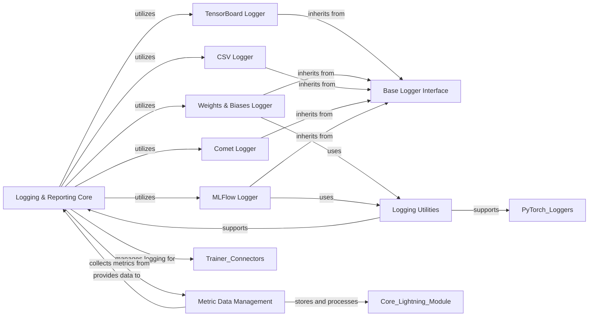

## Component Details

The 'Logging & Reporting' component in PyTorch Lightning is a crucial subsystem responsible for capturing, processing, and presenting experiment data. It integrates with various external logging platforms to record metrics, hyperparameters, and model graphs throughout the training, validation, and testing phases. This component ensures that users have comprehensive insights into their model's performance and training progress, facilitating experiment tracking, comparison, and reproducibility.

### Logging & Reporting Core
The central orchestrator for all logging activities, responsible for configuring loggers, managing the flow of metrics, and dispatching data to specific logging backends. It acts as the primary interface between the Trainer and the logging infrastructure.

**Related Classes/Methods**:

- <a href="https://github.com/Lightning-AI/lightning/blob/master/src/lightning/pytorch/trainer/connectors/logger_connector/logger_connector.py#L32-L263" target="_blank" rel="noopener noreferrer">`lightning.src.lightning.pytorch.trainer.connectors.logger_connector.logger_connector._LoggerConnector` (32:263)</a>

### Metric Data Management
Handles the collection, aggregation, and processing of individual metrics and their metadata during different stages of training (step-level and epoch-level). It provides a structured way to store and retrieve metrics before they are dispatched to loggers.

**Related Classes/Methods**:

- <a href="https://github.com/Lightning-AI/lightning/blob/master/src/lightning/pytorch/trainer/connectors/logger_connector/result.py#L313-L528" target="_blank" rel="noopener noreferrer">`lightning.pytorch.trainer.connectors.logger_connector.result._ResultCollection` (313:528)</a>
- <a href="https://github.com/Lightning-AI/lightning/blob/master/src/lightning/pytorch/trainer/connectors/logger_connector/result.py#L184-L310" target="_blank" rel="noopener noreferrer">`lightning.pytorch.trainer.connectors.logger_connector.result._ResultMetric` (184:310)</a>

### Base Logger Interface
Defines the abstract interface and common functionalities that all specific logger implementations must adhere to. It provides a standardized way for the framework to interact with different logging backends.

**Related Classes/Methods**:

- <a href="https://github.com/Lightning-AI/lightning/blob/master/src/lightning/fabric/loggers/logger.py#L27-L99" target="_blank" rel="noopener noreferrer">`lightning.src.lightning.fabric.loggers.logger.Logger` (27:99)</a>

### TensorBoard Logger
A concrete logger implementation for integrating with TensorBoard, enabling the logging of metrics, hyperparameters, and computational graphs to TensorBoard's visualization dashboard.

**Related Classes/Methods**:

- <a href="https://github.com/Lightning-AI/lightning/blob/master/src/lightning/pytorch/loggers/tensorboard.py#L39-L262" target="_blank" rel="noopener noreferrer">`lightning.src.lightning.pytorch.loggers.tensorboard.TensorBoardLogger` (39:262)</a>

### Weights & Biases Logger
A concrete logger implementation for integrating with Weights & Biases, supporting logging of metrics, hyperparameters, model checkpoints as artifacts, and various media types.

**Related Classes/Methods**:

- <a href="https://github.com/Lightning-AI/lightning/blob/master/src/lightning/pytorch/loggers/wandb.py#L51-L686" target="_blank" rel="noopener noreferrer">`lightning.src.lightning.pytorch.loggers.wandb.WandbLogger` (51:686)</a>

### CSV Logger
A simple logger implementation that saves metrics and hyperparameters to local CSV and YAML files, suitable for basic experiment tracking without external dependencies.

**Related Classes/Methods**:

- <a href="https://github.com/Lightning-AI/lightning/blob/master/src/lightning/pytorch/loggers/csv_logs.py#L64-L163" target="_blank" rel="noopener noreferrer">`lightning.src.lightning.pytorch.loggers.csv_logs.CSVLogger` (64:163)</a>

### Comet Logger
A concrete logger implementation for integrating with Comet, allowing for tracking of parameters, metrics, source code, and other assets to the Comet platform.

**Related Classes/Methods**:

- <a href="https://github.com/Lightning-AI/lightning/blob/master/src/lightning/pytorch/loggers/comet.py#L45-L421" target="_blank" rel="noopener noreferrer">`lightning.src.lightning.pytorch.loggers.comet.CometLogger` (45:421)</a>

### MLFlow Logger
A concrete logger implementation for integrating with MLflow, supporting the logging of metrics, hyperparameters, and model checkpoints as artifacts to an MLflow tracking server.

**Related Classes/Methods**:

- <a href="https://github.com/Lightning-AI/lightning/blob/master/src/lightning/pytorch/loggers/mlflow.py#L49-L383" target="_blank" rel="noopener noreferrer">`lightning.src.lightning.pytorch.loggers.mlflow.MLFlowLogger` (49:383)</a>

### Logging Utilities
A collection of helper functions that support various logging tasks, including processing hyperparameters, scanning for model checkpoints, and preparing data for logging.

**Related Classes/Methods**:

- <a href="https://github.com/Lightning-AI/lightning/blob/master/src/lightning/pytorch/loggers/utilities.py#L59-L102" target="_blank" rel="noopener noreferrer">`lightning.pytorch.loggers.utilities._log_hyperparams` (59:102)</a>
- <a href="https://github.com/Lightning-AI/lightning/blob/master/src/lightning/pytorch/loggers/utilities.py#L32-L56" target="_blank" rel="noopener noreferrer">`lightning.pytorch.loggers.utilities._scan_checkpoints` (32:56)</a>

### [FAQ](https://github.com/CodeBoarding/GeneratedOnBoardings/tree/main?tab=readme-ov-file#faq)