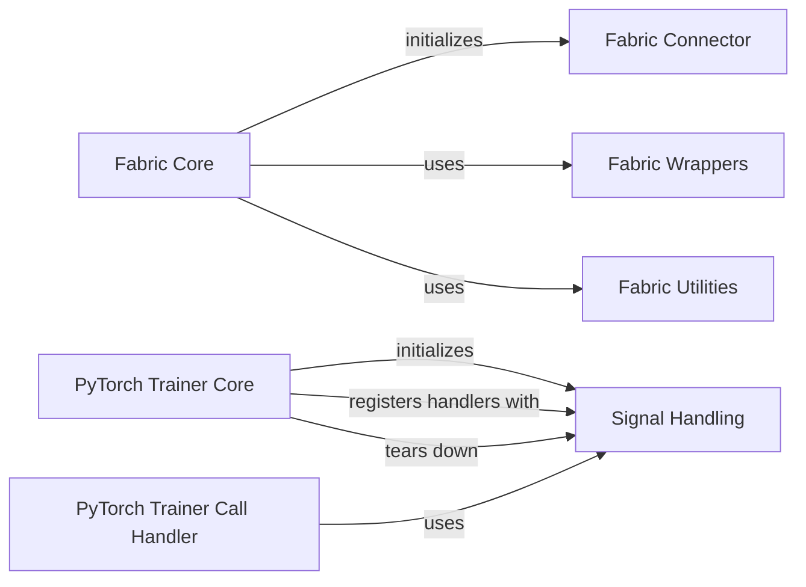

## Component Details

The System & Core Fabric subsystem provides the fundamental building blocks for distributed training and low-level system interactions within Lightning. It encompasses core functionalities like device-agnostic training setup, distributed operations, and robust signal handling to manage interruptions, ensuring a stable and scalable training environment.

### Signal Handling
Manages the registration and teardown of signal handlers within the Lightning PyTorch Trainer, ensuring proper behavior during interruptions.

**Related Classes/Methods**:

- <a href="https://github.com/Lightning-AI/lightning/blob/master/src/lightning/pytorch/trainer/connectors/signal_connector.py#L39-L158" target="_blank" rel="noopener noreferrer">`lightning.src.lightning.pytorch.trainer.connectors.signal_connector._SignalConnector` (39:158)</a>
- <a href="https://github.com/Lightning-AI/lightning/blob/master/src/lightning/pytorch/trainer/connectors/signal_connector.py#L45-L68" target="_blank" rel="noopener noreferrer">`lightning.src.lightning.pytorch.trainer.connectors.signal_connector._SignalConnector:register_signal_handlers` (45:68)</a>
- <a href="https://github.com/Lightning-AI/lightning/blob/master/src/lightning/pytorch/trainer/connectors/signal_connector.py#L125-L130" target="_blank" rel="noopener noreferrer">`lightning.src.lightning.pytorch.trainer.connectors.signal_connector._SignalConnector:teardown` (125:130)</a>
- <a href="https://github.com/Lightning-AI/lightning/blob/master/src/lightning/pytorch/trainer/connectors/signal_connector.py#L133-L139" target="_blank" rel="noopener noreferrer">`lightning.src.lightning.pytorch.trainer.connectors.signal_connector._SignalConnector._get_current_signal_handlers` (133:139)</a>
- <a href="https://github.com/Lightning-AI/lightning/blob/master/src/lightning/pytorch/trainer/connectors/signal_connector.py#L147-L148" target="_blank" rel="noopener noreferrer">`lightning.src.lightning.pytorch.trainer.connectors.signal_connector._SignalConnector._has_already_handler` (147:148)</a>
- <a href="https://github.com/Lightning-AI/lightning/blob/master/src/lightning/pytorch/trainer/connectors/signal_connector.py#L151-L153" target="_blank" rel="noopener noreferrer">`lightning.src.lightning.pytorch.trainer.connectors.signal_connector._SignalConnector._register_signal` (151:153)</a>
- <a href="https://github.com/Lightning-AI/lightning/blob/master/src/lightning/pytorch/trainer/connectors/signal_connector.py#L142-L144" target="_blank" rel="noopener noreferrer">`lightning.src.lightning.pytorch.trainer.connectors.signal_connector._SignalConnector._valid_signals` (142:144)</a>
- <a href="https://github.com/Lightning-AI/lightning/blob/master/src/lightning/pytorch/trainer/connectors/signal_connector.py#L25-L36" target="_blank" rel="noopener noreferrer">`lightning.src.lightning.pytorch.trainer.connectors.signal_connector._HandlersCompose` (25:36)</a>
- <a href="https://github.com/Lightning-AI/lightning/blob/master/src/lightning/pytorch/trainer/connectors/signal_connector.py#L161-L162" target="_blank" rel="noopener noreferrer">`lightning.pytorch.trainer.connectors.signal_connector._get_sigkill_signal` (161:162)</a>

### Fabric Core
Provides the central API for Lightning Fabric, enabling users to write device-agnostic training and inference logic. It handles setup, data loading, model/optimizer wrapping, and distributed operations.

**Related Classes/Methods**:

- <a href="https://github.com/Lightning-AI/lightning/blob/master/src/lightning/fabric/fabric.py#L82-L1061" target="_blank" rel="noopener noreferrer">`lightning.src.lightning.fabric.fabric.Fabric` (82:1061)</a>
- <a href="https://github.com/Lightning-AI/lightning/blob/master/src/lightning/fabric/fabric.py#L110-L144" target="_blank" rel="noopener noreferrer">`lightning.src.lightning.fabric.fabric.Fabric:__init__` (110:144)</a>
- <a href="https://github.com/Lightning-AI/lightning/blob/master/src/lightning/fabric/fabric.py#L205-L270" target="_blank" rel="noopener noreferrer">`lightning.src.lightning.fabric.fabric.Fabric:setup` (205:270)</a>
- <a href="https://github.com/Lightning-AI/lightning/blob/master/src/lightning/fabric/fabric.py#L272-L321" target="_blank" rel="noopener noreferrer">`lightning.src.lightning.fabric.fabric.Fabric:setup_module` (272:321)</a>
- <a href="https://github.com/Lightning-AI/lightning/blob/master/src/lightning/fabric/fabric.py#L323-L342" target="_blank" rel="noopener noreferrer">`lightning.src.lightning.fabric.fabric.Fabric:setup_optimizers` (323:342)</a>
- <a href="https://github.com/Lightning-AI/lightning/blob/master/src/lightning/fabric/fabric.py#L344-L370" target="_blank" rel="noopener noreferrer">`lightning.src.lightning.fabric.fabric.Fabric:setup_dataloaders` (344:370)</a>
- <a href="https://github.com/Lightning-AI/lightning/blob/master/src/lightning/fabric/fabric.py#L405-L439" target="_blank" rel="noopener noreferrer">`lightning.src.lightning.fabric.fabric.Fabric:backward` (405:439)</a>
- <a href="https://github.com/Lightning-AI/lightning/blob/master/src/lightning/fabric/fabric.py#L441-L483" target="_blank" rel="noopener noreferrer">`lightning.src.lightning.fabric.fabric.Fabric:clip_gradients` (441:483)</a>
- <a href="https://github.com/Lightning-AI/lightning/blob/master/src/lightning/fabric/fabric.py#L495-L495" target="_blank" rel="noopener noreferrer">`lightning.src.lightning.fabric.fabric.Fabric:to_device` (495:495)</a>
- <a href="https://github.com/Lightning-AI/lightning/blob/master/src/lightning/fabric/fabric.py#L531-L540" target="_blank" rel="noopener noreferrer">`lightning.src.lightning.fabric.fabric.Fabric:barrier` (531:540)</a>
- <a href="https://github.com/Lightning-AI/lightning/blob/master/src/lightning/fabric/fabric.py#L542-L557" target="_blank" rel="noopener noreferrer">`lightning.src.lightning.fabric.fabric.Fabric:broadcast` (542:557)</a>
- <a href="https://github.com/Lightning-AI/lightning/blob/master/src/lightning/fabric/fabric.py#L559-L581" target="_blank" rel="noopener noreferrer">`lightning.src.lightning.fabric.fabric.Fabric:all_gather` (559:581)</a>
- <a href="https://github.com/Lightning-AI/lightning/blob/master/src/lightning/fabric/fabric.py#L583-L610" target="_blank" rel="noopener noreferrer">`lightning.src.lightning.fabric.fabric.Fabric:all_reduce` (583:610)</a>
- <a href="https://github.com/Lightning-AI/lightning/blob/master/src/lightning/fabric/fabric.py#L613-L633" target="_blank" rel="noopener noreferrer">`lightning.src.lightning.fabric.fabric.Fabric:rank_zero_first` (613:633)</a>
- <a href="https://github.com/Lightning-AI/lightning/blob/master/src/lightning/fabric/fabric.py#L635-L675" target="_blank" rel="noopener noreferrer">`lightning.src.lightning.fabric.fabric.Fabric:no_backward_sync` (635:675)</a>
- <a href="https://github.com/Lightning-AI/lightning/blob/master/src/lightning/fabric/fabric.py#L677-L687" target="_blank" rel="noopener noreferrer">`lightning.src.lightning.fabric.fabric.Fabric:sharded_model` (677:687)</a>
- <a href="https://github.com/Lightning-AI/lightning/blob/master/src/lightning/fabric/fabric.py#L694-L707" target="_blank" rel="noopener noreferrer">`lightning.src.lightning.fabric.fabric.Fabric:init_module` (694:707)</a>
- <a href="https://github.com/Lightning-AI/lightning/blob/master/src/lightning/fabric/fabric.py#L709-L741" target="_blank" rel="noopener noreferrer">`lightning.src.lightning.fabric.fabric.Fabric:save` (709:741)</a>
- <a href="https://github.com/Lightning-AI/lightning/blob/master/src/lightning/fabric/fabric.py#L743-L776" target="_blank" rel="noopener noreferrer">`lightning.src.lightning.fabric.fabric.Fabric:load` (743:776)</a>
- <a href="https://github.com/Lightning-AI/lightning/blob/master/src/lightning/fabric/fabric.py#L778-L793" target="_blank" rel="noopener noreferrer">`lightning.src.lightning.fabric.fabric.Fabric:load_raw` (778:793)</a>
- <a href="https://github.com/Lightning-AI/lightning/blob/master/src/lightning/fabric/fabric.py#L795-L836" target="_blank" rel="noopener noreferrer">`lightning.src.lightning.fabric.fabric.Fabric:launch` (795:836)</a>
- <a href="https://github.com/Lightning-AI/lightning/blob/master/src/lightning/fabric/fabric.py#L877-L888" target="_blank" rel="noopener noreferrer">`lightning.src.lightning.fabric.fabric.Fabric:log` (877:888)</a>
- <a href="https://github.com/Lightning-AI/lightning/blob/master/src/lightning/fabric/fabric.py#L890-L902" target="_blank" rel="noopener noreferrer">`lightning.src.lightning.fabric.fabric.Fabric:log_dict` (890:902)</a>
- <a href="https://github.com/Lightning-AI/lightning/blob/master/src/lightning/fabric/fabric.py#L905-L915" target="_blank" rel="noopener noreferrer">`lightning.src.lightning.fabric.fabric.Fabric:seed_everything` (905:915)</a>
- <a href="https://github.com/Lightning-AI/lightning/blob/master/src/lightning/fabric/fabric.py#L924-L927" target="_blank" rel="noopener noreferrer">`lightning.src.lightning.fabric.fabric.Fabric._wrap_with_setup` (924:927)</a>
- <a href="https://github.com/Lightning-AI/lightning/blob/master/src/lightning/fabric/fabric.py#L929-L968" target="_blank" rel="noopener noreferrer">`lightning.src.lightning.fabric.fabric.Fabric._move_model_to_device` (929:968)</a>
- <a href="https://github.com/Lightning-AI/lightning/blob/master/src/lightning/fabric/fabric.py#L970-L975" target="_blank" rel="noopener noreferrer">`lightning.src.lightning.fabric.fabric.Fabric._requires_distributed_sampler` (970:975)</a>
- <a href="https://github.com/Lightning-AI/lightning/blob/master/src/lightning/fabric/fabric.py#L978-L983" target="_blank" rel="noopener noreferrer">`lightning.src.lightning.fabric.fabric.Fabric._get_distributed_sampler` (978:983)</a>
- <a href="https://github.com/Lightning-AI/lightning/blob/master/src/lightning/fabric/fabric.py#L985-L992" target="_blank" rel="noopener noreferrer">`lightning.src.lightning.fabric.fabric.Fabric._prepare_run_method` (985:992)</a>
- <a href="https://github.com/Lightning-AI/lightning/blob/master/src/lightning/fabric/fabric.py#L1001-L1017" target="_blank" rel="noopener noreferrer">`lightning.src.lightning.fabric.fabric.Fabric._validate_setup` (1001:1017)</a>
- <a href="https://github.com/Lightning-AI/lightning/blob/master/src/lightning/fabric/fabric.py#L1019-L1022" target="_blank" rel="noopener noreferrer">`lightning.src.lightning.fabric.fabric.Fabric._validate_setup_module` (1019:1022)</a>
- <a href="https://github.com/Lightning-AI/lightning/blob/master/src/lightning/fabric/fabric.py#L1024-L1043" target="_blank" rel="noopener noreferrer">`lightning.src.lightning.fabric.fabric.Fabric._validate_setup_optimizers` (1024:1043)</a>
- <a href="https://github.com/Lightning-AI/lightning/blob/master/src/lightning/fabric/fabric.py#L1045-L1054" target="_blank" rel="noopener noreferrer">`lightning.src.lightning.fabric.fabric.Fabric._validate_setup_dataloaders` (1045:1054)</a>
- <a href="https://github.com/Lightning-AI/lightning/blob/master/src/lightning/fabric/fabric.py#L1057-L1061" target="_blank" rel="noopener noreferrer">`lightning.src.lightning.fabric.fabric.Fabric._configure_callbacks` (1057:1061)</a>
- <a href="https://github.com/Lightning-AI/lightning/blob/master/src/lightning/fabric/fabric.py#L917-L922" target="_blank" rel="noopener noreferrer">`lightning.src.lightning.fabric.fabric.Fabric._wrap_and_launch` (917:922)</a>
- <a href="https://github.com/Lightning-AI/lightning/blob/master/src/lightning/fabric/fabric.py#L372-L403" target="_blank" rel="noopener noreferrer">`lightning.src.lightning.fabric.fabric.Fabric._setup_dataloader` (372:403)</a>

### Fabric Utilities
Contains various helper functions and classes used across Lightning Fabric for tasks like device management, data manipulation, distributed operations, seeding, and callback loading.

**Related Classes/Methods**:

- <a href="https://github.com/Lightning-AI/lightning/blob/master/src/lightning/fabric/utilities/device_dtype_mixin.py#L109-L120" target="_blank" rel="noopener noreferrer">`lightning.fabric.utilities.device_dtype_mixin._update_properties` (109:120)</a>
- <a href="https://github.com/Lightning-AI/lightning/blob/master/src/lightning/fabric/utilities/apply_func.py#L78-L110" target="_blank" rel="noopener noreferrer">`lightning.fabric.utilities.apply_func.move_data_to_device` (78:110)</a>
- <a href="https://github.com/Lightning-AI/lightning/blob/master/src/lightning/fabric/utilities/apply_func.py#L113-L117" target="_blank" rel="noopener noreferrer">`lightning.fabric.utilities.apply_func.convert_to_tensors` (113:117)</a>
- <a href="https://github.com/Lightning-AI/lightning/blob/master/src/lightning/fabric/utilities/apply_func.py#L120-L136" target="_blank" rel="noopener noreferrer">`lightning.fabric.utilities.apply_func.convert_tensors_to_scalars` (120:136)</a>
- <a href="https://github.com/Lightning-AI/lightning/blob/master/src/lightning/fabric/utilities/distributed.py#L407-L433" target="_blank" rel="noopener noreferrer">`lightning.fabric.utilities.distributed._InfiniteBarrier` (407:433)</a>
- <a href="https://github.com/Lightning-AI/lightning/blob/master/src/lightning/fabric/utilities/data.py#L75-L77" target="_blank" rel="noopener noreferrer">`lightning.fabric.utilities.data._update_dataloader` (75:77)</a>
- <a href="https://github.com/Lightning-AI/lightning/blob/master/src/lightning/fabric/utilities/data.py#L246-L250" target="_blank" rel="noopener noreferrer">`lightning.fabric.utilities.data._auto_add_worker_init_fn` (246:250)</a>
- <a href="https://github.com/Lightning-AI/lightning/blob/master/src/lightning/fabric/utilities/data.py#L44-L45" target="_blank" rel="noopener noreferrer">`lightning.fabric.utilities.data.has_iterable_dataset` (44:45)</a>
- <a href="https://github.com/Lightning-AI/lightning/blob/master/src/lightning/fabric/utilities/distributed.py#L365-L384" target="_blank" rel="noopener noreferrer">`lightning.fabric.utilities.distributed.DistributedSamplerWrapper` (365:384)</a>
- <a href="https://github.com/Lightning-AI/lightning/blob/master/src/lightning/fabric/utilities/seed.py#L20-L69" target="_blank" rel="noopener noreferrer">`lightning.fabric.utilities.seed.seed_everything` (20:69)</a>
- <a href="https://github.com/Lightning-AI/lightning/blob/master/src/lightning/fabric/utilities/data.py#L359-L387" target="_blank" rel="noopener noreferrer">`lightning.fabric.utilities.data._replace_dunder_methods` (359:387)</a>
- <a href="https://github.com/Lightning-AI/lightning/blob/master/src/lightning/fabric/utilities/init.py#L108-L115" target="_blank" rel="noopener noreferrer">`lightning.fabric.utilities.init._has_meta_device_parameters_or_buffers` (108:115)</a>
- <a href="https://github.com/Lightning-AI/lightning/blob/master/src/lightning/fabric/utilities/registry.py#L27-L54" target="_blank" rel="noopener noreferrer">`lightning.fabric.utilities.registry._load_external_callbacks` (27:54)</a>

### Fabric Wrappers
Provides wrappers for models, optimizers, and dataloaders to enable device-agnostic execution and distributed training capabilities within Lightning Fabric.

**Related Classes/Methods**:

- <a href="https://github.com/Lightning-AI/lightning/blob/master/src/lightning/fabric/wrappers.py#L348-L361" target="_blank" rel="noopener noreferrer">`lightning.fabric.wrappers._unwrap_compiled` (348:361)</a>
- <a href="https://github.com/Lightning-AI/lightning/blob/master/src/lightning/fabric/wrappers.py#L364-L365" target="_blank" rel="noopener noreferrer">`lightning.fabric.wrappers._to_compiled` (364:365)</a>
- <a href="https://github.com/Lightning-AI/lightning/blob/master/src/lightning/fabric/wrappers.py#L101-L290" target="_blank" rel="noopener noreferrer">`lightning.fabric.wrappers._FabricModule` (101:290)</a>
- <a href="https://github.com/Lightning-AI/lightning/blob/master/src/lightning/fabric/wrappers.py#L52-L98" target="_blank" rel="noopener noreferrer">`lightning.fabric.wrappers._FabricOptimizer` (52:98)</a>
- <a href="https://github.com/Lightning-AI/lightning/blob/master/src/lightning/fabric/wrappers.py#L293-L327" target="_blank" rel="noopener noreferrer">`lightning.fabric.wrappers._FabricDataLoader` (293:327)</a>
- <a href="https://github.com/Lightning-AI/lightning/blob/master/src/lightning/fabric/wrappers.py#L330-L345" target="_blank" rel="noopener noreferrer">`lightning.fabric.wrappers._unwrap_objects` (330:345)</a>

### Fabric Connector
Handles the connection logic for Lightning Fabric, including CLI integration.

**Related Classes/Methods**:

- <a href="https://github.com/Lightning-AI/lightning/blob/master/src/lightning/fabric/connector.py#L74-L554" target="_blank" rel="noopener noreferrer">`lightning.fabric.connector._Connector` (74:554)</a>
- <a href="https://github.com/Lightning-AI/lightning/blob/master/src/lightning/fabric/connector.py#L579-L580" target="_blank" rel="noopener noreferrer">`lightning.fabric.connector._is_using_cli` (579:580)</a>

### PyTorch Trainer Core
Represents the core training loop and lifecycle management for Lightning PyTorch, including initialization, running, and teardown of the training process.

**Related Classes/Methods**:

- <a href="https://github.com/Lightning-AI/lightning/blob/master/src/lightning/pytorch/trainer/trainer.py#L89-L1727" target="_blank" rel="noopener noreferrer">`lightning.src.lightning.pytorch.trainer.trainer.Trainer` (89:1727)</a>
- <a href="https://github.com/Lightning-AI/lightning/blob/master/src/lightning/pytorch/trainer/trainer.py#L91-L511" target="_blank" rel="noopener noreferrer">`lightning.src.lightning.pytorch.trainer.trainer.Trainer:__init__` (91:511)</a>
- <a href="https://github.com/Lightning-AI/lightning/blob/master/src/lightning/pytorch/trainer/trainer.py#L941-L1038" target="_blank" rel="noopener noreferrer">`lightning.src.lightning.pytorch.trainer.trainer.Trainer:_run` (941:1038)</a>
- <a href="https://github.com/Lightning-AI/lightning/blob/master/src/lightning/pytorch/trainer/trainer.py#L1040-L1049" target="_blank" rel="noopener noreferrer">`lightning.src.lightning.pytorch.trainer.trainer.Trainer:_teardown` (1040:1049)</a>

### PyTorch Trainer Call Handler
Manages the execution of trainer calls and handles interruptions during the training process.

**Related Classes/Methods**:

- <a href="https://github.com/Lightning-AI/lightning/blob/master/src/lightning/pytorch/trainer/call.py#L35-L72" target="_blank" rel="noopener noreferrer">`lightning.src.lightning.pytorch.trainer.call:_call_and_handle_interrupt` (35:72)</a>

### [FAQ](https://github.com/CodeBoarding/GeneratedOnBoardings/tree/main?tab=readme-ov-file#faq)