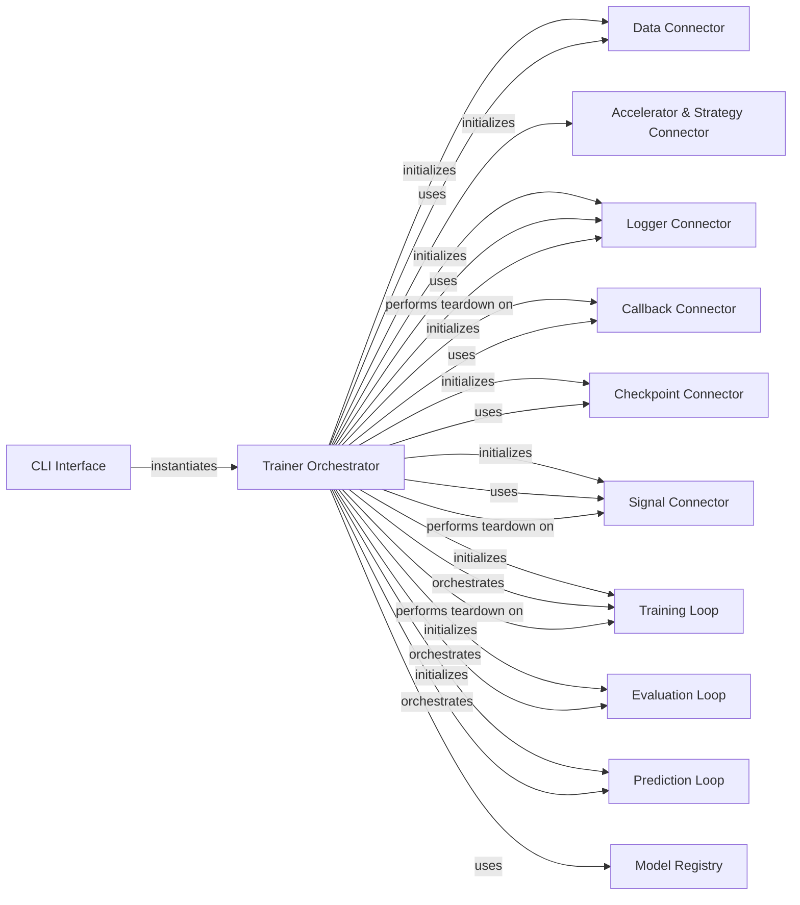

## Component Details

This graph illustrates the architecture of the `Trainer` component in PyTorch Lightning. The `Trainer Orchestrator` is the central hub, managing the entire deep learning workflow including training, validation, testing, and prediction. It initializes and coordinates various specialized connectors (Data, Accelerator & Strategy, Logger, Callback, Checkpoint, Signal) and orchestrates the core loops (Training, Evaluation, Prediction). The `CLI Interface` serves as the entry point, instantiating the `Trainer Orchestrator` with user-defined configurations. The overall purpose is to provide a robust and extensible framework for managing the lifecycle of deep learning models.

### Trainer Orchestrator
The central component, lightning.pytorch.trainer.trainer.Trainer, responsible for coordinating the entire machine learning workflow (training, validation, testing, prediction). It initializes and manages various sub-components, defines the high-level execution flow, and handles overall state management, including error handling, profiling setup, and general configuration validation.

**Related Classes/Methods**:

- <a href="https://github.com/Lightning-AI/lightning/blob/master/src/lightning/pytorch/trainer/trainer.py#L89-L1727" target="_blank" rel="noopener noreferrer">`lightning.src.lightning.pytorch.trainer.trainer.Trainer` (89:1727)</a>
- <a href="https://github.com/Lightning-AI/lightning/blob/master/src/lightning/pytorch/trainer/trainer.py#L91-L511" target="_blank" rel="noopener noreferrer">`lightning.src.lightning.pytorch.trainer.trainer.Trainer:__init__` (91:511)</a>
- <a href="https://github.com/Lightning-AI/lightning/blob/master/src/lightning/pytorch/trainer/trainer.py#L513-L569" target="_blank" rel="noopener noreferrer">`lightning.src.lightning.pytorch.trainer.trainer.Trainer:fit` (513:569)</a>
- <a href="https://github.com/Lightning-AI/lightning/blob/master/src/lightning/pytorch/trainer/trainer.py#L571-L609" target="_blank" rel="noopener noreferrer">`lightning.src.lightning.pytorch.trainer.trainer.Trainer:_fit_impl` (571:609)</a>
- <a href="https://github.com/Lightning-AI/lightning/blob/master/src/lightning/pytorch/trainer/trainer.py#L611-L672" target="_blank" rel="noopener noreferrer">`lightning.src.lightning.pytorch.trainer.trainer.Trainer:validate` (611:672)</a>
- <a href="https://github.com/Lightning-AI/lightning/blob/master/src/lightning/pytorch/trainer/trainer.py#L674-L719" target="_blank" rel="noopener noreferrer">`lightning.src.lightning.pytorch.trainer.trainer.Trainer:_validate_impl` (674:719)</a>
- <a href="https://github.com/Lightning-AI/lightning/blob/master/src/lightning/pytorch/trainer/trainer.py#L721-L783" target="_blank" rel="noopener noreferrer">`lightning.src.lightning.pytorch.trainer.trainer.Trainer:test` (721:783)</a>
- <a href="https://github.com/Lightning-AI/lightning/blob/master/src/lightning/pytorch/trainer/trainer.py#L785-L830" target="_blank" rel="noopener noreferrer">`lightning.src.lightning.pytorch.trainer.trainer.Trainer:_test_impl` (785:830)</a>
- <a href="https://github.com/Lightning-AI/lightning/blob/master/src/lightning/pytorch/trainer/trainer.py#L832-L895" target="_blank" rel="noopener noreferrer">`lightning.src.lightning.pytorch.trainer.trainer.Trainer:predict` (832:895)</a>
- <a href="https://github.com/Lightning-AI/lightning/blob/master/src/lightning/pytorch/trainer/trainer.py#L897-L939" target="_blank" rel="noopener noreferrer">`lightning.src.lightning.pytorch.trainer.trainer.Trainer:_predict_impl` (897:939)</a>
- <a href="https://github.com/Lightning-AI/lightning/blob/master/src/lightning/pytorch/trainer/trainer.py#L941-L1038" target="_blank" rel="noopener noreferrer">`lightning.src.lightning.pytorch.trainer.trainer.Trainer:_run` (941:1038)</a>
- <a href="https://github.com/Lightning-AI/lightning/blob/master/src/lightning/pytorch/trainer/trainer.py#L1040-L1049" target="_blank" rel="noopener noreferrer">`lightning.src.lightning.pytorch.trainer.trainer.Trainer:_teardown` (1040:1049)</a>
- <a href="https://github.com/Lightning-AI/lightning/blob/master/src/lightning/pytorch/trainer/trainer.py#L1051-L1066" target="_blank" rel="noopener noreferrer">`lightning.src.lightning.pytorch.trainer.trainer.Trainer:_run_stage` (1051:1066)</a>
- <a href="https://github.com/Lightning-AI/lightning/blob/master/src/lightning/pytorch/trainer/trainer.py#L1068-L1104" target="_blank" rel="noopener noreferrer">`lightning.src.lightning.pytorch.trainer.trainer.Trainer:_run_sanity_check` (1068:1104)</a>
- <a href="https://github.com/Lightning-AI/lightning/blob/master/src/lightning/pytorch/trainer/trainer.py#L1113-L1138" target="_blank" rel="noopener noreferrer">`lightning.src.lightning.pytorch.trainer.trainer.Trainer:init_module` (1113:1138)</a>
- <a href="https://github.com/Lightning-AI/lightning/blob/master/src/lightning/pytorch/trainer/trainer.py#L1295-L1301" target="_blank" rel="noopener noreferrer">`lightning.src.lightning.pytorch.trainer.trainer.Trainer:enable_validation` (1295:1301)</a>
- <a href="https://github.com/Lightning-AI/lightning/blob/master/src/lightning/pytorch/trainer/trainer.py#L1304-L1312" target="_blank" rel="noopener noreferrer">`lightning.src.lightning.pytorch.trainer.trainer.Trainer:default_root_dir` (1304:1312)</a>
- <a href="https://github.com/Lightning-AI/lightning/blob/master/src/lightning/pytorch/trainer/trainer.py#L1380-L1406" target="_blank" rel="noopener noreferrer">`lightning.src.lightning.pytorch.trainer.trainer.Trainer:save_checkpoint` (1380:1406)</a>
- <a href="https://github.com/Lightning-AI/lightning/blob/master/src/lightning/pytorch/trainer/trainer.py#L1689-L1727" target="_blank" rel="noopener noreferrer">`lightning.src.lightning.pytorch.trainer.trainer.Trainer:estimated_stepping_batches` (1689:1727)</a>
- <a href="https://github.com/Lightning-AI/lightning/blob/master/src/lightning/pytorch/trainer/trainer.py#L1106-L1110" target="_blank" rel="noopener noreferrer">`lightning.src.lightning.pytorch.trainer.trainer.Trainer.__setup_profiler` (1106:1110)</a>
- <a href="https://github.com/Lightning-AI/lightning/blob/master/src/lightning/pytorch/trainer/states.py#L75-L88" target="_blank" rel="noopener noreferrer">`lightning.pytorch.trainer.states.TrainerState` (75:88)</a>
- <a href="https://github.com/Lightning-AI/lightning/blob/master/src/lightning/pytorch/trainer/call.py#L35-L72" target="_blank" rel="noopener noreferrer">`lightning.pytorch.trainer.call._call_and_handle_interrupt` (35:72)</a>
- <a href="https://github.com/Lightning-AI/lightning/blob/master/src/lightning/pytorch/trainer/call.py#L85-L111" target="_blank" rel="noopener noreferrer">`lightning.pytorch.trainer.call._call_setup_hook` (85:111)</a>
- <a href="https://github.com/Lightning-AI/lightning/blob/master/src/lightning/pytorch/trainer/call.py#L114-L128" target="_blank" rel="noopener noreferrer">`lightning.pytorch.trainer.call._call_configure_model` (114:128)</a>
- <a href="https://github.com/Lightning-AI/lightning/blob/master/src/lightning/pytorch/trainer/call.py#L131-L151" target="_blank" rel="noopener noreferrer">`lightning.pytorch.trainer.call._call_teardown_hook` (131:151)</a>
- <a href="https://github.com/Lightning-AI/lightning/blob/master/src/lightning/pytorch/trainer/setup.py#L144-L189" target="_blank" rel="noopener noreferrer">`lightning.pytorch.trainer.setup._log_device_info` (144:189)</a>
- <a href="https://github.com/Lightning-AI/lightning/blob/master/src/lightning/pytorch/trainer/setup.py#L125-L141" target="_blank" rel="noopener noreferrer">`lightning.pytorch.trainer.setup._init_profiler` (125:141)</a>
- <a href="https://github.com/Lightning-AI/lightning/blob/master/src/lightning/pytorch/trainer/setup.py#L35-L89" target="_blank" rel="noopener noreferrer">`lightning.pytorch.trainer.setup._init_debugging_flags` (35:89)</a>
- <a href="https://github.com/Lightning-AI/lightning/blob/master/src/lightning/pytorch/trainer/configuration_validator.py#L24-L46" target="_blank" rel="noopener noreferrer">`lightning.pytorch.trainer.configuration_validator._verify_loop_configurations` (24:46)</a>
- <a href="https://github.com/Lightning-AI/lightning/blob/master/src/lightning/pytorch/utilities/parsing.py#L40-L49" target="_blank" rel="noopener noreferrer">`lightning.pytorch.utilities.parsing.clean_namespace` (40:49)</a>
- <a href="https://github.com/Lightning-AI/lightning/blob/master/src/lightning/pytorch/utilities/seed.py#L23-L46" target="_blank" rel="noopener noreferrer">`lightning.pytorch.utilities.seed.isolate_rng` (23:46)</a>
- <a href="https://github.com/Lightning-AI/lightning/blob/master/src/lightning/fabric/utilities/cloud_io.py#L152-L153" target="_blank" rel="noopener noreferrer">`lightning.fabric.utilities.cloud_io._is_local_file_protocol` (152:153)</a>
- <a href="https://github.com/Lightning-AI/lightning/blob/master/src/lightning/pytorch/utilities/model_helpers.py#L29-L46" target="_blank" rel="noopener noreferrer">`lightning.pytorch.utilities.model_helpers.is_overridden` (29:46)</a>
- <a href="https://github.com/Lightning-AI/lightning/blob/master/src/lightning/pytorch/utilities/compile.py#L105-L113" target="_blank" rel="noopener noreferrer">`lightning.pytorch.utilities.compile._maybe_unwrap_optimized` (105:113)</a>
- <a href="https://github.com/Lightning-AI/lightning/blob/master/src/lightning/pytorch/utilities/compile.py#L116-L125" target="_blank" rel="noopener noreferrer">`lightning.pytorch.utilities.compile._verify_strategy_supports_compile` (116:125)</a>
- <a href="https://github.com/Lightning-AI/lightning/blob/master/src/lightning/fabric/utilities/exceptions.py#L16-L17" target="_blank" rel="noopener noreferrer">`lightning.fabric.utilities.exceptions.MisconfigurationException` (16:17)</a>
- <a href="https://github.com/Lightning-AI/lightning/blob/master/src/lightning/pytorch/utilities/enums.py#L21-L40" target="_blank" rel="noopener noreferrer">`lightning.pytorch.utilities.enums.GradClipAlgorithmType` (21:40)</a>
- <a href="https://github.com/Lightning-AI/lightning/blob/master/src/lightning/pytorch/utilities/enums.py#L35-L36" target="_blank" rel="noopener noreferrer">`lightning.pytorch.utilities.enums.GradClipAlgorithmType.supported_type` (35:36)</a>
- <a href="https://github.com/Lightning-AI/lightning/blob/master/src/lightning/pytorch/utilities/enums.py#L39-L40" target="_blank" rel="noopener noreferrer">`lightning.pytorch.utilities.enums.GradClipAlgorithmType.supported_types` (39:40)</a>
- <a href="https://github.com/Lightning-AI/lightning/blob/master/src/lightning/fabric/utilities/apply_func.py#L120-L136" target="_blank" rel="noopener noreferrer">`lightning.fabric.utilities.apply_func.convert_tensors_to_scalars` (120:136)</a>

### Data Connector
Manages the attachment and preparation of data loaders for training, validation, testing, and prediction stages, ensuring data is correctly provided to the model and handling data-related configurations.

**Related Classes/Methods**:

- <a href="https://github.com/Lightning-AI/lightning/blob/master/src/lightning/pytorch/trainer/connectors/data_connector.py#L46-L226" target="_blank" rel="noopener noreferrer">`lightning.pytorch.trainer.connectors.data_connector._DataConnector` (46:226)</a>
- <a href="https://github.com/Lightning-AI/lightning/blob/master/src/lightning/pytorch/trainer/connectors/data_connector.py#L51-L77" target="_blank" rel="noopener noreferrer">`lightning.pytorch.trainer.connectors.data_connector._DataConnector.on_trainer_init` (51:77)</a>
- <a href="https://github.com/Lightning-AI/lightning/blob/master/src/lightning/pytorch/trainer/connectors/data_connector.py#L103-L123" target="_blank" rel="noopener noreferrer">`lightning.pytorch.trainer.connectors.data_connector._DataConnector.attach_data` (103:123)</a>
- <a href="https://github.com/Lightning-AI/lightning/blob/master/src/lightning/pytorch/trainer/connectors/data_connector.py#L79-L101" target="_blank" rel="noopener noreferrer">`lightning.pytorch.trainer.connectors.data_connector._DataConnector.prepare_data` (79:101)</a>
- <a href="https://github.com/Lightning-AI/lightning/blob/master/src/lightning/pytorch/trainer/connectors/data_connector.py#L297-L303" target="_blank" rel="noopener noreferrer">`lightning.pytorch.trainer.connectors.data_connector._DataLoaderSource.is_defined` (297:303)</a>

### Accelerator & Strategy Connector
Configures and manages the hardware accelerator (CPU, GPU, TPU, etc.) and the training strategy (e.g., DistributedDataParallel, DDP Spawn), handling device placement, precision settings, and distributed sampler usage.

**Related Classes/Methods**:

- <a href="https://github.com/Lightning-AI/lightning/blob/master/src/lightning/pytorch/trainer/connectors/accelerator_connector.py#L75-L628" target="_blank" rel="noopener noreferrer">`lightning.pytorch.trainer.connectors.accelerator_connector._AcceleratorConnector` (75:628)</a>

### Logger Connector
Facilitates logging of metrics, hyperparameters, and other relevant information to various loggers (e.g., TensorBoard, CSVLogger) and manages progress bar updates, including resetting results and metrics.

**Related Classes/Methods**:

- <a href="https://github.com/Lightning-AI/lightning/blob/master/src/lightning/pytorch/trainer/connectors/logger_connector/logger_connector.py#L32-L263" target="_blank" rel="noopener noreferrer">`lightning.pytorch.trainer.connectors.logger_connector.logger_connector._LoggerConnector` (32:263)</a>
- <a href="https://github.com/Lightning-AI/lightning/blob/master/src/lightning/pytorch/trainer/connectors/logger_connector/logger_connector.py#L42-L48" target="_blank" rel="noopener noreferrer">`lightning.pytorch.trainer.connectors.logger_connector.logger_connector._LoggerConnector.on_trainer_init` (42:48)</a>
- <a href="https://github.com/Lightning-AI/lightning/blob/master/src/lightning/pytorch/trainer/connectors/logger_connector/logger_connector.py#L223-L229" target="_blank" rel="noopener noreferrer">`lightning.pytorch.trainer.connectors.logger_connector.logger_connector._LoggerConnector.reset_results` (223:229)</a>
- <a href="https://github.com/Lightning-AI/lightning/blob/master/src/lightning/pytorch/trainer/connectors/logger_connector/logger_connector.py#L218-L221" target="_blank" rel="noopener noreferrer">`lightning.pytorch.trainer.connectors.logger_connector.logger_connector._LoggerConnector.reset_metrics` (218:221)</a>
- <a href="https://github.com/Lightning-AI/lightning/blob/master/src/lightning/pytorch/trainer/connectors/logger_connector/logger_connector.py#L259-L263" target="_blank" rel="noopener noreferrer">`lightning.pytorch.trainer.connectors.logger_connector.logger_connector._LoggerConnector.teardown` (259:263)</a>
- <a href="https://github.com/Lightning-AI/lightning/blob/master/src/lightning/pytorch/loggers/utilities.py#L59-L102" target="_blank" rel="noopener noreferrer">`lightning.pytorch.loggers.utilities._log_hyperparams` (59:102)</a>

### Callback Connector
Manages the registration and execution of user-defined callbacks and internal LightningModule hooks at appropriate points in the training, validation, testing, and prediction loops.

**Related Classes/Methods**:

- <a href="https://github.com/Lightning-AI/lightning/blob/master/src/lightning/pytorch/trainer/connectors/callback_connector.py#L46-L244" target="_blank" rel="noopener noreferrer">`lightning.pytorch.trainer.connectors.callback_connector._CallbackConnector` (46:244)</a>
- <a href="https://github.com/Lightning-AI/lightning/blob/master/src/lightning/pytorch/trainer/connectors/callback_connector.py#L50-L86" target="_blank" rel="noopener noreferrer">`lightning.pytorch.trainer.connectors.callback_connector._CallbackConnector.on_trainer_init` (50:86)</a>
- <a href="https://github.com/Lightning-AI/lightning/blob/master/src/lightning/pytorch/trainer/connectors/callback_connector.py#L178-L216" target="_blank" rel="noopener noreferrer">`lightning.pytorch.trainer.connectors.callback_connector._CallbackConnector._attach_model_callbacks` (178:216)</a>
- <a href="https://github.com/Lightning-AI/lightning/blob/master/src/lightning/pytorch/trainer/connectors/callback_connector.py#L172-L176" target="_blank" rel="noopener noreferrer">`lightning.pytorch.trainer.connectors.callback_connector._CallbackConnector._attach_model_logging_functions` (172:176)</a>
- <a href="https://github.com/Lightning-AI/lightning/blob/master/src/lightning/pytorch/trainer/call.py#L202-L231" target="_blank" rel="noopener noreferrer">`lightning.pytorch.trainer.call._call_callback_hooks` (202:231)</a>
- <a href="https://github.com/Lightning-AI/lightning/blob/master/src/lightning/pytorch/trainer/call.py#L154-L181" target="_blank" rel="noopener noreferrer">`lightning.pytorch.trainer.call._call_lightning_module_hook` (154:181)</a>

### Checkpoint Connector
Handles the saving and loading of model checkpoints, including selecting the appropriate checkpoint path, restoring model weights, optimizers, and other training states, and managing resume operations.

**Related Classes/Methods**:

- <a href="https://github.com/Lightning-AI/lightning/blob/master/src/lightning/pytorch/trainer/connectors/checkpoint_connector.py#L46-L558" target="_blank" rel="noopener noreferrer">`lightning.pytorch.trainer.connectors.checkpoint_connector._CheckpointConnector` (46:558)</a>
- <a href="https://github.com/Lightning-AI/lightning/blob/master/src/lightning/pytorch/trainer/connectors/checkpoint_connector.py#L86-L114" target="_blank" rel="noopener noreferrer">`lightning.pytorch.trainer.connectors.checkpoint_connector._CheckpointConnector._select_ckpt_path` (86:114)</a>
- <a href="https://github.com/Lightning-AI/lightning/blob/master/src/lightning/pytorch/trainer/connectors/checkpoint_connector.py#L406-L411" target="_blank" rel="noopener noreferrer">`lightning.pytorch.trainer.connectors.checkpoint_connector._CheckpointConnector._restore_modules_and_callbacks` (406:411)</a>
- <a href="https://github.com/Lightning-AI/lightning/blob/master/src/lightning/pytorch/trainer/connectors/checkpoint_connector.py#L291-L309" target="_blank" rel="noopener noreferrer">`lightning.pytorch.trainer.connectors.checkpoint_connector._CheckpointConnector.restore_training_state` (291:309)</a>
- <a href="https://github.com/Lightning-AI/lightning/blob/master/src/lightning/pytorch/trainer/connectors/checkpoint_connector.py#L219-L231" target="_blank" rel="noopener noreferrer">`lightning.pytorch.trainer.connectors.checkpoint_connector._CheckpointConnector.resume_end` (219:231)</a>
- <a href="https://github.com/Lightning-AI/lightning/blob/master/src/lightning/pytorch/trainer/connectors/checkpoint_connector.py#L413-L503" target="_blank" rel="noopener noreferrer">`lightning.pytorch.trainer.connectors.checkpoint_connector._CheckpointConnector.dump_checkpoint` (413:503)</a>

### Signal Connector
Manages system signals, such as SIGTERM, to enable graceful shutdowns and interruptions during training, ensuring the application can respond to external termination requests.

**Related Classes/Methods**:

- <a href="https://github.com/Lightning-AI/lightning/blob/master/src/lightning/pytorch/trainer/connectors/signal_connector.py#L39-L158" target="_blank" rel="noopener noreferrer">`lightning.pytorch.trainer.connectors.signal_connector._SignalConnector` (39:158)</a>
- <a href="https://github.com/Lightning-AI/lightning/blob/master/src/lightning/pytorch/trainer/connectors/signal_connector.py#L45-L68" target="_blank" rel="noopener noreferrer">`lightning.pytorch.trainer.connectors.signal_connector._SignalConnector.register_signal_handlers` (45:68)</a>
- <a href="https://github.com/Lightning-AI/lightning/blob/master/src/lightning/pytorch/trainer/connectors/signal_connector.py#L125-L130" target="_blank" rel="noopener noreferrer">`lightning.pytorch.trainer.connectors.signal_connector._SignalConnector.teardown` (125:130)</a>

### Training Loop
Implements the core training logic, iterating over epochs and batches, managing the training epoch loop, and handling progress tracking and limits.

**Related Classes/Methods**:

- <a href="https://github.com/Lightning-AI/lightning/blob/master/src/lightning/pytorch/loops/fit_loop.py#L58-L529" target="_blank" rel="noopener noreferrer">`lightning.pytorch.loops.fit_loop._FitLoop` (58:529)</a>
- <a href="https://github.com/Lightning-AI/lightning/blob/master/src/lightning/pytorch/loops/fit_loop.py#L500-L504" target="_blank" rel="noopener noreferrer">`lightning.pytorch.loops.fit_loop._FitLoop.teardown` (500:504)</a>
- <a href="https://github.com/Lightning-AI/lightning/blob/master/src/lightning/pytorch/loops/fit_loop.py#L207-L223" target="_blank" rel="noopener noreferrer">`lightning.pytorch.loops.fit_loop._FitLoop.run` (207:223)</a>
- <a href="https://github.com/Lightning-AI/lightning/blob/master/src/lightning/pytorch/loops/fit_loop.py#L225-L315" target="_blank" rel="noopener noreferrer">`lightning.pytorch.loops.fit_loop._FitLoop.setup_data` (225:315)</a>
- <a href="https://github.com/Lightning-AI/lightning/blob/master/src/lightning/pytorch/loops/training_epoch_loop.py#L50-L569" target="_blank" rel="noopener noreferrer">`lightning.pytorch.loops.training_epoch_loop._TrainingEpochLoop` (50:569)</a>
- <a href="https://github.com/Lightning-AI/lightning/blob/master/src/lightning/pytorch/loops/utilities.py#L50-L90" target="_blank" rel="noopener noreferrer">`lightning.pytorch.loops.utilities._parse_loop_limits` (50:90)</a>
- <a href="https://github.com/Lightning-AI/lightning/blob/master/src/lightning/pytorch/loops/utilities.py#L127-L132" target="_blank" rel="noopener noreferrer">`lightning.pytorch.loops.utilities._reset_progress` (127:132)</a>

### Evaluation Loop
Implements the logic for validation and testing phases, iterating over batches, collecting evaluation metrics, and handling sanity checks.

**Related Classes/Methods**:

- <a href="https://github.com/Lightning-AI/lightning/blob/master/src/lightning/pytorch/loops/evaluation_loop.py#L57-L613" target="_blank" rel="noopener noreferrer">`lightning.pytorch.loops.evaluation_loop._EvaluationLoop` (57:613)</a>
- <a href="https://github.com/Lightning-AI/lightning/blob/master/src/lightning/pytorch/loops/evaluation_loop.py#L119-L152" target="_blank" rel="noopener noreferrer">`lightning.pytorch.loops.evaluation_loop._EvaluationLoop.run` (119:152)</a>

### Prediction Loop
Implements the logic for the prediction phase, iterating over batches and generating model predictions.

**Related Classes/Methods**:

- <a href="https://github.com/Lightning-AI/lightning/blob/master/src/lightning/pytorch/loops/prediction_loop.py#L47-L404" target="_blank" rel="noopener noreferrer">`lightning.pytorch.loops.prediction_loop._PredictionLoop` (47:404)</a>
- <a href="https://github.com/Lightning-AI/lightning/blob/master/src/lightning/pytorch/loops/prediction_loop.py#L104-L131" target="_blank" rel="noopener noreferrer">`lightning.pytorch.loops.prediction_loop._PredictionLoop.run` (104:131)</a>

### Model Registry
Provides functionality to interact with a model registry, allowing for downloading pre-trained models based on specified paths or versions.

**Related Classes/Methods**:

- <a href="https://github.com/Lightning-AI/lightning/blob/master/src/lightning/pytorch/utilities/model_registry.py#L29-L50" target="_blank" rel="noopener noreferrer">`lightning.pytorch.utilities.model_registry._is_registry` (29:50)</a>
- <a href="https://github.com/Lightning-AI/lightning/blob/master/src/lightning/pytorch/utilities/model_registry.py#L159-L178" target="_blank" rel="noopener noreferrer">`lightning.pytorch.utilities.model_registry.download_model_from_registry` (159:178)</a>

### CLI Interface
The command-line interface component responsible for parsing arguments and instantiating the Trainer with the specified configurations, and potentially integrating with callbacks like SaveConfigCallback.

**Related Classes/Methods**:

- <a href="https://github.com/Lightning-AI/lightning/blob/master/src/lightning/pytorch/cli.py#L311-L744" target="_blank" rel="noopener noreferrer">`lightning.src.lightning.pytorch.cli.LightningCLI` (311:744)</a>
- <a href="https://github.com/Lightning-AI/lightning/blob/master/src/lightning/pytorch/cli.py#L588-L611" target="_blank" rel="noopener noreferrer">`lightning.src.lightning.pytorch.cli.LightningCLI:_instantiate_trainer` (588:611)</a>
- <a href="https://github.com/Lightning-AI/lightning/blob/master/src/lightning/pytorch/cli.py#L613-L617" target="_blank" rel="noopener noreferrer">`lightning.src.lightning.pytorch.cli.LightningCLI:_parser` (613:617)</a>
- <a href="https://github.com/Lightning-AI/lightning/blob/master/src/lightning/pytorch/cli.py#L214-L308" target="_blank" rel="noopener noreferrer">`lightning.src.lightning.pytorch.cli.SaveConfigCallback` (214:308)</a>

### [FAQ](https://github.com/CodeBoarding/GeneratedOnBoardings/tree/main?tab=readme-ov-file#faq)