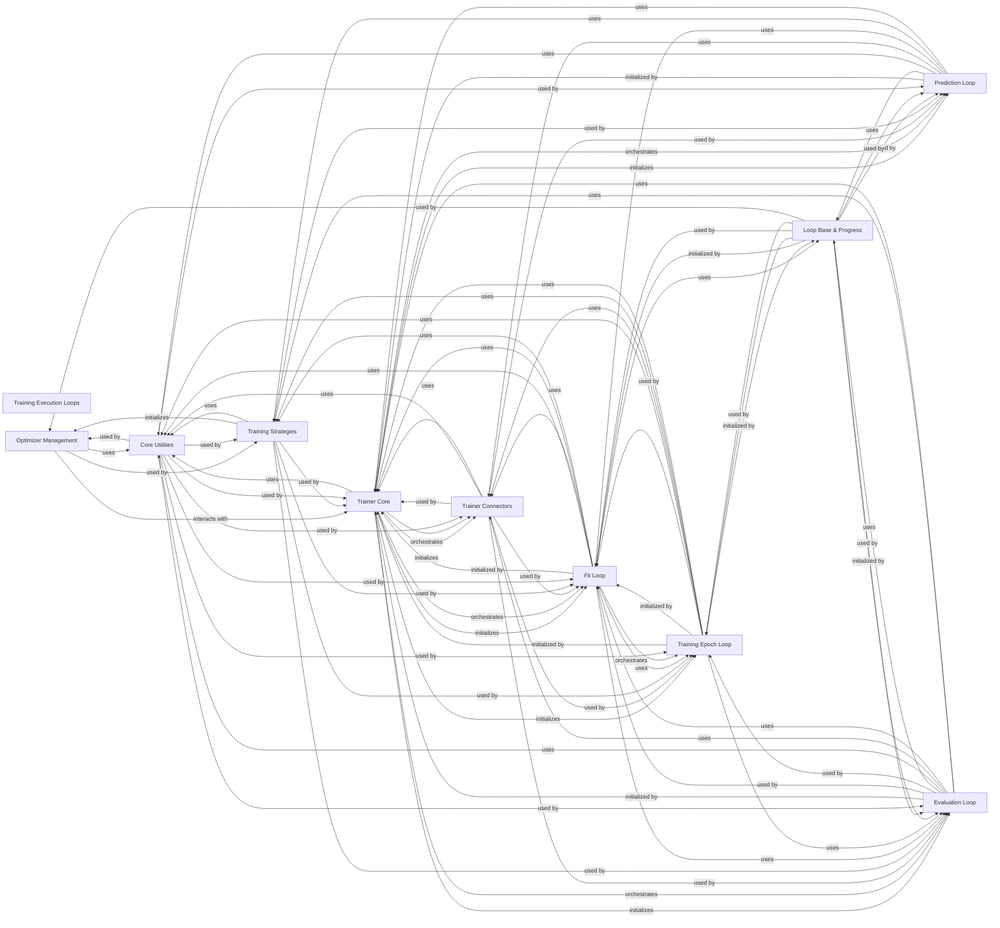

## Component Details

This component overview describes the core iterative processes and supporting functionalities within the Lightning framework for model training, evaluation, and prediction. It highlights the central role of the `Trainer Core` in orchestrating various `Loops` (Fit, Evaluation, Prediction, Training Epoch) and managing `Optimizer Management` and `Training Strategies`. `Trainer Connectors` provide essential linkages for data, accelerators, logging, and callbacks, while `Loop Base & Progress` offers foundational utilities for all loops. `Core Utilities` serve as a common pool of helper functions and classes used across the entire system.

### Training Execution Loops
Defines the iterative processes for different phases of model training (fit, evaluation, prediction) and manages batch processing, epoch progression, and parameter updates via optimizers and schedulers.

**Related Classes/Methods**:

- <a href="https://github.com/Lightning-AI/lightning/blob/master/src/lightning/pytorch/loops/fit_loop.py#L58-L529" target="_blank" rel="noopener noreferrer">`lightning.src.lightning.pytorch.loops.fit_loop._FitLoop` (58:529)</a>
- <a href="https://github.com/Lightning-AI/lightning/blob/master/src/lightning/pytorch/loops/evaluation_loop.py#L57-L613" target="_blank" rel="noopener noreferrer">`lightning.src.lightning.pytorch.loops.evaluation_loop._EvaluationLoop` (57:613)</a>
- <a href="https://github.com/Lightning-AI/lightning/blob/master/src/lightning/pytorch/loops/prediction_loop.py#L47-L404" target="_blank" rel="noopener noreferrer">`lightning.src.lightning.pytorch.loops.prediction_loop._PredictionLoop` (47:404)</a>
- <a href="https://github.com/Lightning-AI/lightning/blob/master/src/lightning/pytorch/core/optimizer.py#L39-L171" target="_blank" rel="noopener noreferrer">`lightning.src.lightning.pytorch.core.optimizer.LightningOptimizer` (39:171)</a>
- <a href="https://github.com/Lightning-AI/lightning/blob/master/src/lightning/pytorch/core/optimizer.py#L174-L197" target="_blank" rel="noopener noreferrer">`lightning.src.lightning.pytorch.core.optimizer._init_optimizers_and_lr_schedulers` (174:197)</a>

### Optimizer Management
Manages the creation, configuration, and stepping of optimizers and learning rate schedulers within Lightning. It handles the core logic for applying gradients and updating model parameters.

**Related Classes/Methods**:

- <a href="https://github.com/Lightning-AI/lightning/blob/master/src/lightning/pytorch/core/optimizer.py#L39-L171" target="_blank" rel="noopener noreferrer">`lightning.src.lightning.pytorch.core.optimizer.LightningOptimizer` (39:171)</a>
- <a href="https://github.com/Lightning-AI/lightning/blob/master/src/lightning/pytorch/core/optimizer.py#L174-L197" target="_blank" rel="noopener noreferrer">`lightning.src.lightning.pytorch.core.optimizer._init_optimizers_and_lr_schedulers` (174:197)</a>
- <a href="https://github.com/Lightning-AI/lightning/blob/master/src/lightning/pytorch/core/optimizer.py#L383-L419" target="_blank" rel="noopener noreferrer">`lightning.src.lightning.pytorch.core.optimizer._MockOptimizer` (383:419)</a>
- <a href="https://github.com/Lightning-AI/lightning/blob/master/src/lightning/pytorch/core/optimizer.py#L200-L247" target="_blank" rel="noopener noreferrer">`lightning.src.lightning.pytorch.core.optimizer._configure_optimizers` (200:247)</a>
- <a href="https://github.com/Lightning-AI/lightning/blob/master/src/lightning/pytorch/core/optimizer.py#L250-L302" target="_blank" rel="noopener noreferrer">`lightning.src.lightning.pytorch.core.optimizer._configure_schedulers_automatic_opt` (250:302)</a>
- <a href="https://github.com/Lightning-AI/lightning/blob/master/src/lightning/pytorch/core/optimizer.py#L305-L327" target="_blank" rel="noopener noreferrer">`lightning.src.lightning.pytorch.core.optimizer._configure_schedulers_manual_opt` (305:327)</a>
- <a href="https://github.com/Lightning-AI/lightning/blob/master/src/lightning/pytorch/core/optimizer.py#L351-L363" target="_blank" rel="noopener noreferrer">`lightning.src.lightning.pytorch.core.optimizer._validate_multiple_optimizers_support` (351:363)</a>
- <a href="https://github.com/Lightning-AI/lightning/blob/master/src/lightning/pytorch/core/optimizer.py#L366-L371" target="_blank" rel="noopener noreferrer">`lightning.src.lightning.pytorch.core.optimizer._validate_optimizers_attached` (366:371)</a>
- <a href="https://github.com/Lightning-AI/lightning/blob/master/src/lightning/pytorch/core/optimizer.py#L330-L348" target="_blank" rel="noopener noreferrer">`lightning.src.lightning.pytorch.core.optimizer._validate_scheduler_api` (330:348)</a>
- <a href="https://github.com/Lightning-AI/lightning/blob/master/src/lightning/pytorch/core/optimizer.py#L35-L36" target="_blank" rel="noopener noreferrer">`lightning.src.lightning.pytorch.core.optimizer.do_nothing_closure` (35:36)</a>

### Training Strategies
Provides an abstraction layer for different distributed and device-specific training paradigms, including DDP, DeepSpeed, FSDP, and XLA. It handles model and optimizer setup, device placement, and synchronization.

**Related Classes/Methods**:

- <a href="https://github.com/Lightning-AI/lightning/blob/master/src/lightning/pytorch/strategies/strategy.py#L47-L599" target="_blank" rel="noopener noreferrer">`lightning.src.lightning.pytorch.strategies.strategy.Strategy` (47:599)</a>
- <a href="https://github.com/Lightning-AI/lightning/blob/master/src/lightning/pytorch/strategies/deepspeed.py#L74-L922" target="_blank" rel="noopener noreferrer">`lightning.src.lightning.pytorch.strategies.deepspeed.DeepSpeedStrategy` (74:922)</a>
- <a href="https://github.com/Lightning-AI/lightning/blob/master/src/lightning/pytorch/strategies/single_xla.py#L33-L122" target="_blank" rel="noopener noreferrer">`lightning.src.lightning.pytorch.strategies.single_xla.SingleDeviceXLAStrategy` (33:122)</a>
- <a href="https://github.com/Lightning-AI/lightning/blob/master/src/lightning/pytorch/strategies/fsdp.py#L92-L673" target="_blank" rel="noopener noreferrer">`lightning.src.lightning.pytorch.strategies.fsdp.FSDPStrategy` (92:673)</a>
- <a href="https://github.com/Lightning-AI/lightning/blob/master/src/lightning/pytorch/strategies/model_parallel.py#L60-L364" target="_blank" rel="noopener noreferrer">`lightning.src.lightning.pytorch.strategies.model_parallel.ModelParallelStrategy` (60:364)</a>
- <a href="https://github.com/Lightning-AI/lightning/blob/master/src/lightning/pytorch/strategies/ddp.py#L68-L419" target="_blank" rel="noopener noreferrer">`lightning.src.lightning.pytorch.strategies.ddp.DDPStrategy` (68:419)</a>
- <a href="https://github.com/Lightning-AI/lightning/blob/master/src/lightning/pytorch/strategies/xla.py#L43-L362" target="_blank" rel="noopener noreferrer">`lightning.src.lightning.pytorch.strategies.xla.XLAStrategy` (43:362)</a>
- <a href="https://github.com/Lightning-AI/lightning/blob/master/src/lightning/pytorch/strategies/strategy.py#L602-L649" target="_blank" rel="noopener noreferrer">`lightning.src.lightning.pytorch.strategies.strategy._ForwardRedirection` (602:649)</a>

### Trainer Core
The central orchestrator of the Lightning training, validation, testing, and prediction workflows. It initializes various connectors and loops, manages the overall training state, and coordinates the execution of different stages.

**Related Classes/Methods**:

- <a href="https://github.com/Lightning-AI/lightning/blob/master/src/lightning/pytorch/trainer/trainer.py#L89-L1727" target="_blank" rel="noopener noreferrer">`lightning.src.lightning.pytorch.trainer.trainer.Trainer` (89:1727)</a>
- <a href="https://github.com/Lightning-AI/lightning/blob/master/src/lightning/pytorch/trainer/setup.py#L144-L189" target="_blank" rel="noopener noreferrer">`lightning.pytorch.trainer.setup._log_device_info` (144:189)</a>
- <a href="https://github.com/Lightning-AI/lightning/blob/master/src/lightning/pytorch/trainer/states.py#L75-L88" target="_blank" rel="noopener noreferrer">`lightning.pytorch.trainer.states.TrainerState` (75:88)</a>
- <a href="https://github.com/Lightning-AI/lightning/blob/master/src/lightning/pytorch/trainer/setup.py#L125-L141" target="_blank" rel="noopener noreferrer">`lightning.pytorch.trainer.setup._init_profiler` (125:141)</a>
- <a href="https://github.com/Lightning-AI/lightning/blob/master/src/lightning/pytorch/trainer/setup.py#L35-L89" target="_blank" rel="noopener noreferrer">`lightning.pytorch.trainer.setup._init_debugging_flags` (35:89)</a>
- <a href="https://github.com/Lightning-AI/lightning/blob/master/src/lightning/pytorch/trainer/configuration_validator.py#L24-L46" target="_blank" rel="noopener noreferrer">`lightning.pytorch.trainer.configuration_validator._verify_loop_configurations` (24:46)</a>
- <a href="https://github.com/Lightning-AI/lightning/blob/master/src/lightning/pytorch/trainer/call.py#L85-L111" target="_blank" rel="noopener noreferrer">`lightning.pytorch.trainer.call._call_setup_hook` (85:111)</a>
- <a href="https://github.com/Lightning-AI/lightning/blob/master/src/lightning/pytorch/trainer/call.py#L114-L128" target="_blank" rel="noopener noreferrer">`lightning.pytorch.trainer.call._call_configure_model` (114:128)</a>
- <a href="https://github.com/Lightning-AI/lightning/blob/master/src/lightning/pytorch/trainer/call.py#L202-L231" target="_blank" rel="noopener noreferrer">`lightning.pytorch.trainer.call._call_callback_hooks` (202:231)</a>
- <a href="https://github.com/Lightning-AI/lightning/blob/master/src/lightning/pytorch/trainer/call.py#L154-L181" target="_blank" rel="noopener noreferrer">`lightning.pytorch.trainer.call._call_lightning_module_hook` (154:181)</a>
- <a href="https://github.com/Lightning-AI/lightning/blob/master/src/lightning/pytorch/trainer/call.py#L131-L151" target="_blank" rel="noopener noreferrer">`lightning.pytorch.trainer.call._call_teardown_hook` (131:151)</a>
- <a href="https://github.com/Lightning-AI/lightning/blob/master/src/lightning/pytorch/loggers/utilities.py#L59-L102" target="_blank" rel="noopener noreferrer">`lightning.pytorch.loggers.utilities._log_hyperparams` (59:102)</a>
- <a href="https://github.com/Lightning-AI/lightning/blob/master/src/lightning/pytorch/utilities/parsing.py#L40-L49" target="_blank" rel="noopener noreferrer">`lightning.pytorch.utilities.parsing.clean_namespace` (40:49)</a>

### Trainer Connectors
A collection of modules responsible for connecting and managing various aspects of the Trainer, including data handling, accelerator setup, logging, callbacks, checkpointing, and signal handling.

**Related Classes/Methods**:

- <a href="https://github.com/Lightning-AI/lightning/blob/master/src/lightning/pytorch/trainer/connectors/data_connector.py#L46-L226" target="_blank" rel="noopener noreferrer">`lightning.pytorch.trainer.connectors.data_connector._DataConnector` (46:226)</a>
- <a href="https://github.com/Lightning-AI/lightning/blob/master/src/lightning/pytorch/trainer/connectors/accelerator_connector.py#L75-L628" target="_blank" rel="noopener noreferrer">`lightning.pytorch.trainer.connectors.accelerator_connector._AcceleratorConnector` (75:628)</a>
- <a href="https://github.com/Lightning-AI/lightning/blob/master/src/lightning/pytorch/trainer/connectors/logger_connector/logger_connector.py#L32-L263" target="_blank" rel="noopener noreferrer">`lightning.pytorch.trainer.connectors.logger_connector.logger_connector._LoggerConnector` (32:263)</a>
- <a href="https://github.com/Lightning-AI/lightning/blob/master/src/lightning/pytorch/trainer/connectors/callback_connector.py#L46-L244" target="_blank" rel="noopener noreferrer">`lightning.pytorch.trainer.connectors.callback_connector._CallbackConnector` (46:244)</a>
- <a href="https://github.com/Lightning-AI/lightning/blob/master/src/lightning/pytorch/trainer/connectors/checkpoint_connector.py#L46-L558" target="_blank" rel="noopener noreferrer">`lightning.pytorch.trainer.connectors.checkpoint_connector._CheckpointConnector` (46:558)</a>
- <a href="https://github.com/Lightning-AI/lightning/blob/master/src/lightning/pytorch/trainer/connectors/signal_connector.py#L39-L158" target="_blank" rel="noopener noreferrer">`lightning.pytorch.trainer.connectors.signal_connector._SignalConnector` (39:158)</a>
- <a href="https://github.com/Lightning-AI/lightning/blob/master/src/lightning/pytorch/trainer/connectors/data_connector.py#L314-L326" target="_blank" rel="noopener noreferrer">`lightning.pytorch.trainer.connectors.data_connector._request_dataloader` (314:326)</a>
- <a href="https://github.com/Lightning-AI/lightning/blob/master/src/lightning/pytorch/trainer/connectors/data_connector.py#L246-L260" target="_blank" rel="noopener noreferrer">`lightning.pytorch.trainer.connectors.data_connector._resolve_overfit_batches` (246:260)</a>
- <a href="https://github.com/Lightning-AI/lightning/blob/master/src/lightning/pytorch/trainer/connectors/data_connector.py#L376-L405" target="_blank" rel="noopener noreferrer">`lightning.pytorch.trainer.connectors.data_connector._check_dataloader_iterable` (376:405)</a>
- <a href="https://github.com/Lightning-AI/lightning/blob/master/src/lightning/pytorch/trainer/connectors/data_connector.py#L469-L504" target="_blank" rel="noopener noreferrer">`lightning.pytorch.trainer.connectors.data_connector._process_dataloader` (469:504)</a>
- <a href="https://github.com/Lightning-AI/lightning/blob/master/src/lightning/pytorch/trainer/connectors/data_connector.py#L440-L466" target="_blank" rel="noopener noreferrer">`lightning.pytorch.trainer.connectors.data_connector._parse_num_batches` (440:466)</a>
- <a href="https://github.com/Lightning-AI/lightning/blob/master/src/lightning/pytorch/trainer/connectors/logger_connector/result.py#L313-L528" target="_blank" rel="noopener noreferrer">`lightning.pytorch.trainer.connectors.logger_connector.result._ResultCollection` (313:528)</a>

### Fit Loop
Manages the entire training process, including epoch-based training, data setup, and coordination with evaluation loops. It orchestrates the flow of training iterations and handles progress tracking.

**Related Classes/Methods**:

- <a href="https://github.com/Lightning-AI/lightning/blob/master/src/lightning/pytorch/loops/fit_loop.py#L58-L529" target="_blank" rel="noopener noreferrer">`lightning.src.lightning.pytorch.loops.fit_loop._FitLoop` (58:529)</a>
- <a href="https://github.com/Lightning-AI/lightning/blob/master/src/lightning/pytorch/loops/utilities.py#L113-L124" target="_blank" rel="noopener noreferrer">`lightning.pytorch.loops.utilities._is_max_limit_reached` (113:124)</a>
- <a href="https://github.com/Lightning-AI/lightning/blob/master/src/lightning/pytorch/loops/utilities.py#L50-L90" target="_blank" rel="noopener noreferrer">`lightning.pytorch.loops.utilities._parse_loop_limits` (50:90)</a>
- <a href="https://github.com/Lightning-AI/lightning/blob/master/src/lightning/pytorch/loops/utilities.py#L135-L154" target="_blank" rel="noopener noreferrer">`lightning.pytorch.loops.utilities._select_data_fetcher` (135:154)</a>
- <a href="https://github.com/Lightning-AI/lightning/blob/master/src/lightning/pytorch/loops/fetchers.py#L29-L83" target="_blank" rel="noopener noreferrer">`lightning.pytorch.loops.fetchers._DataFetcher` (29:83)</a>

### Prediction Loop
Handles the inference process, iterating through prediction data, executing prediction steps, and managing the collection and storage of predictions.

**Related Classes/Methods**:

- <a href="https://github.com/Lightning-AI/lightning/blob/master/src/lightning/pytorch/loops/prediction_loop.py#L47-L404" target="_blank" rel="noopener noreferrer">`lightning.src.lightning.pytorch.loops.prediction_loop._PredictionLoop` (47:404)</a>
- <a href="https://github.com/Lightning-AI/lightning/blob/master/src/lightning/pytorch/loops/utilities.py#L184-L205" target="_blank" rel="noopener noreferrer">`lightning.pytorch.loops.utilities._verify_dataloader_idx_requirement` (184:205)</a>

### Evaluation Loop
Manages the validation and testing phases of a model, including data setup, execution of evaluation steps, and aggregation of results.

**Related Classes/Methods**:

- <a href="https://github.com/Lightning-AI/lightning/blob/master/src/lightning/pytorch/loops/evaluation_loop.py#L57-L613" target="_blank" rel="noopener noreferrer">`lightning.src.lightning.pytorch.loops.evaluation_loop._EvaluationLoop` (57:613)</a>

### Training Epoch Loop
Responsible for the execution of a single training epoch, including batch processing, optimization, and learning rate scheduler updates. It interacts with automatic and manual optimization routines.

**Related Classes/Methods**:

- <a href="https://github.com/Lightning-AI/lightning/blob/master/src/lightning/pytorch/loops/training_epoch_loop.py#L50-L569" target="_blank" rel="noopener noreferrer">`lightning.src.lightning.pytorch.loops.training_epoch_loop._TrainingEpochLoop` (50:569)</a>
- <a href="https://github.com/Lightning-AI/lightning/blob/master/src/lightning/pytorch/loops/optimization/automatic.py#L153-L329" target="_blank" rel="noopener noreferrer">`lightning.pytorch.loops.optimization.automatic._AutomaticOptimization` (153:329)</a>
- <a href="https://github.com/Lightning-AI/lightning/blob/master/src/lightning/pytorch/loops/optimization/manual.py#L71-L136" target="_blank" rel="noopener noreferrer">`lightning.pytorch.loops.optimization.manual._ManualOptimization` (71:136)</a>

### Loop Base & Progress
Provides foundational functionalities for all loops, including common lifecycle hooks and mechanisms for tracking training progress (batches, epochs, optimization steps).

**Related Classes/Methods**:

- <a href="https://github.com/Lightning-AI/lightning/blob/master/src/lightning/pytorch/loops/loop.py#L20-L105" target="_blank" rel="noopener noreferrer">`lightning.pytorch.loops.loop._Loop` (20:105)</a>
- <a href="https://github.com/Lightning-AI/lightning/blob/master/src/lightning/pytorch/loops/progress.py#L139-L198" target="_blank" rel="noopener noreferrer">`lightning.pytorch.loops.progress._Progress` (139:198)</a>
- <a href="https://github.com/Lightning-AI/lightning/blob/master/src/lightning/pytorch/loops/progress.py#L202-L233" target="_blank" rel="noopener noreferrer">`lightning.pytorch.loops.progress._BatchProgress` (202:233)</a>
- <a href="https://github.com/Lightning-AI/lightning/blob/master/src/lightning/pytorch/loops/progress.py#L237-L249" target="_blank" rel="noopener noreferrer">`lightning.pytorch.loops.progress._SchedulerProgress` (237:249)</a>
- <a href="https://github.com/Lightning-AI/lightning/blob/master/src/lightning/pytorch/loops/progress.py#L285-L311" target="_blank" rel="noopener noreferrer">`lightning.pytorch.loops.progress._OptimizationProgress` (285:311)</a>
- <a href="https://github.com/Lightning-AI/lightning/blob/master/src/lightning/pytorch/loops/progress.py#L107-L135" target="_blank" rel="noopener noreferrer">`lightning.pytorch.loops.progress._ProcessedTracker` (107:135)</a>

### Core Utilities
A collection of essential utility functions and classes used across various Lightning components for tasks such as exception handling, enum definitions, parameter tying, model state management, distributed initialization, data manipulation, and device transfers.

**Related Classes/Methods**:

- <a href="https://github.com/Lightning-AI/lightning/blob/master/src/lightning/fabric/utilities/exceptions.py#L16-L17" target="_blank" rel="noopener noreferrer">`lightning.fabric.utilities.exceptions.MisconfigurationException` (16:17)</a>
- <a href="https://github.com/Lightning-AI/lightning/blob/master/src/lightning/pytorch/utilities/enums.py#L21-L40" target="_blank" rel="noopener noreferrer">`lightning.pytorch.utilities.enums.GradClipAlgorithmType` (21:40)</a>
- <a href="https://github.com/Lightning-AI/lightning/blob/master/src/lightning/pytorch/utilities/parameter_tying.py#L26-L28" target="_blank" rel="noopener noreferrer">`lightning.pytorch.utilities.parameter_tying.find_shared_parameters` (26:28)</a>
- <a href="https://github.com/Lightning-AI/lightning/blob/master/src/lightning/pytorch/utilities/parameter_tying.py#L49-L54" target="_blank" rel="noopener noreferrer">`lightning.pytorch.utilities.parameter_tying.set_shared_parameters` (49:54)</a>
- <a href="https://github.com/Lightning-AI/lightning/blob/master/src/lightning/pytorch/utilities/model_helpers.py#L29-L46" target="_blank" rel="noopener noreferrer">`lightning.pytorch.utilities.model_helpers.is_overridden` (29:46)</a>
- <a href="https://github.com/Lightning-AI/lightning/blob/master/src/lightning/pytorch/utilities/model_helpers.py#L64-L83" target="_blank" rel="noopener noreferrer">`lightning.pytorch.utilities.model_helpers._ModuleMode` (64:83)</a>
- <a href="https://github.com/Lightning-AI/lightning/blob/master/src/lightning/fabric/utilities/init.py#L81-L105" target="_blank" rel="noopener noreferrer">`lightning.fabric.utilities.init._materialize_distributed_module` (81:105)</a>
- <a href="https://github.com/Lightning-AI/lightning/blob/master/src/lightning/fabric/utilities/optimizer.py#L24-L27" target="_blank" rel="noopener noreferrer">`lightning.fabric.utilities.optimizer._optimizers_to_device` (24:27)</a>
- <a href="https://github.com/Lightning-AI/lightning/blob/master/src/lightning/fabric/strategies/fsdp.py#L788-L791" target="_blank" rel="noopener noreferrer">`lightning.fabric.strategies.fsdp._optimizer_has_flat_params` (788:791)</a>
- <a href="https://github.com/Lightning-AI/lightning/blob/master/src/lightning/pytorch/utilities/types.py#L81-L94" target="_blank" rel="noopener noreferrer">`lightning.pytorch.utilities.types.LRSchedulerConfig` (81:94)</a>
- <a href="https://github.com/Lightning-AI/lightning/blob/master/src/lightning/pytorch/utilities/combined_loader.py#L222-L394" target="_blank" rel="noopener noreferrer">`lightning.pytorch.utilities.combined_loader.CombinedLoader` (222:394)</a>
- <a href="https://github.com/Lightning-AI/lightning/blob/master/src/lightning/pytorch/utilities/data.py#L93-L129" target="_blank" rel="noopener noreferrer">`lightning.pytorch.utilities.data.has_len_all_ranks` (93:129)</a>
- <a href="https://github.com/Lightning-AI/lightning/blob/master/src/lightning/fabric/utilities/data.py#L48-L55" target="_blank" rel="noopener noreferrer">`lightning.fabric.utilities.data.sized_len` (48:55)</a>
- <a href="https://github.com/Lightning-AI/lightning/blob/master/src/lightning/fabric/utilities/data.py#L415-L436" target="_blank" rel="noopener noreferrer">`lightning.fabric.utilities.data._set_sampler_epoch` (415:436)</a>
- <a href="https://github.com/Lightning-AI/lightning/blob/master/src/lightning/fabric/utilities/apply_func.py#L78-L110" target="_blank" rel="noopener noreferrer">`lightning.fabric.utilities.apply_func.move_data_to_device` (78:110)</a>
- <a href="https://github.com/Lightning-AI/lightning/blob/master/src/lightning/pytorch/overrides/distributed.py#L164-L176" target="_blank" rel="noopener noreferrer">`lightning.pytorch.overrides.distributed._sync_module_states` (164:176)</a>

### [FAQ](https://github.com/CodeBoarding/GeneratedOnBoardings/tree/main?tab=readme-ov-file#faq)